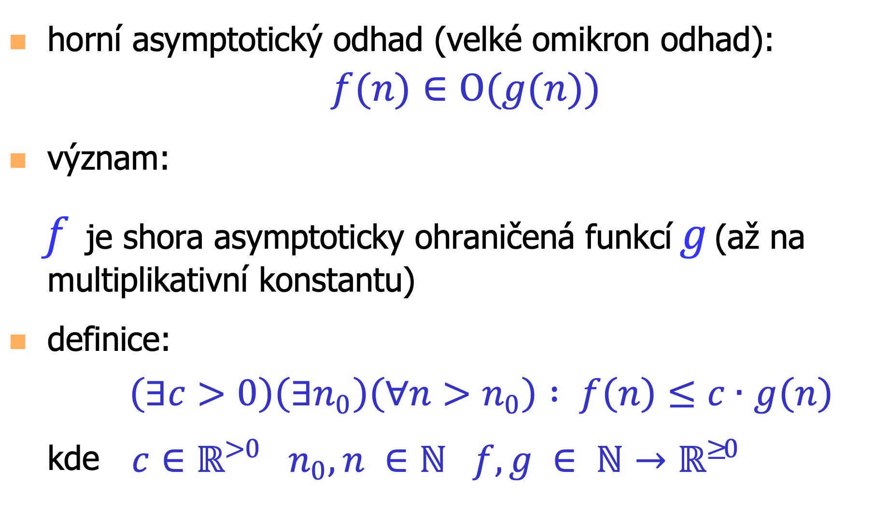

# ALG

Status: Done

## Requirements

Základní algoritmy a datové struktury pro vyhledávání a řazení. Vyhledávací stromy, rozptylovací tabulky. Prohledávání grafu. Úlohy dynamického programování. Asymptotická
složitost a její určování.

• Řád růstu funkcí, asymptotická složitost algoritmu.

• Rekurze, Stromy, binární stromy, prohledávání s návratem.

• Fronta, zásobník, průchod stromem/grafem do šířky/hloubky.

• Binární vyhledávací stromy, AVL a B- stromy

• Algoritmy řazení: Insert Sort, Selection Sort, Bubble Sort, QuickSort Merge Sort, Halda, Heap
Sort, Radix sort, Counting Sort.

• Dynamické programování, struktura optimálního řešení, odstranění rekurze. Nejdelší společná podposloupnost, optimální násobení matic, problém batohu.

• Rozptylovací tabulky (Hashing), hashovací funkce, řešení kolizí, otevřené a zřetězené tabulky,
double hashing, srůstající tabulky, univerzální hashování.

## Function growth, asymptotic complexity

### Big O

A function f is asymptotically bounded from the top by g if there exists a constant c, for which exists an x such that the c \* g(x) for any larger x is at least as high as f(x)

### Big Omega

A function f is asymptotically bounded from the bottom by g if there exists a constant c, for which exists an x such that the c \* g(x) for any larger x is at most as high as f(x)

### Big Theta

Intersection of the two previous definitions

### Algorithm Complexity Classes

### Recursion Complexity

Main idea: divide and conquer

Assembling a solution from sub-solutions

How to compute the asymptotic complexity?

We can express the complexity for a given in from the recursive relationship

### Substitution

No optimal way how to guess the solution.

Example

### Recursive Tree Method

1. Add the tree leaves, we need to calculate the depth and width of the tree. Depth: log4(n). Width at the bottom (leaf count): 3^depth = 3^log4(n) = 4^log4(3)log4(n) = n^log4(3)
2. Add the constant term at every level of the tree: cn^2 + c*3*(n/4)^2 + c*3^2*(n/4)^2 + … is equivalent to a geometric series with q = 3/16. Compute the sum as 1/(1-q) = 16/13, so we get complexity of the nodes themselves at 16/13cn^2.
3. Now compare the complexity, since (16/13)cn^2 > n^log4(3), the algorithm is O(n^2)

## Trees

Additional properties:

- No cycles
- $|V| = |E|+1$

N-ary trees: every node has at most n-children

### Binary Trees

Regular: either 0 or 2 children

Balanced: All levels except for the last one are always full. For N-nodes, the depth can be estimated as ceil(log2(n+1))-1 (+1 for empty tree!)

There are multiple ways to perform depth-first binary tree traversal.

- Inorder: left → root → right
- Preorder: root → left → right
- Postorder: left → right → root

We can implement the recursive traversal using a stack (explicitly, not using the system stack).

Node counting:

Depth Calculation:

We can combine these and create a tree-drawing algorithm (y-axis depth, x-axis by the inorder index).

Longest path: maximum depth.

### Backtracking

Go through the state space tree, and test all possible solutions. If one is bad, return one level up and try a different one.

Can be very time consuming, is ideal to use pruning/heuristics/state space reduction.

## Graph Traversal

### Graph Representation

### BFS

Uses a queue, the neighbors of a node are added to the back, and a new node is taken from the front. This traverses the graph in a distance-order from the starting node. Never expands a node whose path length from the start is greater by 2 or more than the smallest node waiting in the queue.

We can implement it cyclically using an array.

Complexity: O(V+E) for an adjacency list and hashset visitation map

### DFS

Uses a stack, the neighbors of a node are pushed onto the stack and the next node to be explored is popped from the stack → traverses in depth first.

We can use the system stack (recursive function) or an explicit stack structure.

Complexity: O(V+E) for an adjacency list and hashset visitation map

### Toposort

In a DAG, iteratively take away the nodes with zero incoming degree, building an order of the nodes that ensures no unresolved dependency in previous steps.

## Search

### Search in an ordered array

Binary search

Simple idea, given some target element, we can look left/right to see how far we are and quickly reduce the search space.

Interpolation search

Based on the first and last element, estimate the index of the query through a linear function. Then halve the interval like in binsearch and repeat. Requires the data to be uniformly distributed, will degrade to linear complexity with large outliers

Exponential search

Incrementally look at exponentially further away numbers until the interval is reduced. Then binsearch in this interval. Data-dependent time complexity.

### Binary Search Tree

Left child: always lower than root

Right child: always higher than root

Tiebreakers up to design decision.

Inorder traversal gives an ordered array.

Find:

Insert:

Delete:

On leaves: simple

If a node has one child:

If a node has two children: must perform a rotation

### AVL Tree

Insertion: we have to take care of a potential break in balance using a rotation. The rotation de-facto adjusts the depths such that the invariant holds.

Similarly for the LR rotation. This helps balance out the tree if we get a depth disparity larger than 1.

Rule of thumb:

- Suppose we delete/insert a node, and traverse upwards the tree
- Once we encounter a unbalanced node, remember 2 last directions we came from (Left/Right)
- If its LL/RR, perform a simple single L or R rotation. If its RL or LR, perform those rotations.

Deletion:

After deleting a node, traverse upwards, update balances, and if unbalanced, update using the two edges towards the deepest subtree of the unbalanced node. We will have to rebalance in every node. That gets out of balance.

### B-Tree

Database systems, filesystems

Find:

Insert:

1. Traverse the tree
2. Find the last suitable child
3. If can insert into remaining space, great
4. If out of capacity, median-sort the contents along with new element (robust splitting for balancing), pick the median value, and split along this value into 2 children. Push the median upstream, along with these two children (left and right). If the root cannot fit the median, repeat the whole procedure recursively

The tree grows upwards, the root changes.

Delete:

1. Traverse the tree
2. If the node is in a full leaf, easy, delete it
3. If the node has multiple children, use the same approach as in BST, and replace with the nearest smallest or largest
4. If the node is in an almost empty leaf, and removing it would violate the minimum k-element invariant, have to look in to neighbors → merge the current leaf, parent value (not node) and neighbor, sort, take median, and split again
5. If we perform 4., but the neighbors are too empty, we will have enough nodes after merging to cover exactly one full leaf. Once we do that, the parent now does not have enough values, we can iterate this approach upwards towards the root. Empty nodes will get deleted (except for root, it can have at minimum 1 element)

## Sorting

### Selection Sort

For each position in the array, look for the smallest element ahead, and swap it with the current position. For every position, we select the ideal element.

### Insertion Sort

Traverse each position, take its element, and insert it into the correct place between the preceding positions. If we pick e[i], then for all j=0..i-1, starting at i-1, compare the value e[j] and e[i]. If e[i] is smaller, swap them. This eventually inserts the element in the right position.

### Bubble Sort

For each position, starting at i=0, bubble up the elements by pairwise comparison (push larger more towards the end).

### Quicksort

Divide and conquer recursive approach.

Main idea: split the array into two parts, one smaller and one larger.

How? Pick a splitting element, so called pivot.

Then take two pointers, one at the beginning or the array, one at the end.

Compare the elements at pointer positions, if we find an offending pair (upper half but less than pivot/lower half but higher than pivot), swap the values at those positions. Every pointer moves unless we find a mutually-offending pair.

No balance guarantees → very bad worst case.

### Stable Sorting

Does not affect the order of comparable elements (in some sense equal) from input to output.

### Merge Sort

Main idea: merge two sorted arrays in a way that does not violate the sorting

Merge Operation

2 riders approach, at output[i], place whichever element is smallest from the other two.

Improve performance by sharing the arrays and sorting elements in-place, always needs one output and one source (independent).

Is also stable (very nice!).

### Heap

A binary tree with an ordering rule. It remains a balanced binary tree.

We can store it efficiently using an array with a simple indexing rule.

Pop rule:

1. Remove root, place the last element in its place, now the heap property is violated
2. Look at the children, pick the smaller one and swap the root with this smaller child
3. Recur downwards until the heap is fixed.

Every subheap of a heap is a valid heap.

We can use heap to sort an array:

When building a heap, because of the recursive property, we can start by constructing the smallest lower heaps and continuing upwards, then we’re certain we don’t violate the already built heap. Also observation: the source array has to be explored only up to its half, as the rest are simply leaves.

We can use heap as a priority queue, the insertion is implemented by appending an element at the bottom and letting it “bubble” up. Or a more efficient approach, Look at the spot where it would be inserted, check the elements along the path towards the root, shift them down and then directly insert A

### Radix Sort

On strings or numbers (number is a decimal string): For all possible characters in the string, sort them lexicographically, by utilizing per-character counting bins (radix).

When going one character up, we need to create a new sorting link structure. We do this by traversing the link structures from the previous step, and incrementally updating the new link structure for the respective characters (e.g. table for c2 from link structure of c3). This ensures that the order in which elements are inserted into the c2 link structure is the stable sorted one from previous step (because we start with the lowest letter first).

### Counting Sort

If we have some elements with a known bounded range that are categorical, we can create a counting table (number of each of the elements), and re-distribute them in an ordered manner:

Second, compute the prefix sum of the counting table, this will give us the starting indices

Now, for each input element, place it in its respective index from the calculated range, which is slowly decremented.

## Dynamic Programming

Used to search for optimal solutions of problems:

### Tabelization

For often repeating results, we can cache them in a table to be retrieved whenever they’re needed in the future.

### Longest Path in a DAG

First, sort the DAG topologically to get a clear processing order. Then, go through the DAG in the topo order, processing each node.

### Longest Common Subsequence

We have 2 sequences, and want to know the longest common subsequence. Given a shorter common subsequence, we can derive a rule on how to build it logically. That is, we connect the same letter with the previously longest subsequence. Also observe something simple - for n=1 and m=any (and vice versa), the LCS is simply the letter equality. This is enough to get us started on the DP.

For all subsequence combinations of the 2 input sequences, we can find the LCS using the previously derived rules in the table.

### Longest Increasing Subsequence

Inspire from the longest path in a DAG → an edge exists between 2 numbers if theyre larger or equal (5 → 6)

We don’t have to build the DAG explicitly, we can process the values one-by-one.

1. Length 1: value 4 at index 1
2. Length 1: update the value to 3, it is a lower number, it cannot make it any worse
3. Length 2: 8 is larger than 3, d = 1, therefore add a sequence of length 2 ending at k=3, previous=2
4. Length 3: 10 is larger than 8, d = 2, add a sequence of length 3, currently ending at index 4 (remember, iL is indexed by sequence length)

…

### Optimal Matrix Multiplication

We will construct a DP table for each subterm.

### Knapsack

The unlimited version

Idea: The ideal combination of elements in the knapsack is the same as taking a smaller-capacity knapsack and adding the “best” item.

This is the longest path in a DAG.

0/1 limited knapsack

We can create a cartesian product between all sets and all capacities, and we will iteratively find which set/capacity combination gives us the best result. When iterating over sets, we can choose whether we want to include the object or not (0/1).

Simply put, for each x and capacity, look whether it makes sense to include the item or not, and pick the better option.

It can be also formulate as a longest path in a DAG:

It coincides with the tabular approach:

## Hashing

### Hashing function examples

### Collision Resolution

Linked data structures

Open-Address hashing

- We know roughly the amount of elements
- Avoids pointers
- Fixed hash table

Linear Probing

Double Hashing:

i is the current index filled with some element

### Coalesced Hashing

LISCH

EISCH

With auxiliary memory

LICH - same as LISCH, but uses the cellar, and cellar is not addressed by h(k)

Same for EICH

VICH performs LICH for items that fit in the cellar and EISCH once cellar runs out
