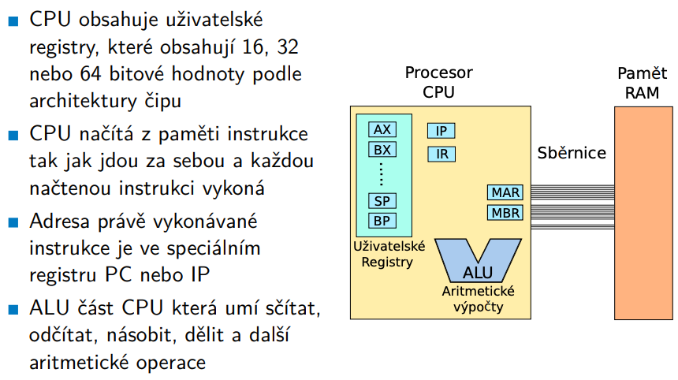

# APO

Status: Done

## Requirements

Architektura počítače; CPU, paměti, subsystémy.

• Architektura počítače - jak jsou v počítači uložena kladná čísla, celá čísla a reálná čísla, příklady používaných přístupů. Nejmenší a největší reálná čísla a jejich přesnosti.

• CPU - RISC/CISC architektura, registry, formát RISC CPU instrukcí, porovnejte jednocyklový procesor a zřetězené zpracování instrukcí, jaké problémy přináší zřetězené zpracování
instrukcí a jak to lze řešit - stall/forwarding.

• Predikce skoků - jak lze predikovat skoky v programu, jak se přiřadí prediktor k instrukci, co je to spekulativní vykonávání instrukcí.

• Paměti - hierarchie pamětí, porovnejte cenu, velikost a rychlost. Cache - organizace cache a její velikost, plně asociativní cache oproti n-cestné cachi - výhody, nevýhody, rychlost a velikost.

• Vstupně výstupní periferie - periferie mapované do paměti, sériový port, sběrnice - sériová/paralelní, half-duplex/full-duplex, sběrnice PCI.

## Computer Architecture

### CPU

The instruction set architecture (ISA) defines the set of instructions that a processor can perform, e.g. x86, arm64.

### Types of ISA

### Amdahl’s Law

$\alpha$ percent of a program cannot be parallelized, the rest can. For a $p$ core processor, we get a speedup of $S(p) = \frac{\alpha + 1 - \alpha}{\alpha + \frac{1-\alpha}{p}}$, evaluating the limit as p goes to infinity gives us $\frac{1}{\alpha}$ maximum theoretical spedup of the program. The advantage vanishes quickly in practice due to overhead.

## Boolean Algebra

Physically implemented using transistor circuits (gates).

Gates have specific markings.

### Arithmetic Circuits

1. Half-Adder: add 2 1-bit numbers, outputs a 1 bit result and a carry bit

1. Full-Adder: add 3 1-bit numbers, outputs a 2-bit result and a carry bit

1. Ripple Carry Adder

Chain a number of full adders, the same way you would add binary numbers on paper

In this case, we get a delay of (k-1)\*3T + 2T for gate delay time T and bit count k.

1. Carry Lookahead Adder

Idea: we can pre-compute next-step carry based on the values of bits at position i

Operations can be performed in parallel, this adder for 4-bit numbers can add them in only 4Ts.

Would be too big for practical bit ranges → Combination.

We can chain multiple CLAs in a RCA fashion for middle ground performance.

### Other Circuits

Mux

Barrel Shifter

## Number Representation

x86, arm64, RISC-V: little-endian

MIPS, network data: big endian

### Multiplication of Binary Numbers

Using this simple approach, we can build the binary multiplier:

Simply check the last bit - like we did on paper. Problem is performance, we have to perform k (32 or 64) additions.

### Wallace Tree Algorithm

Quickly add 4 32-bit numbers

First step, three 1-bit numbers are added, then, repeat with the result, the carry bits and the fourth number. This gives 1 result and 1 carry result. Those can be added to produce the final output.

Multiply each instance of x by a bit from y and add them together in a shifted fashion following the wallace tree algorithm.

### Division of Binary Numbers

Similarly, we can build the binary divisor circuit

## Integer Representation

So zero is 00000000, and -1 is 11111111 (2^8 - 1)

Addition works as before, for subtraction, we compute A + (-B). To obtain -B, we need negate the number. How to do it? Negate all the bits of B, and add 1. This corresponds to applying the formula for negative numbers.

Multiplication and division works on absolute values and determines the sign at the end.

### Overflow/Underflow

Issue arises when carry(k-1) is zero but carry (k) is one.

If the signs of the numbers are different, there can never be an overflow/underflow (for MIN, any positive value increases it, up until 2^k-1, which wil generate -1, symmetrically for MAX)

### Alternative Representation

We could use shifted-zero coding: each number is shifted by a constant. It is more difficult to add and subtract these

One-complement instead only relies on negation, but has 2 zeros.

BCD coding saves the numbers in a decimal format with digit per nibble, difficult for computation.

## Real Number Representation

Real numbers expressed in the binary system

### Fixed point numbers

For limited ranges can get better performance

### Floating point numbers

Recall the scientific notation

There are 2 standard sizes of these numbers

Float32

Float64 (double precision)

There are also 16 and 128 bit representations.

Special case are normalized floating point numbers

So, whenever exponent is nonzero in binary, there is automatically one in front of the mantissa. The denormalized numbers have exponent -126 even though the shift is 127, there is a bias because of the special values.

There are some fault modes

There are some nice properties of floating point numbers

### Floating Point Addition

First they have to be converted to a common exponent (the largest one), the subtract or add the mantissa (at the common exponent!). Finally, it is necessary to normalize the number (find an exponent such that it has a leading hidden mantissa one if applicable).

### Floating Point Multiplication

Add exponents, multiply mantissa with hidden leading ones, then normalize the result.

### Floating Point Ranges

## CPU

### Von Neumann Model

Architecture independent, can execute any program stored in memory. Differs from Harvard architecture by sharing program and data memory.

Instructions are arithmetic/logical/memory IO/branch/control.

### Core Registers

- PC - Program Counter contains the address of just-executed instruction
- IR - Instruction Register - value of the just executed instruction (code)
- General Purpose Registers - user, for data or address memory or both
- SP - Stack Pointer used for data organization
- PSW - Program Status Word - processor state
- IM - Interrupt Mask - enable interrupts
- FPR - Floating Point Registers - floats, SIMD

### CPU Cycle

### Instruction Code

We have to fit all the necessary information and coding into the instruction, which has a fixed-size (e.g. 32 bits)

### Processor Construction

Registers implemented using a D-latch

D is the data pin, E is write enable.

The write pin is pulsed using the output of a flip-flop with not gates acting as delays.

### Instruction Examples

load word (lw)

More instructions: store word (sw), add (two register), addi (add immediate to register), sub (tract), beq (branch if equal), or, ori, and, andi

### Processor Speed

### Control Unit (Řadič)

The control unit sets the respective control signals based on the instruction (RegWrite, MemWrite, ALUControl etc.)

## Memory

Memory - an addressable array of fixed-sized memory cells (e.g. 1 byte)

Physical size is limited by the number of bits the CPU can set on the memory bus (how many bits can it used to address the memory cells), e.g. a 32bit addressing can handle at most 4GiB of memory (2^32). Modern CPUs limit this arbitrarily, don’t need that much address space.

Internal memory - RAM (Random Access Memory) can access randomly, storage usually accessed sequentially or block-wise (not random cell-wise like RAM).

Types of memory (access-wise)

- ROM (read only, eeproms), not writable during operation
- RAM (read-write), random access, volatile

Types of memory (volatility-wise)

- Permanent - flash, eeprom, ssd
- Volatile - DDR SDRAM, SRAM, cache

Types of RAM based on the electrical properties:

- SRAM - cycled NOT gates, requires only power
- DRAM - data stored using a capacitor, small and cheap, but requires periodic refresh of the capacitor

### Addressing

### Hierarchy

Programs need only a small range of addresses at a given moment.

This is important on many levels. We can construct the memory hierarchy to better address these needs.

### Cache

Hidden memory used to balance load and speed between different memory subsystems. In computers, we use it to speed up access to data otherwise located on a slow medium. Works automatically based on the needs of the programs. Needs to be kept in mind when writing programs and designing algorithms.

Cache is filled from RAM, sometimes it will contain old data, we need to decide which data to drop.

When writing data, we have to take care of this the other way - how to get data efficiently into the main memory while ensuring coherence.

### Types of Cache

Fully associative - One set, can be placed into any block

Direct mapping - take the last k bits from the address (excl. last 2 used for 32 bit word indexing) and use these bits to compute the set into which the address is stored.

Multi-way associative: there are fixed sets (using bit addressing) and blocks in a set, which may be used arbitrarily.

Direct mapping example:

General N-way cache:

## Virtual Memory Management

Instead of using hardware addresses in the program, we use a virtual address space, per-process, which is mapped secondarily to the main physical memory. The Virtual space in units of pages (e.g. 4KB). Allows for swap (on HDD).

### Translation

Translation is handled by the CPU’s MMU. Page Faults are handled by the OS. There is similarity with the way cache works (replacement).

### Two-Level Paging Example

More levels - better granularity in the physical memory, more spatially efficient but more computationally inefficient due to multilevel translation

Single level: 2^20 4B entries in the page able (about 4MB), has to always be allocated.

Two-Level: 2^10 4B entries in the page directory (4KB), page table 2^10 of 4B entries (4KB), covers the same address space size for much lower memory usage. Additionally, each table fits well into a physical page.

Present, Read/Write, User/Supervisor, Write Through/Back, Enable/Disable, Accessed, Dirty

Paging on modern 64bit systems:

Huge address space → is needed, not even fully utilized today

### Optimization

Similarly to data access through cache, we can optimize page lookups using the TLB (translation look-aside buffer)

## Pipelining

Knowing this, we would like to minimize the time spent per-step. E.g. fetching an instruction and executing it are 2 separate steps performed in different clock cycles. At the same time, once a part of the critical path fulfills its purpose, it remains unused for all other clock cycles. So in every step, we can simply perform the step for the next instruction (one is fetching, the other one is executing and so on).

Overall pipelined design (c.f. the previous single-stage one)

### Pipelining Hazards

There are some risks associated with this speedup.

1. Data hazards - an instruction earlier in the pipeline read the value of the register, while the current writeback stage has changed the value in that register
2. Control hazards - We may want to branch to a different part of the program, while the previous part has already been fetched and is being executed in the pipeline.

In practice - the read-write operations can lag by a half-cycle, because write is performed in the first half of the cycle and read in the second.

### Data Hazard Solutions

If the result is ready on time (before the next instruction requiring it starts executing), it is possible to directly forward the value. How we detect it? Check the values in the EX to the values in WB and MEM. Then resolve using the Hazard Unit.

If forwarding cannot help (load word, takes long), dispatch a nop instruction for the EX stage and lag the pipeline until forwarding is possible.

### Control Hazard Solutions

If we are waiting for a branch-determining result, we can only re-start the pipeline after the branch is performed. A solution is to add a lightweight logical unit that determines whether a branch must be performed sooner in the decode stage.

### Other Issues

Data need to be ready before clock-high

Rise times

Clock delays (physical layout)

Pipelining has to be split in a way that makes it relatively well time-balanced (superpipelining)

## Superscalar Architecture

Instruction-level Parallelism - basically “placing multiple pipelines in parallel”

New term - instruction pipeline width

Usually, each pipeline branch is specialized for some purpose (floating, integer, logical, SIMD).

Main building block: the reorder buffer, which hides/renames registers and sends the instructions to the reservation station, where they are kept and dispatched as soon as their dependencies are met. Common data bus then performs writeback on the shadow registers to the physical ones.

Tomasulo algorithm

IF → ROB (rename register of result) → RES stations → Execute → WB → finalize if the instruction is first in the FIFO. Out-of-order execution (fast) but in-order completion (correct).

## Branch Prediction

Jumps are difficult, if they are conditional, we cannot forward-predict what instructions will have to performed. We would have to flush the pipeline and start over.

Solution: predict which instruction(s) will be performed next and speculatively pre-fetch and start executing them.

Once the branch is resolved, keep or trash whatever has been computed so far.

Sometimes the target address can change, adding complexity.

Important, in loops, it is statistically sensible to assume the branch will be taken.

### Static Predictors

### Dynamic Predictors

Try to predict the T/NT state based on the previous behavior/statistics. Realistically, build 2^k predictors for the last k bits in an instruction address → track the jump for each address modulo something. Simple, but potential for interference.

1bit smith predictor - single step memory, predicts last outcome

2bit smith predictor - 2 step memory with weakly taken/not taken states.

2bit smith-predictor with 2 step memory and hysteresis

We can keep a history of the taken/not taken statistics using the branch history register.

Basically concatenates address with the history size. Alternative is GShare, which XORs the address with the BHR and allows for better utilization.

Tournament predictors use a pair of simpler (1 or 2 bit) predictors that try to win by predicting the highest number of correct jumps. If their prediction differs, take the one that was more successful in the past.

It is also possible to use a perceptron as the predictor (0/1 classification)

### Jump Target Prediction

In some cases, it is known deterministically apriori - target part of the instruction or defined relative wrt. the PC. Problem is jalr, which jumps based on a register value or memory contents. x86 has ret and jump indirect.

## I/O

Communication

Types of I/O devices

There are some for human interaction (keyboard, microphone, speakers, printers) and for computer interaction (network, storage). Also we may have some sensors or actuators for robotics (camera, lidar, PMSM motors).

### Types of communication

### Memory-mapped peripherals

### Bus types

### Serial Port

Different types

### Buses

### PCI

Driven by a dedicated clock signal

Super parallel, many dedicated conductors. Negated signals due to faster falling edges. The address is transmitted along with data. The bus is operated in a Delegated-Token fashion with a bus arbiter.

Transmission process:

1. Ask arbiter for access
2. Transmit destination address on the AD signal lines
3. Set FRAME low and transmit the command
4. Wait for TRDY/IRDY and DevSel

### PCIe (Express)

Problem of PCI is in the large number of parallel lines and the physical differences, which leads to timing drift (especially for fast clocks/high frequencies).

PCIe is peer-to-peer without an arbiter, full-duplex. Transmission over 2 differential conductors (symmetrical, noise resistant)

Mapping similar to bit-stuffing.

## Interrupts

We have to distinguish between interrupts and exceptions

Some can be masked out in the PSW

How are interrupts processed?

1. PSW along with PC are saved to the stack or some dedicated backup registers
2. CPU mode switched to system or machine
3. Mask out lower-priority interrupts
4. PC set to first instruction of the interrupt handler
5. The handler saves all previously used data and resolves the interrupt/exception
6. If the state is recoverable (e.g. I/O interrupt), the previous state of the registers is restored
7. The handler returns and PSW/PC are popped back to their pre-interrupt states

### Examples

## Direct Memory Access

## Considerations of Multilevel Caches, Multiple Processors, Peripherals

Always need to keep in mind the presence of data at multiple memory levels in the system.If we change the data

