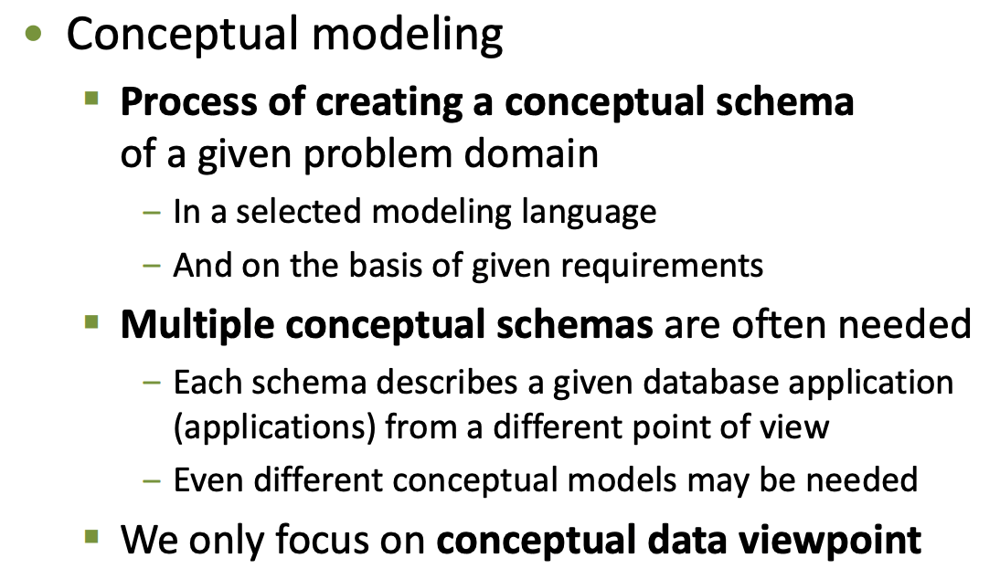
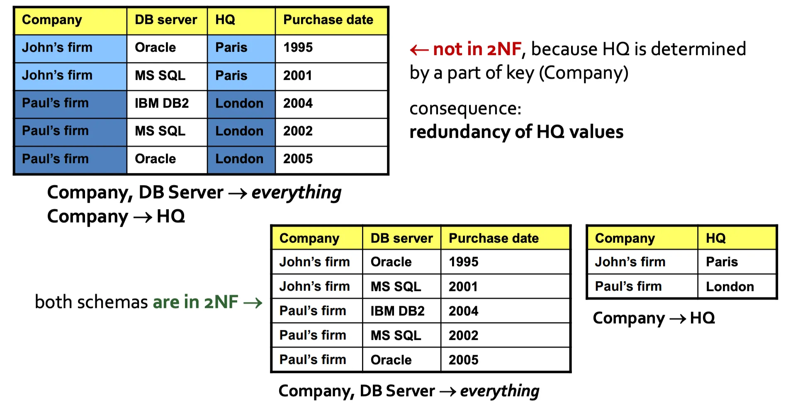

# DBS

Status: Done

# Requirements

Konceptuální a logický datovýmodel, dotazovací jazyk SQL, transakční zpracování, objektověrelační mapování, noSQL databáze. B0B36DBS (Webové stránky předmětu)

• Konceptuální modelování. ER (entitní typy, atributy, identifikátory, vztahové typy, n-ární, rekurzivní, slabé entitní typy, ISA hierarchie). Logické modely (tabulkový, objektový, stromový,
grafový). Relační model (definice, klíč, nadklíč, cizí klíč), transformace ER schématu do relačního schématu.

• Relační databáze (datový model, NULL hodnoty, tříhodnotová logika), integritní omezení (NOT
NULL, UNIQUE, PRIMARY KEY, CHECK, FOREIGN KEY a referenční akce), umělé identifikátory.

• Jazyk SQL. Definice schématu. Manipulace s daty (SELECT, INSERT, UPDATE, DELETE). Spojovánítabulek, predikáty, řazení, seskupování a agregace, množinové operace, vnořené dotazy. Pohledy (aktualizovatelnost, CHECK OPTION). Procedurální rozšíření (funkce, kurzory, triggery).

• Fyzická vrstva (bloky, sloty, buffer management). Organizace záznamů (halda, seřazený
soubor, hašovaný soubor, složitost operací), indexové struktury (B+-stromy, hašované indexy,
bitmapové indexy).

• Funkční závislosti (definice, Armstrongovy axiomy), úpravy závislostí (funkční uzávěr, pokrytí,
kanonické pokrytí, redundantní závislost, neredundantní pokrytí, atributový uzávěr, redukovaná závislost, minimální pokrytí). Hledání klíčů (nalezení prvního klíče, Lucchesi-Osborn).

Normální formy (první, druhá, třetí, Boyceho-Coddova).

• Transakce (základní pojmy, ACID vlastnosti, BEGIN a COMMIT, rozvrh / historie, uspořádatelnost
/ serializovatelnost), konfliktová uspořádatelnost (konflikty WR, RW, WW, precedenční graf),
zamykací protokoly (dvoufázové a striktní dvoufázové zamykání), uváznutí (deadlock, graf
čekání, Coffmanovy podmínky, strategie wait-die a wound-wait), fantom.

# Conceptual model

A database is a logically organized collection of related data

## Definition



Expressing the problem in a modeling language


## Models


## ER

### Entity


Has multiple attributes with cardinalities (0..n)

Attributes may be explicitly typed in ER

### Relationships


Relationship is between entities. Relationships can have their own attributes with some cardinalities.

We always speak about cardinalities of relationships.

In the example above

- Team has 1..n persons (members)
- A person is a member of 0..n teams

### Inheritance


ISA hierarchy

- Not in an programming/OOP sense
- Complete: there may be no instance of parent entity
- Partial: we can instantiate subclasses and superclasses (we can have a person who isn’t a professor or a student)

### Composite attributes


From multiple sub-attributes

### Recursive relationships


Relationships between entities of the same type

### N-ary relationships


Connect more than 2 entities

e.g. A person may work on a project only as a team member

Can have attributes like binary relationships

Can be replaced by an entity and binary relationships

### Identifiers


A unique identifier that distinguishes different instances of an entity in a database


Weak entity type is identified by a (1,1) relationship

An entity type must always be identifiable

# Logical model

Specifies how will the conceptual components (entities, relationship) represented in logical data structures on computers

Needs to be selected based on the nature of the data and the conceptual schema

Always assess what will be stored and how will it be queried

## Logical structures


## Logical models

### Object-based

Objects with attributes

Pointer between objects

Motivated by OOP, encapsulation, inheritance

### Graph-based

Vertices, edges, attributes

Rich operations:

- graph traversal
- pattern matching
- graph algorithms

e.g. GraphDB

### Tree-based

Vertices with attributes, edges

Natively hierarchically organized

Can support structured data (JSON, XML)

### Table-based

Rows for entities, columns for attributes

Select, project, join

Relational model and derivatives (SQL)

## Levels of abstraction


# Relational model

Entities and relationship stored in relations

Uses tables

Row = entity

Column = attribute

Relation is formally a subset of cartesian product of attribute domains → tuples

Relational database = set of relations

## Schema


## Integrity constraints

### Identification

A tuple in a relation is identified by one or more attributes

Superkey = set of such attributes

Key = superkey with minimal number of attributes

We can have multiple keys in one relation

Keys must be underlined (composite contain multiple attributes)

### Referential integrity

Foreign key = attributes of a key being referenced


## Transforming ER to Relational Model

### Classes/Entities


Multivalued or composite attributes are placed in dedicated tables and referenced using the Person’s identifier.

### Relationships

- 1,1 - 1,1
    1. Three tables (entity A, relation, entity B)
    2. Single table(inline into one of the two entity tables)
- 1,1 - 0,1
    1. Two tables (entity A must be in relation with B → can store the ID there, B may exist independently)
- 0,1 - 0,1
    1. Three tables (everything is optional)
- 0,n - 1,1
    1. Two tables (entity B always has one entity A)
- 0,n - 0,1
    1. Three tables (everything is optional)

Relationship attributes inlined with the table storing the association

N-ary relationship stored in separate tables

### ISA hierarchy

Universal solution: separate tables for each type with only specific attributes, the shared ones re stored in the superclass table

Concise solution: one table with a type column and all possible attributes, needs NULL

Compromise: Each leaf type has its own table with all dedicated attributes, leading to duplicities

# SQL

Structured query language


## Data Definition

### Table creation

Using the CREATE TABLE directive


### Data types


Supports automatic casting where it makes sense

### Integrity constraints

For columns:

- NOT NULL - values cannot be NULL
- UNIQUE - all values in the column must be distinct (question of NULL)
- PRIMARY KEY - conjunction of the previous two
- FOREIGN KEY - checks referential integrity in the referenced table, keyword REFERENCES
- CHECK - some general conditions

Column level constraints


For entire tables/multiple columns at a time (data tuples)

- UNIQUE
- PRIMARY KEY
- FOREIGN KEY
- CHECK

Table level constraint:


### Referential integrity

Referential actions are performed when there is a change in the referenced table

Prevents invalidation of the foreign key

Trigger ON UPDATE, ON DELETE

Examples:

- CASCADE - write through the update
- SET NULL - nullify the value in the referencing table
- SET DEFAULT - same as null but uses default value
- NO ACTION - ignore
- RESTRICT - check before everything else

### Schema modification

DROP TABLE - remove table

ALTER TABLE - change the columns

## Data modification

INSERT INTO - adds new rows to a table, either from enumeration or selection

UPDATE - modifies existing rows

DELETE FROM - deletes existing rows from a table

## Data querying


SELECT x FROM (joint tables) WHERE (condition applies) GROUP BY (aggregate by column value) HAVING (condition) ORDER BY (column value)

### Three-value logic

The presence of a null value could cause problems, need to handle in predicates

NULL + 3 = NULL

3 < NULL = UNKNOWN

→ third logical value UNKNOWN


### Select

All important SELECT operation. Argument is the list of column names to be extracted. 

Asterisk * selects a whole table.

Output modifiers: ALL, DISTINCT (remove duplicates)

### Where

Condition that selects the rows

Combine simple expressions using logical operators


String matching: LIKE and percentage

IN ask for specific values in tuples

### From

Description of tables to be queried

Can create new tables using JOIN

JOINs:

- Cross-join: cartesian product of the tables
- Natural-join: combine rows only with equality of all shared values
- Inner-join: ON (logical condition) or USING (column value equality)
- Outer-join: Inner join + rows that cannot be joined (LEFT/RIGHT/FULL), missing values filled with NULL
- Union-join: creates a unified table, no rows combined together

### Group by, Having

Used for aggregation 

Group by - rows divided into groups by the shared values over specified columns

having - aggregated (super) rows are filtered using a search condition


These operations define which columns we can select


Aggregation functions:

- COUNT - counts the number of rows
- SUM/SUM/AVG/MIN/MAX - null ignored, supports ALL and DISTINCT

### Order by

We can sort the row in the selection result by ASC (ascending) or DESC (descending)

Can use multiple columns (lexical)

### Set operations

Set ops performed on the result of a selection query


### Nested queries

We can nest selection queries


### Database views

Named select queries that are evaluated dynamically

Allow for virtualization of tables, better security and hiding some tables from users

Can be updated if the select query was simple and did not perform any joins → it is possible to exactly say which table should be changed on update (cannot do that with joined tables)

```sql
CREATE VIEW mojeView AS SELECT * FROM Aircraft WHERE (Capacity > 200) WITH LOCAL CHECK OPTION
```


### Cursors

Control structure for traversing a table (row-wise)

Declared for a select statement

SCROLL option to fetch forward or backward (by default only forward)

FETCH … INTO <variable>

### Triggers

Procedure that is executed as a response to some event on a table

Used for insertion, update, delete

FOR EACH STATEMENT - called only once for a query (processes all rows at once)

FOR EACH ROW - for reach row separately

### Functions

Part of the embedded SQL

PL/pgSQL for PostgreSQL

Supports branching (if then else for while switch)


# Transactions

### Motivation

Multiple user may want to access the database in parallel

Perform complex operations and queries 

A transaction = sequence of actions on database objects 

### DBMS


### Termination

Transactions can be either successful or unsuccesful

COMMIT: termination command of a successful transaction, changes are kept

ABORT/ROLL: violated a constraint, deadlock/DBMS abort or HW failure

### ACID


Atomicity - no partial execution (same as atomic instructions)

Consistency - transaction may not violate the DBS state

Isolation - Transactions isolated from each other

Durability - Is forever

### Actions


### Program vs schedule

A database program is a piece of nonlinear code

Schedule is a sorted history of actions coming from several parallel transactions

### Schedules

Serial schedule - all transaction operations are coupled, no interleaving, no parallelism


It makes sense to interleave them to improve response times


### Serializability

A schedule is serializable if its execution leads to a consistent database state or if it is equivalent to any serial schedule

Secures IC in ACID

View-serializability: includes ABORT and dynamic databases - NP complete problem

### Potential conflicts

Conflict pairs prevent us from using an arbitrary interleaving method


WR - reads data that may disappear

RW - operation cannot be repeated

WW - mutual overwrite

### Conflict serializability


Stronger than serializability

Does not consider ABORT/ROLLBACK, could be unrecoverable

Dynamic databases (insert/delete) → phantoms

How to detect? Using a precedence graph


Graph must be acyclic

### Recoverability

If we add the ABORT operation, we have a problem

If a transaction is aborted, we may not be able to roll back all changes

Problem is someone has read what the aborted transaction wrote

A schedule is recoverable iff:

- It is committed only after all other transactions affecting T commit (they change the data)
- Enforce reading of only commited data → avoid abort cascade

## Transaction scheduling protocols

The mode of scheduler operation to enforce ACID and deliver high performance

Pessimistic - for highly concurrent, use locks and timestsamps

Optimistic - not much concurrency

### Locking protocols

Lock the database entities to ensure read/write order and solve conflict serializability

Exclusive locking: only owner of the lock can R/W, only 1 transaction (owner) at a time

Shared locking: only for reading, can be owned by multiple transactions

Transaction is suspended while waiting for a lock

### Two Phase Locking

1. T wants to R (W), must acquire shared (exclusive) lock on R
2. T cannot request another lock after releasing one

Does not guarantee recoverability


### Strict Two Phase Locking

1. T wants to R (W), must acquire shared (exclusive) lock on R
2. All locks are released on termination

Leads to acyclic precedence graph

Ensures recoverability (nobody else can use the resource)

## Deadlock


### Detection

Wait-for graph - a dynamic graph that captures the requests of locks (waiting transactions)

Nodes = active transactions

Edge = T1 requests lock held by T2

Cycle ⇒ deadlock

Periodically check this to detect a deadlock

### Resolution

Abort waiting transactions and restart them in correct order

Some heuristic to minimize damage: least numbers of lock held, far from completion, least amount of work

### Prevention

Prioritization of transactions by e.g. timestamps

If T1 wants a lock held by T2, we have 2 options

1. wait-die: if T1 > T2 then wait, else die
2. wound-wait: if T1 > T2 kill T2, else wait 

### Coffman conditions

1. Mutual exclusion: we can exclusively lock a resource
2. Hold and wait: an entity can lock one resource and wait for another
3. Cyclic dependencies: T1 wants T2, T2 wants T1
4. No preemption: cannot forcefully remove lock ownership

## Phantom

Occurs in dynamic databases (insert, delete)

T1 works with set data entities, T2 changes this set (insert/delete), then T1 would work with inconsistent data 

T1 will lock some of the data, but not the new one added by T2

The unlocked entities could be overwritten.


### Prevention

No indexes → lock everything

With indexed structures (B+ trees), we can look for a phantom on index level - index locking

Predicate locking: request locks for logical sets, not instances (hard to do)

# Physical Layer

Data stored on disk, need to organize efficiently

## Paging

Disk access is performed in terms of disk pages, must consider this 

HW/firmware can access only the entire pages

Sequential access faster than random on HDD

Page → slots → records

Record id: page id + slot id


### Data types


## Buffer Management

A buffer a piece of main memory for temp storage of disk pages

1:1 mapping

Buffer manager implements the read/write operation for DBMS

Read:

1. page from buffer, if not there fetch from disk

Write:

1. Write to buffer
2. Set page dirty

Full buffer → LRU replacement, write out dirty pages

## Database storage


## Data files

### Heap

Unordered storage of records, stored in order of insertion

Only linear sequential search

Fast insertion

Holes/fragmentations on deletion

Uses a doubly-linked list or page directory (linked list of directory pages), directory → data

### Sorted file

Records stored in pages based on an ordering according to some search key

Pages are maintained in a contiguous fashion - no holes

Fast search, slow insertion/deletion (need to move a large segment)

Equality search using binary search

### Hashed file

K buckets containing pages

Destination bucket id determined by a hashing function

Linked list of pages makes up one bucket

Needs dynamic hashing

## Indexing

Helper structure for fast search based on search keys

Organized into disk pages

Only keys and links to records (record ID)

### Index


### Clustering

The indexing can be clustered, ordering of index items similar to the data file (tree-based index, hashed index), searched using the primary key

Unclustered does not preserve order of search keys

### B+-trees

Balanced tree based index, extends B-tree with

1. All keys in the leaves, inner nodes contain indexing intervals
2. Leaf pages are linked for faster range-wise queries


### Hashed index

Same as the hashed data file

### Bitmaps

Indexing attributes of low-cardinality data types (e.g. categorical types)


Vector-wise and/or operations - very fast and paralellizable


# Functional dependencies

Relational design leads to relational schemas

There are some problems


We convert the schema to a normalized for to remove redundancies

Example:

If a work position determines the salary, we shouldn’t store salary for each worker but just for his position

### Definition


We can determine Y by knowing X


Needs to be grounded in reality/common sense


### Armstrong’s axioms


The last one can be derived from the first 3

are correct, and complete

### Example of derivation


### Closure


All derivable functional dependencies

### Cover


They have the same closure

### Redundant functional dependencies


### Attribute closure


All attributes that can be derived from X and A (the original set of attributes) using the functional dependencies F

### Redundant attributes


Proof example:


### FD vs attributes


### Minimal cover


## Keys

### Determining the first key

Iteratively remove the left hand side attributes of a functional dependency $A \to A$


### Determining all the keys


For a key, find a dependency that derives it. Remove the right hand side from K and reduce it further to obtain a new key on the left.


### 1. Normal Form

A database is a collection of 2D tables

### 2. Normal Form

There are no partial dependencies of non-key attributes on any key

If it were, we could create a separate table containing the non-key attribute determined only by a part of the key


Example:



### 3. Normal Form

Non-key attributes are not transitively dependent on a key

Again, we could create a separate table


Example:


### Boyce-Codd Normal Form (BCNF)


Every attribute is directly dependent on a key

Example:

