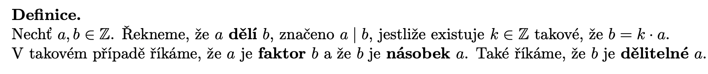

# DMA

Status: Done

## Requirements

Vlastnosti celých čísel, Euklidův algoritmus. Binární relace. Matematická indukce, rekurzivní vztahy. B4B01DMA (Webové stránky předmětu)

• Dělitelnost: definice, základnı́ vlastnosti (tranzitivita a podobně), gcd(a,b).

• Celá čı́sla modulo n: Co je kongruence, jak se tam počı́tá, co je inverznı́ čı́slo a kdy existuje.

• Bezoutova identita, která gcd poskytne jako lineárnı́ kombinaci čı́sel a,b. K čemu se dá použı́t:
řešenı́ diofantických rovnic, hledánı́ inverznı́ho čı́sla ve světě modulo.

• Euklidův algoritmus: Jak funguje, teoreticky (přechod ke zbytku po dělenı́) i prakticky, jak se
pozná kdy končı́. Jak funguje jeho rozšı́řená verze, která umı́ poskytnout Bezoutovu identitu
(prakticky).

• Binárnı́ relace: Definice a jejı́ ilustrace na jednoduchých přı́kladech. Čtyři základnı́ vlastnosti
(reflexivita, symetrie, antisymetrie, tranzitivita): Jaký majı́ význam, umět ilustrovat na grafu
relace, popřı́padě (alespoň intuitivně) rozpoznat u nějaké relace ze života.

• Indukce: Je třeba rozumět principu, vnı́mat různé verze (slabá, silná), umět přı́padně ilustrovat na nějakém jednoduchém důkazu.

• Rekurentnı́ rovnice: Základnı́ vlastnosti homogennı́ch lineárnı́ch rekurentnı́ch rovnic (jejich
množina řešenı́ tvořı́ vektorový prostor dimenze rovné řádu rovnice, takže řešenı́ lze generovat pomocı́ vhodné báze), jak najı́t vhodnou bázi (pomocı́ kořenů charakteristického
polynomu).

## Delitelnost

Vlastnosti delitelnosti: je to reflexivni, tranzitivni a antisymetricka, antisymetrie plati pouze pro prirozena cisla, jelikoz pro cela se mohou navzajem delit ale nebudou rovna.

Bod 3 druhe vety dokazeme tak, ze vezmeme absolutni hodnotu celeho cisla, a vyuzijeme predchozi bod

Vztahy cisel mezi sebou vzhledem k delitelnosti lze popsat obecne

Pro tyto vlastnosti jsou zajimave jejich extremy, to jest nejvetsi spolecny delitel a nejmensi spolecny nasobek

### GCD

Pokud jedno z cisel je nenulove, pak toto cislo deli libovolne cislo, pro druhe nenulove tedy existuje nejake nejvetsi cislo, ktere ho deli. Ve skutecnosti je to presne absolutni hodnota tohoto cisla.

Pokud obe cisla jsou 0, GCD je 0

### LCM

Z mnoziny spolecnych nasobku vybirame to nejmensi. Pokud jedno ze dvou cisel je 0, definujeme LCM jako 0.

### Vzajemny vztah

Lze dokazat pres faktorizaci prvocisel

### Zbytek po deleni

Prove using floor/ceil and differences. Nezapomen ukazat unikatnost!

### Eukliduv algoritmus

Nejprve definujme zbytek po deleni, jako vysledek operace modulo

Dale uvedeme lemma, ktere udava vztah zbytku a cisla

1. d | b, d | a ⇒ b = k1d, a = k2d. r = qb - a = qk1d - k2d = d(qk1-k2), tedy d deli i r. Druha strana d | r, d | b ⇒ r = k3d, b = k4d. a = qb + r = qk4d + k3d = d(qk4+k3), tedy d deli i a.
2. Z predchoziho vyplyva, ze g = gcd(a,b) je urcite delitelem (b,r). Nyni dokazeme minimalitu. Predpokladejme, ze g2 je gcd(b,r) a g > g2. Z predchoziho: r = k1g2, b = k2g2. Jelikoz a =  qb + r = qk2g2 + k1g2 = g2(qk2+k1). Tedy g je i delitelem a, tedy je spolecnym delitelem a i b, a je mensi nez jejich gcd, coz je spor.

Samotny algoritmus na nalezeni GCD dvou cisel

Je krok korektni? Ano, gcd(a,b) = gcd(b,r) = .. rozlozime b na nejaky nasobek r + zbytek..

V kazdem kroku plati rovnost gcd(a,b) pro obe cisla - invariant. 

Variant: posloupnost zbytku je klesajici (?), nejak ukazat ze dojedeme na nulu protoze to je minimalni zbytek

### Bezoutova identita

Prove by reverse unrolling the euclids algorithm

How to find the identity? Using an extended euclidean algorithm:

Practical example:

### Euklidovo Lemma

Dokazujeme z Bezouta

### Faktorizace na prvocisla

## Kongruence

Neboli: maji rovne zbytky

Vlastnosti relace:

Je tranzitivni, symetricka a reflexivni = je to relace ekvivalence na mnozine celych cisel, ktera ma 

nekonecne mnoho trid ekvivalence

Prakticke vyuziti:

Cislo je kongruentni v n se svym zbytkem po deleni n

### Inverze v $\mathbb{Z}_n$

a musi byt nesoudelne s n. Inverzni cislo je proste nasobek a, kterym dostaneme o 1 nebo mensi hodnotu nez je nejaky nasobek n.

Dukaz vety: 1 = ax + kn ⇒ bezoutova identita. gcd(a,n) = 1 ⇒ bezout hned

Jak ho najit? Pomoci rozsireneho euklidova algoritmu, kdyz vyjde GCD=1, muzeme rovnou pouzit koeficient z bezoutovy identity

### Vypocty

## Diofanticke rovnice

Linearni rovnice nad celymi cisly

Maji i homogenni rovnice

Jak nalezt tato reseni?

Z relace kongruence plyne alternativni tvar

## Binarni Relace

Velmi obecne, mame dve mnoziny, A a B, relace mezi nimi je podmnozina kartezskeho soucinu (mnoziny vsech usporadanych dvojic). Relace je na A, pokud jde z A do A

Definujeme i inverzni relaci (prevraceni poradi vztahu)

Dale definujeme i slozenou relaci (pres spolecne prvky)

Definujeme klicove vlastnosti relaci

### Specialni relace

Castecne usporadani = lze s ni usporadat prvky nebo vyhodnotit rovnost

Muzeme pro usporadani konstruovat Hasseuv Diagram

Usporadame do vrstev DAGu, vzdy najdeme nejmensi prvky, odstranime z relace, zakresli do patra a spojime tam, kde existuji relace (od nejnovejsi az po tu uplne prvni dole).

Pro usporadani definujeme extremalni prvky

min/max - neexistuje ostre mensi/vetsi

plati pro libovolne usporadani

Jsou li kazde dva porovnatelne, muzeme mnozinu usporadat linearne

Pokud toto neplati, muzeme doplnit existujici usporadani na linearni

V lexikografickem usporadani porovnavame od prvniho rozdilu v poradi “dimenze” ntic.

### Ekvivalence

Kazda reflexivni, symetricka a tranzitivni relace. Definuje tridy ekvivalence.

## Matematicka Indukce

Ekvivalentni s principem dobreho usporadani prirozenych cisel (kazda podmnozina ma nejmensi prvek). Myslenka dukazu ⇒ velmi zhruba: vykonali jsme dukaz indukci (zakladni + indukcni) predpokladejme ze existuje nejake n kde to neplati. Pak mnozina vsech techto n ma minimalni prvek, nejake m. Z naseho hotoveho dukazu plyne, ze to neni 1, tedy m > 1. Plati m - 1 < m, ale m-1 neni v mnozine porusujicich hodnot, coz by dle indukcniho kroku muselo. Tedy mnozina porusujicich hodnot je prazdna a dukaz indukci je korektni.

Postup:

Slaby princip dokazujeme pouze pro jeden prvek, implikace V(n) ⇒ V(n+1)

Silny princip

Potrebujeme, pokud nas vztah (napr. posloupnost kterou analyzujeme) zavisi na vice nez jednom predchozim kroku, treba f(n) = f(n-1) + 2f(n-2) + 3f(n-3).

Oba principy si jsou ekvivalentni. 

Muzeme pouzit tzv. modifikovany princip, ktery se kouka pouze nejakych m kroku do minulosti (silna indukce moc overkill sometimes).

## Mnoziny

### Induktivni definice mnozin

### Mohutnost

### Podmnoziny

## Zobrazeni

Podobne jako relace, podmnozina kartezskeho soucinu mezi A a B. Mame vsak podminku, ze pro kazdy prvek z A existuje nejvyse jeden prvek z B, na ktery se zobrazi.

Muzeme je skladat

Definujeme inverzi, podobne jako pro relaci.

Proste: kazdy obraz prave jeden vzor

Na: pokryva celou mnozinu obrazu

Bijekce: oboji

Zobrazeni muzeme pouzit vzhledem k mohutnosti mnozin

## Posloupnosti

Rad rustu posloupnosti

## Rekurentni rovnice

### Linearni Rekurentni Rovnice

O co se u techto rovnic budeme snazit? Chceme najit funkce popisujici reseni jako posloupnost.

Vzdy musime znat rozsah a pocatecni podminky, nejaka pevne zvolena cisla pro prvnich k clenu.

Prostor reseni je linearni (prostor posloupnosti) a opet ma homogenni a partikularni cast.

Tato rovnice muze mit konstantni koeficienty:

Pro ni lze nalezt charakteristicky polynom

Potrebne informace

Algoritmus pro reseni homogennich rovnic

Algoritmus pro reseni obecnych rovnic

### Rekurentni algoritmy

Pro nejakou rekurentni rovnici zkusim uhadnout explicitni tvar podle funkcnich hodnot, pak dokazujeme indukci korektnost. 

Pro obecny tvar funkce $f(n) = af(\frac{n}{b}) + cn^d$ muzeme pouzit master theorem

### Kombinatorika

