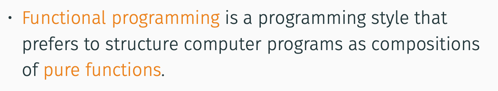
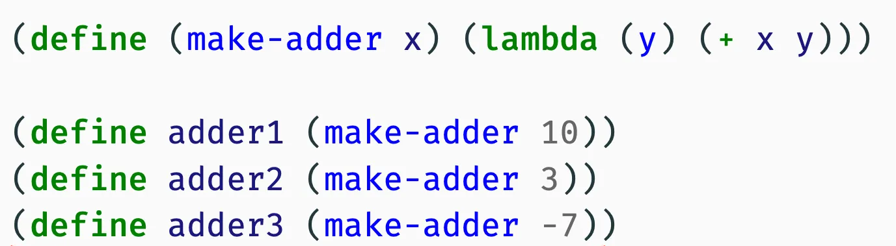
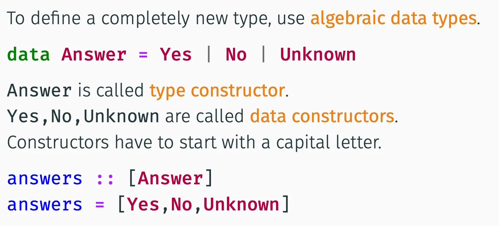
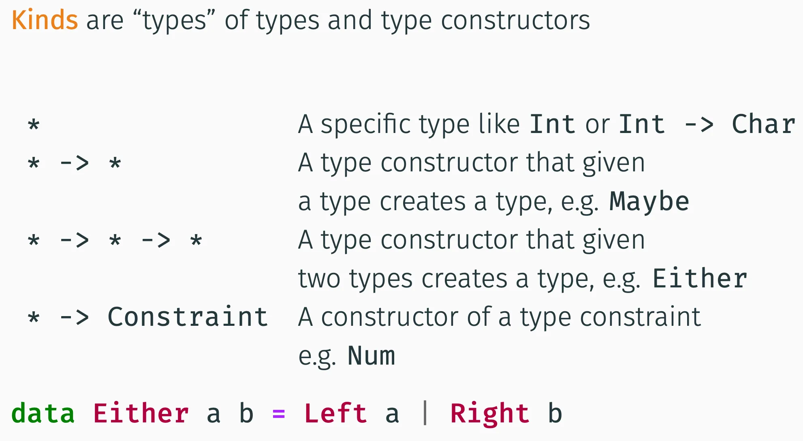

# FUP

Status: Done

# Requirements

Funkcionální jazyky a jejich vlastnosti. Lambda kalkulus, iterativní konstrukty a rekurze.

• Čisté funkce (pure functions), jejich výhody a nevýhody.

• Rekurzivní funkce, typy rekurze, koncová rekurze (tail recursion).

• Reprezentace seznamů a stromů ve Scheme/Racketu.

• Víceřádové funkce (higher-order functions), příklady, currying a částečně vyhodnocené
funkce, levý a pravý fold.

• Funkční (neboli lexikální) uzávěry, příklady.

• Lambda kalkulus, alfa-konverze, beta-redukce, evaluační strategie (normal a applicative),
normální forma, Church-Rosserova věta, Y-combinator.

• Algebraické datove typy (ADT) v Haskellu, příklad rekurzivního ADT.

• Typové třídy (type classes) v Haskellu, polymorfismy v Haskellu.

• Typové třídy Functor, Applicative functor, Monad a jejich použití.



# Pure functions


They operate only on the input data, returning some different data, and have no persistent state or outside effects (side effects).

A pure functional program is a program composed only of pure functions.

## Advantages

Easy to debug, minimum amount of things that can go wrong (e.g. unit testing). 

Easy refactoring (all functionality is restricted to one place, don’t have to worry about the outside world)

Parallelization, concurrency (launch the function on multiple instances with no synchronization)

Formal verification of code correctness

Call caching

## Challenges

Cannot use loops, they need to mutate some state by definition

Instead, use recursion and hold the intermediate results on the system stack

Cannot change data structures → we must always create an altered copy → expensive

Typically less efficient that imperative/OOP (cannot cache, must copy etc.)

## Persistent Data Structures


We only change the altered state (copy on write)

## Side Effects

If we had no side effects, FP programs would be useless (how do you return the result of the computation?)


Try to separate it as best as possible

## Functional vs Imperative


# Higher-order functions

Functions that operate on a function


## List-wise HOF


### Map


### Folding


## Currying


We can split a multi-argument function into a series of functions that receive a single argument and return a function that returns the rest


## Function composition


### Point-free functions

All operations are composed into a single large function which then gets called on the argument.

## Closures


Similar to free variables in predicate logic

Closure definition:


### Binding scope


### Closure example



# Recursion


### Linear

```python
f(x):
	y = f(x-1)
	result = y**2 + x
	return result
```

### Tail

```python
f(x):
	return f(5x-3)
```

### Tree

```python
f(x):
	y = f(x-1)
	z = f(2x-5)
	result = y**2 + x - z
	return result
```

Tail recursion has advantage of O(1) memory complexity, as the tail call can be eliminated (don’t need to store the previous’ call memory on the stack, can rewrite with the new call)

# Lisp-like languages

Lisp = list processor

We use Racket

A lot of brackets 

Uses a lot of brackets and prefix notation for operators


Evaluation strategy is innermost to outermost bracket, and is eager most of the time

Conditionals tend to be lazy

Example code:


## Pairs


Is a linked data structure, can be used to create a hierarchical data structure similar to a binary tree

Cons function (binary): create a new pair with 2 elements, if the second one is a list, it creates a new list

Car function: get the first element of a pair

Cdr function: get the last element of a pair

## Lists


Linked pairs

List function (n-ary): create a new list from the given arguments

If we want to compare, we may only use the eq? function (deep equality)

## Trees

Nested lists or pairs


## Lazy evaluation


### Thunking


## Streams


### Example


## Interpreters


Use the built-in interpreter of the language to parse our custom language, we just need the evaluator. 

Advantage is that the source code can be directly mapped to a tree structure.

# Pattern matching

Decompose a data structure to its components and branch the code (a switch statement on steroids).


# Lambda calculus

We restrict ourselves to untyped lambda calculus


## Syntax


Lambdas are left-associative, we drop the brackets.


Alpha conversion allows us to rename the bound variables arbitrarily. However, it must not name clash with another bound variable within the expression (a free variable would then become bound).

### Example


This is an AST of the lambda expression. V does not have a binding lambda, therefore it is a free variable in this expression

## $\beta$-reduction

The lambda term represents a function that can be applied to another expression

The application is performed by substitution for the variable bound in the lambda


## Examples

Simple single lambda substitution


Double substitution


Free argument


## Name conflicts

Again, we have to make sure that nothing in the argument (rightmost outermost) will become bound after substituting it into the lambda.

Eventual problems can be fixed using alpha conversion


Make sure to not propagate the substitution beyond the scope of the lambda expression (the binding lambda is the one closest in the AST).

## Evaluation strategies


Left: syntax tree inorder traversal.


## Computation in lambda calculus

Functions don’t have names, we apply a function by writing out its definition and the argument. Functions are only abbreviated using capital letters, but this abbreviation is **not part of the formal calculus**.

### Identity


### Booleans


Handy shortcut for an if statement


### Logical operators


Each takes two arguments

### Numbers


Functions of 2 variables, the number is encoded as the number of applications of $s$ to $z$

### Successor

+= 1 operator


We can use it for addition, by application successor to some N M-times


### Multiplication

Prefix-based, takes 2 arguments and calls the number N times on M


### Pair


### Y-combinator


Similar to the infinite loop, except we can apply an additional function to the arguments before looping. The left term in the duplication performs the recursion by repeatedly calling the target function.

# Haskell

## Basics


Both interpreted and compiled

## Basic data types


## Code example


Pattern matching directly in function definition


Where or let define a block, denoted by a pivot column in the code source file

## Conditions


Or using guards


## Lists


## Tuples


## List access patterns

There specific patterns that allow us to decompose lists and tuples by individual elements


## Type system

Haskell is strongly, statically typed

Strong: no automatic conversions or implicit casting (python style)

Statically: compile-time checks


### Function typing


Functions are automatically curried

### Polymorphism

Haskell allows polymorphic functions


Here, $a$ is the type variable. This makes the function fully parametrically polymorphic

For ad hoc polymorphism, we need type classes

### Type classes


The class defines methods that are defined for this type class


### Type declaration


They can be composed/nested, but not recursive

```haskell
type Trans = Pos -> Pos
```

### Algebraic data types

There are also algebraic data types, that are defined as a new type of data using a type constructor with individual data constructors



They can be parametrized by other types


The most common is Maybe

```haskell
data Maybe a = Nothing | Just a
```

They can be defined recursively


### Records


### Type class

To make our custom datatype an instance of an existing type class (e.g. Eq), we implement the instance. The Show a ⇒ part says that we assume a is already an instance of show. If more assumptions are needed, write them in brackets (Show a, Ord a)


we can also define custom type classes


### Type class hierarchy


### Kinds



### Functor

Functor is a type class that defines types over which we can map


If we have a haskell list, fmap is equal to map. 

Example:


### Monad


The monad holds some computational context. The operations can be described as follows:

1. Take a structure $m$ of $a$, a function that transforms $a$ to $m$ of $b$, process and return $m$ of $b$
2. Replace the contents of $m$ with $b$
3. Wrap raw value into the context

Every monad is a functor:  

```haskell
fmap f x = x >>= return . f
```

Explanation: extract the variable in context, apply the raw function, and return a new context

To chain operations, we can use a do block


### Example: failing computations


A problem: when we want to apply a function that just takes an Int, it won’t work because we have a type Maybe Int

We can solve it using a functor


However, we still have a problem: it is difficult to compose operations that use Maybe. Solve it using the monadic composition


### Applicative Functor

Enable lifting of a binary operator similar to Functor


### State Monad

Need to solve the problem of stateful programming in Haskell


In FP, we must pack the state along with the computation variables. We can do it cleverly using a state monad.


The contents of this type are a function that maps the state to a new value and a new state.


### Foldable

Convenient for list aggregation


We can split the aggregation and traversing logic


Finally, we can use foldMap on Foldable instances


## I/O

Cannot avoid mutation of the state (outside world)

A naive solution is to use a World instance and pass it around


Doesn’t work well. We use Monads instead. This is the IO monad.


It is extensible

