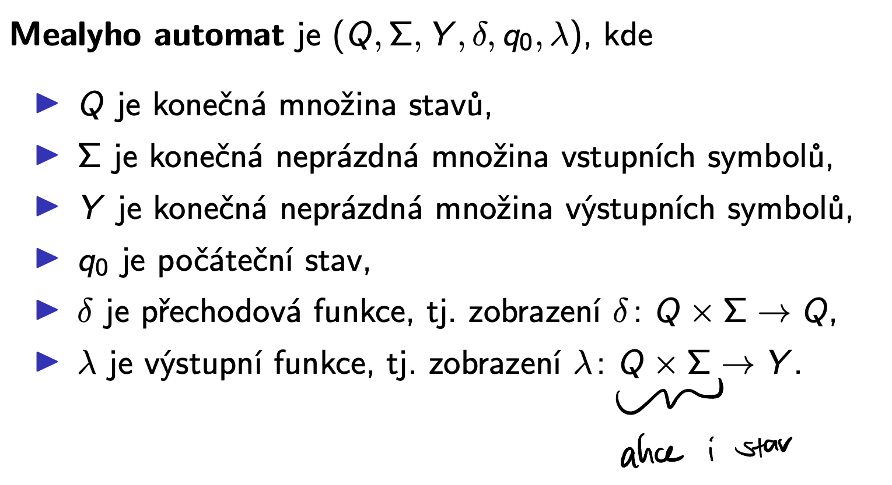

# JAG

Status: Done

## Requirements

Regulární jazyky a bezkontextové jazyky. Popis těchto jazyků pomocí automatů a gramatik,
vlastnosti regulárních a bezkontextových jazyků. 

• Deterministické a nedeterministické konečné automaty a jejich vztah.

• Regulární jazyky a jejich vlastnosti. Lemma o vkládání (Pumping lemma) a Nerodova věta.

• Regulární výrazy a jejich vztah k regulárním jazykům.

• Bezkontextové gramatiky. Chomského hierarchie jazyků. Bezkontextové jazyky a jejich vlastnosti. Lemma o vkládání pro bezkontextové jazyky (Pumping lemma pro bezkontextové
jazyky).

• Zásobníkové automaty (nedeterministické i deterministické ) a jejich vztah k bezkontextovým
jazykům.

## Deterministic and Non Deterministic Automata

### Deterministic Automata

### Reduction of DFA

### Non-Deterministic Automata

## Regular Languages

The class of languages accepted by some finite deterministic (or non-deterministic) automaton.

### Pumping Lemma

Can be used to prove a language is not regular (necessary condition)

### Nerod’s Theorem

Can be used to prove a language is or isn’t regular.

### Operations with Languages

Prove claims by proving the elementary ones with automatons and the rest with logic.

## Regular Expressions

Proof by closure of regular languages to the operations, and the fact that all of the elementary regular expressions describe regular languages.

Construct by incremental hops and loops in the DFA

### Problems that can be solved algorithmically

## Grammars

### Chomsky Hierarchy of Grammars

Construct by an algorithm that first removes everything that generates an empty word by backward induction and then add all possible empty-word rules to the grammar.

## Context-Free Grammar

### Reduced Context-Free Grammar

### Chomsky Normal Form CF Grammar

Proof: binary tree

### Pumping Lemma for Context-Free Languages

Again, used to prove a language is not context free.

### CYK Algorithm

Check if CF grammar in CHNF generates w

### Closures

Proof 1.: grammars

Proof 2.: counterexample

Proof 1: stack automaton

Proof 2: reversed grammar

Proof 3: too hard

### Problems

1. solve by finding a grammar that does not generate an empty word
2. CYK

## Stack-Based Automata

Proof 1: Add a new starting symbol, new starting state and new finish state, whenever the read word is empty and new starting symbol is on stack, go to finish.

Proof 2: In finish states empty the stack and go to a new dummy state.

Let the automaton expand the rules of the grammar on the stack such that the non terminal symbols are expanded with empty input (generate a stack with all possible rule applications), and whenever the word and the top of the stack match with the same letter, delete them from both. 

### Deterministic SFA

