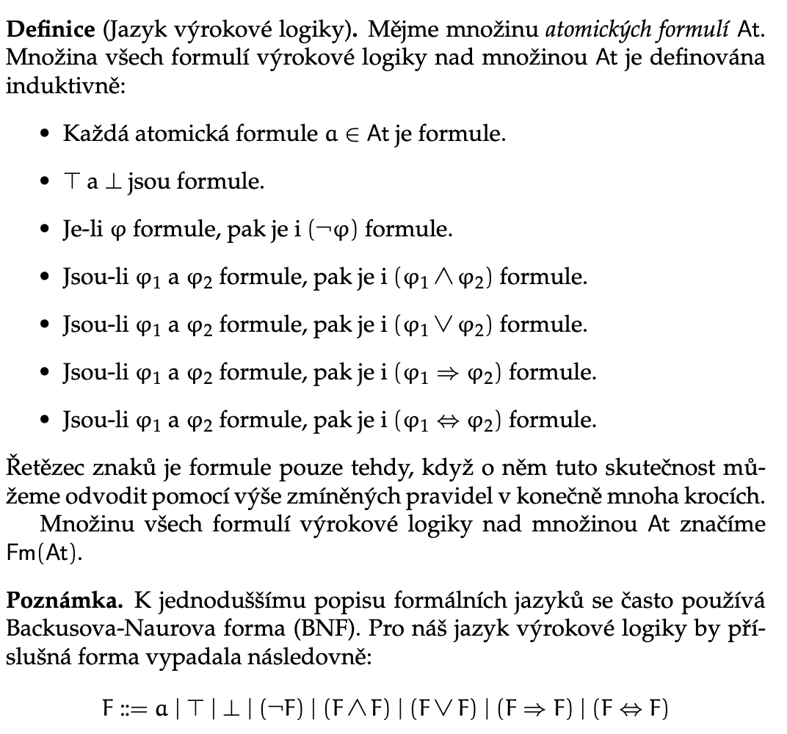

# LGR

Status: Done

## Requirements

Syntaxe a sémantika výrokové a predikátové logiky. Základní pojmy teorie grafů. B0B01LGR
(Webové stránky předmětu)

• Syntax výrokové logiky. Sémantika výrokové logiky. Důkazový systém přirozená dedukce.
Významová (sémantická) ekvivalence formulı́ výrokové logiky. Normálnı́ formy formulı́. Du-
̊sledek ve výrokové logice. Úplné systémy logických spojek. Schopnost formalisace a řešenı́
logických úloh s využitı́m výrokové logiky.

• Syntax predikátové logiky. Sémantika predikátové logiky. Významová (sémantická) ekvivalence formulı́ predikátové logiky. Normálnı́ formy formulı́. Důsledek v predikátové logice.
Schopnost formalisace a řešenı́ logických úloh s využitı́m predikátové logiky.

• Základnı́ pojmy a definice teorie grafů; schopnost formálnı́ práce s těmito pojmy. Stromy a
jejich vlastnosti. Minimálnı́ kostry a algoritmy na jejich hledánı́. Komponenty silné souvislosti
a algoritmus na jejich hledánı́. Schopnost modelovánı́ praktických problémů s využitı́m
grafů.

## Vyrokova Logika

Kazda formule vyrokove logiky je jednoznacne citelna

### Syntakticky Strom

Formule jsou logicky ekvivalentni, pokud $\phi \vdash \psi$ a zaroven $\psi \vdash \phi$

### Prirozena dedukce ve vyrokove logice

Priklad:

V PD existuje scope platnych predpokladu, a lze iterativne opakovat jiz platna tvrzeni z vnejsich scopu

Neprimy Dukaz LEM

Negace je syntactic sugar pro $\phi \vdash \bot$

Syntakticky a semanticky vyznam se lisi, $a \neq \neg \neg a$

## Semantika vyrokove logiky

tl;dr, hledame pravdivostni ohodnoceni dane formule z existence ohodnoceni atomickych formuli

Pravdivostni ohodnoceni formule je zobrazeni rozsirujici ohodnoceni atomickych formuli. Necht $u_\text{at}: \text{At} \to \{0,1\}$ je ohodnoceni atomickych formuli. Hodnoceni vsech formuli definujeme rekurzivne:

- $u(a) = u_\text{at}(a)$
- $u(\top) = 1$
- $u(\bot) = 0$
- $u(\phi \cdot \psi) = [\bullet](u(\phi), u(\phi)]$ kde $\bullet$ je libovolna binarni spojka
- $u(\neg \phi) = [\neg]u(\phi)$

### Formule dle splnitelnosti

Mnozina formuli je splnitelna, pokud existuje ohodnoceni takove, ze vsechny formule mnoziny jsou pravdive zaroven.

Vztah semanticke ekvivalence je reflexivni, symetricky a tranzitivni.

### Tautologicke vztahy spojek

Semanticky dusledek mnoziny formuli $S$

Rekneme, ze $\phi$ je semantickym dusledkem $S$, pokud $\forall u: S \text{ je pravdiva} \implies u(\phi)=1$

Pro $S$ ktera neni splnitelna je dusledkem libovolna formule (predpoklad nelze splnit).

### Logicky a semanticky dusledek

Veta o korektnosti a uplnosti prirozene dedukce ve vyrokove logice

- Plati $S \vdash \phi \iff S \vDash \phi$
- Levo-pravo: korektnost
- Pravo-levo: uplnost

Vhodne pro dukazy, ukazeme semanticky dusledek dukazem logickeho pomoci PD. Na druhou stranu ukazeme, ze formule neni dusledek tak, ze najdeme protiprikladove ohodnoceni atomickych formuli

### Normalni Formy

Booleovske funkce lze popsat tabulkami, lze kazdou takovou funkci reprezentovat formuli VL?

- DNF - jazyk
    - L:= $a| \neg a$ - literál
    - K:= $L| K\land L$ - konjunkce literálů
    - D:=$K|D\lor K$ - formule
- CNF - jazyk
    - L:= $a| \neg a$ - literál
    - K:= $L| K\lor L$ - disjunkce literálů
    - D:=$K|D\land K$ - formule

Dokazuji, ze $\lor, \land, \neg$ je uplny system logicky spojek, lze s nimi reprezentovat jakoukoliv booleovskou funkci (napr. NAND)

## Predikatova Logika

### Jazyk

Predikatovy symbol: ruznym hodnotam promennych (pocet dany aritou) prirazuje logicke ohodnoceni (0,1), napr. x je sude

Konstantni symbol: ekvivalent “vlastniho podstatneho jmena”

Dvousortovy jazyk: termy - objekty, formule - vlastnosti

Funkcni symbol: mapuji promenne na jine promenne, napr. x+6 (Arita 1)

### Termy

Termy specifikujeme BNF jako $t := x|c|f(t_1,t_2, \dots, t_m)$

### Atomicka formule

### Formule

### Promenne

Substituci lze nahradit volne vyskyty promennych

### Sentence

### Substituce

Pro promennou $x$, term $t$ a formuli $\phi$ definujeme substituci $\phi[\frac{t}{x}]$ jako formuli ktera vznikne nahrazenim volnym vyskytu promenne x termem t.

Rekneme, ze term je volny pro x, pokud se zadna volna promenna v termu t nestane po substituci vazana (name clash s kvantifikatorem).

### Prirozena dedukce v predikatove logice

Ekvivalence a uplnost plati stejne, jako ve vyrokove logice

### PD v Predikatove Logice

Spojky jako ve VL, kvantifikatory nasledovne:

Pri eliminaci obecneho kvantifikatoru musime mit volnost!

Musime deklarovat promenne, a pouzivat pouze deklarovane promenne

Rovnost:

## Semantika Predikatove Logiky

Predikatovym symbolum priradime ty mnoziny promennych, kde jsou pravdive

Konstantnim priradime prvky universa

Funkcnim priradime N-tice z universa

Priklad:

Jak interpretujeme termy? Pomoci kontextu promennych

Kontext promennych $\rho$  je parcialni zobrazeni promennych na prvky univerza, ne nutne pro vsechny promenne. Definujeme update kontextu $\rho[x:= d]$ tak, ze vsechny prvky jine nez $x$ si ponechaji prirazeni a pouze x je zmeneno.

Interpretaci termu definujeme induktivne.

Toto se dokazuje pomoci prirozene dedukce v predikatove logice

### Semanticky dusledek

- Sémantický důsledek
    - sentence $\varphi$ je sémantický důsledek množiny S, pokud je každý model množiny $S_i$ i modelem sentence $\varphi$

Korektnost a uplnost dle Godelovy vety.

### Normalni Formy

## Teorie Grafu

### Neorientovane Grafy

### Stromy

### Kostry

Myslenka obecneho algoritmu pro nalezeni: Rozdel graf na jednovrcholove komponenty souvislosti, postupne pridavej hrany, ktere propoji dve komponenty, a jsou pro jednu z nich nejlevnejsi.

### Grafove Algoritmy

### Eulerovske Grafy

### Barveni Grafu

### Nezavislost

### Orientovane Grafy

### Korenovy strom

### Acyklicke grafy

