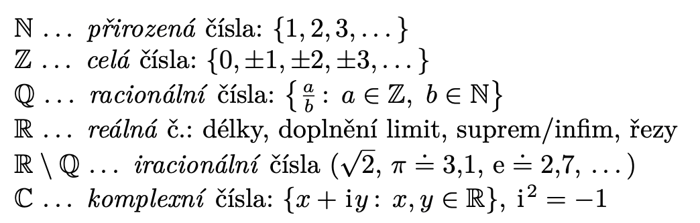

# MA1

Status: Done

# Requirements

Funkce jedné proměnné. Určitý a neurčitý integrál, řady

- Maximum, minimum, supremum a infimum množiny reálných čı́sel, jejich existence.

• Pojem funkce, inverznı́ funkce a jejı́ existence. Monotonie a (lokálnı́) extrémy funkcı́ a jejich
vyšetřovánı́ pomocı́ derivace. Vlastnosti (monotonie, limity) základnı́ch funkcı́ (mocniny,
exponenciálnı́, sinus, kosinus, tangens a k nim inverznı́).

• Limita funkce, jejı́jednoznačnost, způsoby výpočtu (součet, rozdı́l, součin, podı́l, l’Hospitalovo
pravidlo).

• Spojitost funkce, spojitost součtu, rozdı́lu, součinu, podı́lu, složené funkce. Vlastnosti spojity-
́ch funkcı́ na intervalu: nabývánı́ mezihodnot, existence primitivnı́ funkce, nabývánı́ maxima
a minima na uzavřeném intervalu, existence určitého integrálu.

• Derivace funkce, jejı́ geometrický význam. Výpočet derivace pro součet, rozdı́l, součin a podı́l
funkcı́, složenou funkci. Souvislost derivace se spojitostı́.

• Neurčitý a určitý integrál, vztahy mezi nimi (Newtonova–Leibnizova formule, primitivnı́ funkce
jako určitý integrál s proměnnou hornı́ mezı́). Linearita, integrace per partes, substituce.
Integrace mocnin, exp, sin, cos.

• Definice čı́selné řady, jejı́ součet. Konvergence, absolutnı́ konvergence a jejich souvislost.
Nutná podmı́nka konvergence. Kritéria konvergence (podı́lové, odmocninové, integrálnı́,
Leibnizovo)

# Realna cisla

## Racionalni cisla

Racionalni cisla: spocetna mnozina vsech zlomku

## Rozsirena mnozina realnych cisel

Zavadime nevlastni cisla +-nekonecno, takove, ze omezuji realna cisla shora resp. zdola.

## Extremalni prvky mnoziny

Sup/inf nemusi byt prvkem mnoziny, ale museji byt z rozsirenych realnych cisel

$(\sqrt 2, \infty)$ ma infimum $\sqrt2$, ale minimum neexistuje

Dodatecne, kazda konecna neprazdna podmnozina $\mathbb{R}$ ma maximum i minimum, lze seradit

# Funkce

Zobrazeni definovane pro podmnoziny realnych cisel

## Zakladni vlastnosti

### Inverzni funkce

Nesmi se na “ztracet informace” a musime mit moznost nalezt vzor libovolneho realneho cisla

### Rust funkci

Definice je vzdy pro rostouci x,y libovolna z def. oboru

Dokazujeme pres 1) prave jeden vzor sporem, kdyby jich existovalo vic porusili bychom podminku (podivat nad i pod vybrane x) 2) bereme zuzeni na obor hodnot jako domenu, invertujeme podminku z definice a ukazeme, ze je rostouci/klesajici

### Dalsi vlastnosti

## Limita funkce

### Okoli bodu

Okoli: otevreny interval do jiste vzdalenosti od bodu (cisla)

Prstencove okoli: neobsahuje samotny bod

### Limita

Tradicneji $\forall \epsilon > 0 \, \exists \delta > 0: \forall x \in P(a, \delta): f(x) \in U(b, \epsilon)$.  Tedy k limitnimu bodu se muzeme priblizit libovolne blizko a vzdy najdeme prstencove okoli v definicnim oboru takove, ze se cele zobrazi do okoli limitniho bodu.

Smer ⇒ rozloz prstencove okoli na sjednoceni leveho a praveho (vsechna x)

Smer ≤= je muzeme sjednotit

Kdyby mela dve limity, nalezneme pro ne dve disjunktni okoli (na ose y). Pro kazde z nich najdeme prstencove okoli na ose x. Ty maji urcite neprazdny prunik (roven tomu mensimu okoli). Zobrazme libovolny bod z tohoto pruniku funkci do kazdeho z okoli. Protoze ty jsou disjunktni, obrazy museji byt navzajem ruzne, co je spor s definici zobrazeni.

Konecna limita: jeji okoli s konecnym epsilon je konecny realny interval, coz je omezena mnozina

### Aritmetika limit

Toto nam umoznuje dokazovat limity

Dva policajti: umlatit nejak na okoli or whatever

Dalsi aritmetika:

Vysvetleni tretiho bodu: pokud g(b)=c, pak je to free. Pokud ale g(b)≠c (abs hodnota s + 5 v 0), potrebujeme zarucit, ze kazde prstencove okoli x bude zobrazeno funkci f do jinych hodnot nez je b. Pokud by aspon jeden bod sel do b, tim, ze limita g neni v b rovna c, nedokazali bychom nalezt okoli vzoru pro kazde epsilon.

## Posloupnosti

Zakladni vlastnosti, limity apod. stejne jako u funkci.

## Spojitost funkce

Stejna definice jako limita az na to, ze do okoli limity musi spadnout i obraz bodu a.

### Aritmetika spojitych funkci

### Vlastnosti spojitych funkci

Funkce na uzavrenem intervalu je omezena: 

1. Bolzano-weierstrass: existuje konvergujici posloupnost, ze spojitosti je limita vzdy konecna, tedy funkce je omezena
2. Ukazeme ze supremum a infimum obrazu je prvkem teto mnoziny, zase bolzano-weierstrass, udelame posloupnost sup-1/n a posleme n do nekonecna, pricemz vybereme konvergentni podposloupnost, dostaneme sup ≤ funkce ≤ sup, tedy plati rovnost (stejne pro infimum/minimum).

# Derivace

Funkce je diferencovatelna, pokud je tato limita realna

Funkce je diferencovatelna na otevrenem intervalu (kraje!), pokud je diferencovatelna v kazdem bode

## Derivace znamych funkci

## Vlastnosti derivace

Myslenka dukazu:

Vezmeme alternativni definici limity $\lim_{x \to c} \frac{f(x)-f(c)}{x-c} = f^\prime(c)$ existuje a je konecna

Pro $x \neq c$ zvazme tuto rovnost $f(x) - f(c) = \frac{f(x)-f(c)}{x-c} (x-c)$

Vysetrime limity, rozdelime na soucin limit, prava je 0, tedy limita leve strany kdyz $x \to c$ je rovna 0 ⇒ plati rovnost limity a funkcni hodnoty

## Aritmetika derivaci

## Derivace slozene funkce (chain rule)

## Derivace inverzni funkce

Dukaz

## Derivace vyssich radu

## l`Hospitalovo pravidlo

Nulove limity, ale existuje limita derivaci, pak jsou si rovny.

## Tayloruv Polynom

## Derivace a  extremy funkce

V bode extremu stacionarni bod

Podminka druheho radu

Pro prakticke vysetreni extremu

# Neurcity integral

## Integraly znamych funkci

## Vlastnosti primitivnich funkci

## Per parts

Odvozeni z derivace soucinu

## Substituce

# Urcity integral

## Integralni soucty

Horni a dolni odhad urciteho integralu

## Riemannuv integral

supremum dolnich se zjemnujicim se delenim → inf na stale mensim intervalu se bude blizit jednomu cislu, stejne jako pro infimum suprem → konverguje k rovnosti

Nezavisi na hodnotach funkce v konecne mnoha bodech

## Stejnomerna spojitost

Vsechny body z intervalu blizsi nez delta budou zobrazeny nejvyse epsilon daleko → funkce se “nemeni moc rychle”. Lze rozbit pro 1/x

## Vlastnosti urciteho integralu

## Aritmetika urciteho integralu

## Zakladni veta kalkulu

## Newton-Leibniz

Klicovy vztah mezi primitivni funkci a urcitym integralem

## Nevlastni integral

Hodi se pro rady

## Aplikace

Rovnomerne rozdeleni z PST

Obsah utvaru vymezeneho grafy funkci

# Ciselne rady

## Definice

## Konvergence

Absolutni konvergence je silnejsi kriterium nez konvergence. Uvedeme $\frac{(-1)^n}{n}$, tato rada konverguje, ale nekonverguje absolutne (harmonicka rada).

## Srovnavaci kriterium

Jak aplikovat? Ze sve rady algebraicky vyvodim nerovnost vuci zname konvergentni rade

Pokud nelze, evaluujeme limitu podilu

$L = \lim_{n \to \infty}\frac{|a_k|}{|b_n|}$, pokud je rovna 0, rada konverguje pokud rada b konverguje. Pokud ne, kriterium nerozhodlo

## Podilove kriterium

A v limitnim tvaru

evaluujeme limitu primo

## Odmocninove kriterium

A v limitnim tvaru

Tady pozor na odmocninu, reseni pres exp-log trik

## Integralni kriterium

Vicemene podle kucharky, nacpu tam radu v abs. hodnote a spocitam nevlastni integral

## Leibnizovo kriterium

Dava konvergenci, ne absolutni!