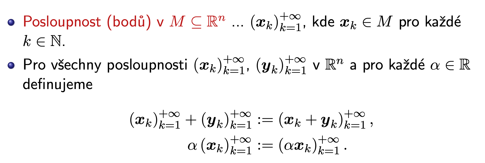

# MA2

Status: Done

# Requirements

Funkce více proměnných. Mocninné řady. Dvojný a trojný integrál. B0B01MA2 (Webové
stránky předmětu)

• Derivace ve směru, parciálnı́ derivace a diferenciál funkce. Gradient a jeho geometrický
význam (směr největšı́ho spádu a kolmost na hladiny konstantnosti).

• Lokálnı́a globálnı́extrémy funkce. Aplikace diferenciálnı́ho počtu na hledánı́extrémů. Vázané
extrémy a metoda Lagrangeových multiplikátorů.

• Mocninná řada. Poloměr konvergence mocninné řady. Derivovánı́ a integrovánı́ mocninné
řady člen po členu. Geometrická řada a jejı́ součet. Rozvoj exponenciálnı́ funkce do mocninné řady.

• Polárnı́, válcové a sférické souřadnice. Jejich využitı́ na výpočet integrálů

# Mnoziny v $\mathbb{R}^n$

## Posloupnost bodu

Konvergentni = existuje limitni bod, divergentni otherwise

Konverguje prave tehdy, konverguje-li po slozkach

## Okoli bodu

Koule o prumeru $\epsilon$ v n dimenzich

Prstencove = chybi stred

## Casti mnozin

Vnitrek = otevrena mnozina, kazdy bod ma okoli ktere se cele vejde do M

Vnejsek = kazdy bod ma okoli ktere nezasahuje do M

Hranice = kazde okoli kazdeho bodu zasahuje to vnitrku a vnejsku zaroven

# Funkce vice promennych

## Definice

## Limita

Pro kazde epsilon existuje delta takove, ze pokud x patri do prstencoveho delta okoli bodu a, pak f(x) spadne do epsilon okoli bodu L

Ostatni vlastnosti plati stejne jako v MA1

## Spojitost

Ukazujeme rozepsanim spojitosti obou funkci samostatne a vyuzitim spojitosti po slozkach

# Smerove a parcialni derivace

## Smerova derivace

Myslenka: v definicnim oboru vybereme smer, podle ktereho se budeme posouvat a vysetrovat rust funkce jedne promenne → dostavame smerovou derivaci.

Bod musi byt vnitrni nebo nalezet do otevrene mnoziny, abychom meli okoli!

### Aritmetika smerove derivace

### Smerove derivaci vyssich radu

### Homogenita ve smeru

Ukazeme cachrovanim s limitou

## Parcialni derivace

Jednoduse: ve smeru kanonicke baze prostoru. Prakticky pocitame jako derivace pouze v te jedne promenne

### Parcialni derivace vyssich radu

Specialne pro derivace druheho radu plati Schwarzova veta

## Diferencial

Linearni zobrazeni dobre aproximujici puvodni funkci na okoli bodu a

Existuje = funkce je diferencovatelna

Ukazuj z limity a protlac linearitu pres diferencial

### Diferencial spojite funkce

## Gradient a geometrie

Plyne z vlastnosti dot productu.

Tayloruv polynom prvniho radu.

## Derivace a gradient slozeneho zobrazeni

## Hessova matice

Matice druhych derivaci

Je to realna symetricka matice, dle definitnosti ziskavame chovani funkce v tomto bode viz extremy.

## Tayloruv polynom

# Extremy funkci vice promennych

## Extremy na mnozine

bod lokalniho extremu ⇒ stacionarni bod funkce (gradient 0)

Jak urcit definitnost? Pokud jsou hlavni minory matice kladne, je PD, pokud se stridaji znamenka a prvni je zaporne, je ND. Jinak je indefinitni. Take zname jako sylvestrovo kriterium

## Lagrangeovy multiplikatory

Pokud gradienty nejsou nezavisle, nedokazeme vyresit. Znamena to, ze bod neni pro vazebni podminky regularni. Pokud tyto body umime najit, musime je vysetrit manualne (vyhodnotit v nich funkci).

# Posloupnosti funkci a rady

## Posloupnosti funkci

### Kovergence

Pro kazde x z M konverguje posloupnost funkci k nejake funkci v nekonecnu. Nejsou svazane konvergence jednotlivych hodnot.

Bodova konvergence zachovava:

- soucty, rozdil, nasobeni, mocneni
- lichost, periodicita, neklesajici, nerostouci, konstantni

Ale nezachovava:

- prostotu, diferencovatelnou spojitost
- integraly

Prikad:

### Uniformni konvergence

Alternativne $\forall \epsilon > 0 \exists N: \forall k>N: \forall x \in M: \left| f_k(x)-f(x)\right| < \epsilon$, tedy pro libovolnou presnost epsilon naleznu k, od ktereho vsechny cleny posloupnosti maji odchylku nejvice epsilon, tedy naleznu bod, od ktereho vsechny funkce konverguji stejne rychle. 

Priklad 

Pro epsilon napr. 0.5 najdeme x, kde to bude vzdy horsi ($x \to 1)$.

### Uniformni konvergence a spojitost

### Zamena integralu

## Rady funkci

Rada = nekonecny soucet funkci 

### Derivace a integral

Integral: funkce jsou stejnomerne konvergentni → soucet zachovava → pravidlo o vnoreni integralu do castecnych souctu, kazdy castecny soucet je konecny soucet prvku posloupnosti funkci

### Kriterium konvergence

~~Postup~~

1. ~~Vypocteme limitu bodove konvergence (zkusim jestli vubec ma sanci)~~
2. ~~pomoci nejakeho kriteria evaluujeme interval absolutni konvergence~~
3. ~~Odhadnu ze shora posloupnosti hodnot podle Weiserstrassova kriteria~~

## Mocninne rady

Konverguje ve stredu $x_o$ se souctem $a_0$

### Polomer konvergence

Polomer konvergence: nejvetsi abs. rozdil stredu a x, pro ktery rada stale konverguje, tj. jeji soucet je konecny

### Kriteria

Postup

1. Nemusim resit bodovou konvergenci (pro mocninnou R vzdy existuje) (faktorial - podil, exponent s k - odmocnina)
2. Evaluuju kriterium (abs)
3. Urcim interval x kde kriterium < 1

### Uniformni konvergence

### Derivace

Lze vnorit derivaci do uniformne konvergentni rady → dle predchozi vety mame uniformni konvergenci uvnitr delta-intervalu → muzeme na nem derivovat

### Integrace

Stejne vnoreni integralu to uniformne konvergentni rady

### Rozvoj funkce

Proste nekonecny taylor

Chceme rozvinout funkci v bode, a najit interval, ve kterem skutecne konverguje k puvodni funkci.

Rozvoj exponencialy:

1. Ukazeme existenci: kazda derivace je rovna $e^x \leq e^{x_0+r}$ na vysetrovanem intervalu, tedy je omezena, tim padem rozvoj existuje a konverguje pro vsechna x
2. Vyplati se funkci rozvinout v $x=0$, tim prijdeme o cleny navic a exponencialu
3. Muzeme substituovat za x $-x^2$ a vyresit tim gausse

# Integralni pocet

## Myslenka

Tvorime horni a dolni integralni soucty na obdelniku/n-dimenzionalni krabici → definicnim oboru integrovane funkce.

Horni a dolni integralni soucin nam udava objemy kvadru vytycenych minimem a maximem funkce na danem subobdelniku. Postup zjemnovanim deleni dostaneme rovnost infima a suprema stejne jako v MA1/

## Fubiniho veta

Dvojny integral na obdelniku lze pocitat jako 2 1D integraly. Muzeme reparametrizovat integraly vzajemne

## Veta o substituci

Tedy pri substituci prenasobujeme substituovanou funkci determinantem jakobianu v abs hodnote, ten popisuje absolutni bodovou zmenu objemu zobrazeni phi, pro velmi male objemy je to linearni → jakobian good enough.

### Polarni souradnice

Idealni kdyz mame nejaky kvadraticky utvar ve 2d - kruh, valec (vysku resime samostatne)

Mezikruzi

### Valcove souradnice

Polarni + plus vyska, nezmeni nam jakobian

### Sfericke souradnice

Sfericka telesa

## Krivkovy integral

### Oblouk

### Krivka

Pouze dve orientace, kladna a zaporna.

Pokud ji obchazime proti smeru hodinovych rucicek (ve smeru kladne rotace v $\mathbb{R}^n$), je kladne orientovana, jinak zaporne.

### Krivkovy integral 1. druhu

Nezavisi na parametrizaci. Pro delku integruju 1 (jenom velikost derivace).

### Krivkovy integral 2. druhu

Zalezi na smeru, kterym prochazime krivku (menime znamenko).

### Oblast

Take zvana souvislou mnozinou

### Greenova veta

Napr. integral vektoroveho pole na kruhu staci udelat integraci na kruznici okolo.

### Potencial

Pouze primitivni funkce spojiteho diferencovatelneho pole → potencial je skalarni funkce. Lze najit resenim soustavy PDE.

Na souvisle mnozine je potencialni pole konzervativni, a pro konvervativni pole nezavisi integral na krivce.

## Plosny integral

### Plocha

### Plosny integral 1. druhu

### Orientovana plocha

Pomoci normalovych vektoru co koukaji ven nebo dovnitr

Standardni plocha je definovana stejne jako neorientovana, pouze pribyvaji castecne orientace podploch

### Plosny integral 2.druhu

Normala = smer lokalne kolmy na gradienty zobrazeni

### Gaussova veta

Integral vektoroveho pole na plose je roven integralu jeho divergence v objemu ohranicenem plochou.

### Stokesova veta

### Pomucky

