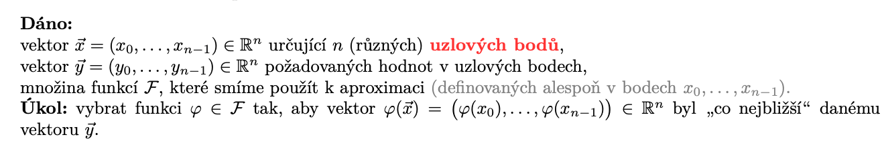

# NUM

Status: Done

## Requirements

Aproximace funkcí. Chyby numerických výpočtů, řešení rovnic a výpočtu integrálů. 

• Zdroje chyb numerických algoritmů.

• Aproximace funkcí: interpolace polynomy a spliny, metoda nejmenších čtverců. Volba aproximační metody.

• Numerické metody řešení (jedné) nelineární rovnice, problematika separace kořenů.

• Numerické řešení soustav lineárních rovnic, možné problémy, argumenty pro použití finitních
nebo iteračních metod.

• Numerická integrace - princip, možné problémy, volba metody, problematika odhadu chyb.

# Chyby numerickych algoritmu

1. Omezena presnost vypoctu na pocitaci, floating point cisla. Pro celociselne typy existuji fixni rozsahy, pokud bychom z tohoto rozsahu v nektere casti algoritmu utekli, dostaneme spatny vysledek. Floating point cisla trpi nebezpecim pri scitani a odcitani cisel s podobnymi rady, kdy nebude stacit dynamicky rozsah. Pri scitani silne odlisnych cisel (velke a male), hrozi, ze male podtece a nedojde ke zmene. Pri nasobeni a deleni hrozi underflow/overflow, tedy NaN a inf. 
2. Nepresnost koeficientu, spatna podminenost napr. matic linearnich soustav. Akumuluje se diky floating-point aritmetice.
3. Chyby metody, napr. obdelinkova integrace sinu(100x) pri velke delce intervalu muze mit obrovske chyby. 

# Aproximace Funkci

Obecne, muzeme k aproximaci pouzit linearni obal nejake omezene mnoziny aproximacnich funkci

Pro jednoduchost a komfort muzeme evaluovat vsechny funkce ve vsech bodech (matice n x k) a dostat tim vektorovou ulohu linearni v koeficientech

## Interpolace

V tomto pripade chceme presnou shodu v uzlovych bodech, tedy vysledek nasi aproximacni funkce musi byt roven cilove hodnote v kazdem bode.

### Prosta interpolace

Reseni soustavy linearnich rovnic

Muze byt tezke, nemusi mit prave jedno reseni, radove n^3

### Interpolace polynomem

Interpolujeme polynomem stupne < n, tedy n koeficientu (stupnu volnosti)

Ma vyhodne vlastnosti pro vypocet (nasobeni, scitani) a dobre se derivuje/integruje

Pro kazde epsilon existuje epsilon-dobra aproximace spojite funkce

Nejjednodussi zpusob, interpolace mezi po sobe jdoucimi dvojicemi po castech linearni funkci:

Dale existuje tzv. Lagrangeova metoda

Tzn. dostaveme polynom, pro ktery jsou vsechny ostatni hodnoty x_j, j ≠ i koreny, a je stupne (n-1)

Vysledny interpolacni polynom je linearni kombinace techto polynomu, pricemz koeficienty jsou primo pozadovane hodnoty v danych bodech

Newtonova metoda:

Vezmeme polynom, ktery ma spravnou hodnotu v prvnim bode (konstantni), a postupne ho opravujeme polynomy tak, aby vsechny nasledujici polynomy mely koren v predchozich bodech a tim padem neovlinily jiz hotove interpolace

Nevilluv algoritmus: nekonstruujeme polynom, pouze spocitame hodnotu v bode postupnym prokladanim konstantami. Potom rekurentne pocitame mezi dvema, mezi trema atd.

Chyba interpolace polynomem:

Mimo uzlove body (v nich je 0).

N-ta derivace v danem bode (zbytek v lagrangeove tvaru)

Cebysevovy Polynomy:

Vyhodne pokud si muzeme zvolit jak rozlozit body, pripadne davaji cosinove rozdeleni bodu 

Hermituv polynom:

Chceme interpolovat s rovnosti hodnot derivaci v danych bodech

Budeme sestrojovat polynomy po slozkach, jako u Lagrangeovy metody, jednak pro funkcni hodnoty a jednak pro derivace:

Nulove hodnoty derivaci urcime tim, ze tam polynom musi mit dvojnasobny koren

Vysledek je pak opet soucet prenasobeny cilovymi hodnotami.

Taylorova rada:

Hermituv polynom s jednim uzlovym bodem

### Interpolace splinou

Po castech polynomialni funkce

Linearni spline: po castech linearni funkce

Kubicky spline:

Jednotlive polynomy najdeme stejne jako u hermitova polynomu na <0,1>, nejdrive s predpokladem znalosti derivaci. Pak polynomy linearne transformujeme na jednotlive podintervaly xi, xi+1.

U jednotlivych polynomu urcime hodnoty druhych derivaci

Protoze ze spojitosti derivaci plyne rovnost v navazujicich bodech, dostaneme z rovnice pro druhou derivaci soustavu n-2 linearnich rovnich o n neznamych

zbyvajici parametry zvolime napr. 0 a vyresime soustavu

### Nejmensi Ctverce

Zde jedina modifikace, ze cilove hodnoty pozadujeme, ale nevynucejeme rovnost (priblizne reseni). Jinak zname zbytek.

Minimalizujeme kvadraty chyb ve funkcnich hodnotach. Muzeme vahovat podle dulezitosti bodu. Kriterium L1 a L-nekonecno normy vede na LP.

Muzeme aproximovat napr. radou goniometrickych funkci (fourierova rada) - goniometricky polynom → soucet sin, cos pro nejaky rozsah frekvenci → umime skladat libovolnou fazi i frekvenci

Lepe pomoci FFT

### Richardsonova Extrapolace

Chceme zvolit krok metody, napr. vzdalenost generovanych bodu. Kdyz je moc vysoka, metoda ma velke chyby. Nechceme moc dat, aby se to nepocitalo dlouho. Zkusme spocitat zavislost chyby na kroku

Najdeme tayloruv rozvoj f v 0

Nizsi termy pryc protoze jsou mensi nez rad metody.

Mame f v nejakych nenulovych bodech

Tedy: vezmu chybu pro nejake h, a pro mensi (napr polovicni) h/q. Z chyb v techto bodech odhadnu chybu pro nulovy krok (dane metody). 

# Numericka Integrace

## Nestandardni postupy

### Aproximace a integrace

### Monte Carlo

## Newton-Cotesovy Vzorce

Zjednodusime ulohu a budeme predpokladat, ze vsechny subintervaly maji stejnou delku

Uvahu udelame tak, ze na kazdy subinterval budeme mit linearni transformaci z <0,1>

### Leve/Prave obdelniky

Berou hodnotu funkce na zacatku intervalu krat sirka (obdelnik z leveho kraje)

Vaha 1 na levy nebo pravy bod intervalu

### Stredove obdelniky

Hodnota funkce ze stredu intervalu <0,1> v kazdem subintervalu

Vaha 1 na bod 0.5

### Lichobeznikova metoda

Obsah lichobeznika tvoreneho hodnotami funkce v krajnim bode intervalu, vaha 1/2 na levy a pravy bod.

### Simpsonova metoda

Prolozime kraje a prostredek intervalu kvadratickym polynomem

Touto soustavu zarucime, ze dokazeme s nulovou chybou integrovat polynomialni funkce stupne 2 a nizsiho.

## Odhad chyby

Pro lichobeznikovou metodu - gj skutecna, phij aproximace, pouzijeme chybu interpolace polynomem

## Rad metody integrace

## Gaussova metoda

Rad metody je 2s

## Richardsonova Extrapolace v integraci

Muzeme zlepsit odhad - odhadneme hodnotu integracni metody pro nulovy krok a pouzijeme to jaky lepsi vysledek/odhad chyby.

Pro vhodne metody lze propagovat az do vah bodu (musime vynulovat/zahodit body pro vyssi h)

## Rombergova metoda

Vezmeme lichobeznikovou metodu, postupne zjemnujeme intervaly a pomoci richardsonovy extrapolace zlepsujeme odhady

## Triky

Kdyz je moc tezky integral, muzeme udelat substituci

Kdyz je nekonecna mez (napriklad v pravdepodobnosti), muzeme odhadnout, kde bude chyba jiz zanedbatelna, a integrovat pouze na omezenem intervalu

Pripadne muzeme pricist znamy integral, pouzit chytre identity (hlavne pro nekonecna/rychle menici se funkce kolem 0 apod).

# Soustavy nelinearnich rovnic

V krajnich bodech musi mit funkce opacna znamenka. 

Separaci korenu musime udelat rucne.

## Bisekce

Beru pulku intervalu, jdu tam, kde budu mit stale opacna znamenka

Konverguje stejne rychle

## Regula Falsi

Rozdelime interval hledani v pomeru abs. hodnot funkce a nastavime delici bod jako koren secny.

Podminka zmeny mezi stejna jako bisekce.

Konci pokud absolutni funkcni hodnota v x_i je mensi nez nejaky prah.

Modifikace do metody secen: pouzivaji se dva posledni spocitane body

## Odhad Chyby

## Newtonova metoda

Linearizujeme funkci v bode x_i a spocitame koren tohoto polynomu prvniho stupne.

Prvni derivace musi existovat, pozor na deleni nulou. Ukoncovat muzeme hodnotou funkce i zmenou x.

## Rychlost konvergence

## Kombinace metod

## Metoda proste iterace (MPI)

X je pevny bod funkce phi.

funkcni hodnoty se priblizuji rychleji nez se priblizuji argumenty. Postacujici podminka pro kontraktivitu: kdyz q < 1

Prave jedno reseni na uzavrenem intervalu!

Muzeme upravit tak, aby q bylo male a metoda rychle konvergovala:

## Nasobne koreny

Koren sude nasobnosti - funkce nemeni znamenko, nelze pouzit metody ktere na tom zavisi

Muzeme newtona.

Muzeme hledat koreny derivace. Derivace tam ma lichy koren (stacionarni bod).

# Soustavy Linearnich Rovnic

Cramerovo pravidlo: moc slozite na vypocet a hrozni numerice chyby

Muzou byt sparse nebo dense, my resime spis dense.

## Podminenost

Podminenost: matice ma male prvky→inverze ma velke prvky a reziduum je male i pro znacne jine x, obracene se zase spatne detekuje konvergence metody.

Cislo podminenosti

Pro libovolnou maticovou normu.

## Prime metody

### GEM

Provadime radkove upravy na horni trojuhelnikovou matici

Vybirame prvek s co nejvetsi absolutni hodnotou jako pivot, abychom nedelili malym cislem a nemeli numericke chyby. Lze vybirat vsude, v radku nebo ve sloupci. Pozor na permutace rovnic a promennych

Gauss-Jordan: Eliminujeme i prvky pod diagonalou

### LU rozklad

Slozme elementarni radkove upravy GEMu do matice:

Upravime soustavu

Spodni soustavu vyresime okamzite zpetnou substituci a dosadime nahoru.

## Inverzni matice

Udelame z toho soustavu

## Determinant

Jako na papire, pomuzeme si LU rozkladem (L ma jednotkovou diagonalu).

## Vlastni cisla

QR rozklad nebo pro male matice pomoci charakteristickeho polynomu.

## Opravy

Muzeme iterovat resenim soustav s rezidui.

## Iteracni metody

### Vektorova Norma

Je to konvexni funkce (trojuhelnikova nerovnost!)

Konvergence posloupnosti vektoru

### Maticova Norma

Motivace: nechceme aby maly vektor nasobeny malou matici dal velky vysledek

Ke kazde vektorove norme existuje souhlasna maticova norma, tzv. indukovana vektorovou normou (operatorova norma)

Indukovana norma je nejmensi souhlasnou normou

Priklady indukovanych norem:

p = 1 

Jednotkova koule: konv. obal bazovych a -bazovych

p = inf

Jednotkova koule: krabice

Frobeniova norma neni indukovana eukleidovskou, ale je s ni souhlasna

### Konvergence posloupnosti matic

### Konvergence matice

### Spektralni polomer matice

Nejvetsi vlastni cislo (abs hodnota)

### Konvergence Iteracni Metody

### Jacobiho Iteracni Metoda

Rozlozime matici soustavy $\mathbf{A}$ na $\mathbf{D} + \mathbf{L} + \mathbf{U}$, kde D je diagonalni, L ostre spodni trojuhelnikova a U ostre horni trojuhelnikova

ostre = nuly na diagonale

### Gauss-Seidelova Metoda

Recyklujeme uz predem vypoctenou slozku v dalsich vypoctech

### Vztah JIM a GSM

Pokud JIM i GSM konverguji, GSM konverguje rychleji

Pro ostre diagonalne dominanti matici (abs hodnoty v radcich jsou vzdy nejvyssi na diagonale) konverguji obe.

GSM konverguje pro sym. pos. def. matice. (nejmensi ctverce)

### Relaxace

Relaxacni metody k matici prictou puvodni soustavu pro zmenseni spektralniho polomeru

Konvexni kombinace stareho a noveho reseni

## Jak resit ulohy

