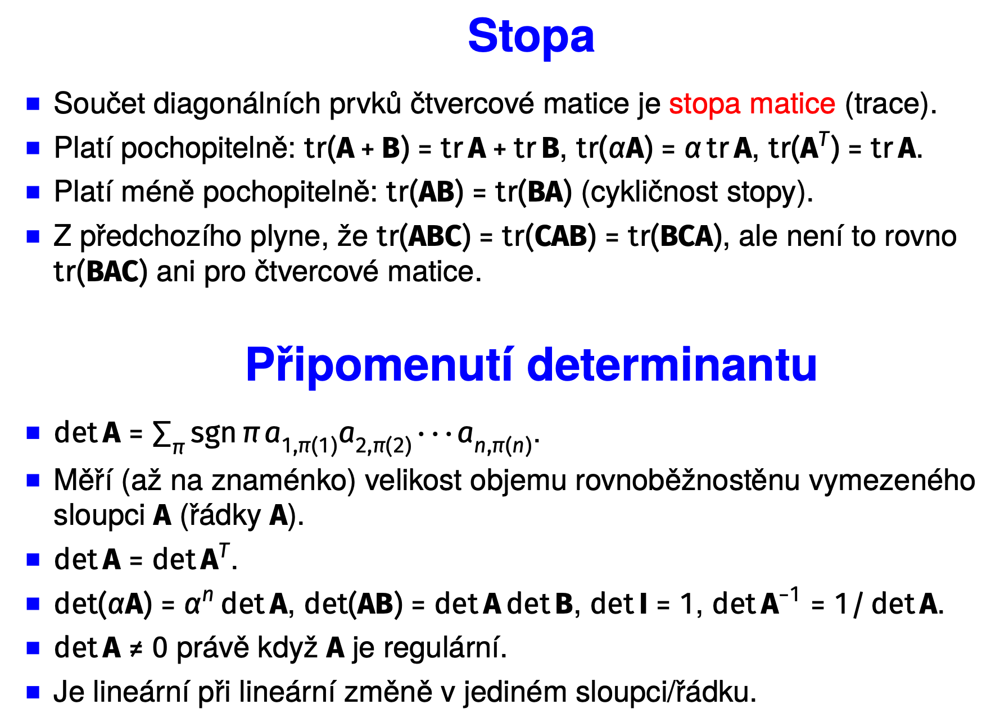

# OPT

Status: Done

## Requirements

Použití lineární algebry v optimalizaci. Iterační algoritmy na volné lokální extrémy. Lineární programování. Konvexní množiny a funkce, konvexní úlohy. Dualita. 

• Přibližné řešení lineární soustavy ve smyslu nejmenších čtverců, normální rovnice. Ortogonální projekce na podprostor a její matice (ortogonální projektor), vzdálenost bodu od
podprostoru. Řešení nedourčené lineární soustavy s nejmenší normou. Pseudoinverze.

• Vlastní čísla a vektory reálné symetrické matice, její spektrální rozklad. Kvadratické formy
na Rn: definitnost, diagonalizace spektrálním rozkladem, minima a maxima. Kvadratické funkce na Rn: doplnění na čtverec, minima a maxima.

• Optimální proložení bodů podprostorem (PCA). Nejbližší matice nižší hodnosti (low-rank approximation). Singulární rozklad matice (SVD).

• Globální a lokální extrémy funkce na podmnožině Rn definice, příklady, volné a vázané extrémy.

• Volné lokální extrémy diferencovatelných funkcí: podmínky prvního a druhého řádu, numerické iterační metody (gradientní a Newtonova, Gauss-Newtonova a Levenberg-Marquardtova).

• Lokální extrémy diferencovatelných funkcí vázané rovnostmi: podmínka prvního řádu, pojem Lagrangeovy funkce a Lagrangeových multiplikátorů.

• Úloha lineárního programování (LP): různé tvary úloh LP a jejich převody, typická použití LP,
přibližné řešení přeurčených soustav v 1-normě a max-normě.

• Geometrie LP: konvexní množiny a mnohostěny, extremální body konvexního mnohostěnu.

• Dualita v LP: věta o slabé dualitě, o komplementaritě, věta o silné dualitě.

• Konvexní funkce: definice, podmínka prvního a druhého řádu, epigraf a subkontura. Úloha
konvexní optimalizace.

## Linear Algebra Tricks

## Orthogonal Projection

Proof of the claim: Orthogonal rejection is the smallest possible error → how to compute? → take orthogonal basis of the rngU (columns of U), compute coordinates as $\mathbf{c}_\mathbf{z} = \mathbf{U}^T\mathbf{z}$, then find the vector that lies in the target space as $\mathbf{x} = \mathbf{U} \mathbf{c}_\mathbf{z}$.

## Least Squares

Intuitively: the solution is the projection of b onto the range of A

How does it relate to the orthogonal projection? 

If we the matrix A is not full rank, there is an infinite number of solutions. 

Why should x be orthogonal to NullA? Easy, if we add any vector that is in nullA to x, we are increasing its norm, but it does not affect the correctness of the solution → we can drop all parts that lie in the nullspace → orthogonal to the nullspace → orthogonal to the complement of row space → lies in row space → range of A^T

Applications: image transformation, linear regression, polynomial fitting, 

- Ridge regression - L2 Regularization.
- LASSO - L1 Regularization.

Why does it work? Zero-mean additive IID noise. LS is optimal (Gauss-Markov), corresponds to MLE of additive gaussian noise.

## Eigenvalues, Eigenvectors

### Quadratic Form and Function Extremas

If A is positive-definite, it has a single global minimum at origin. For negative definiteness, it is the single global maximum. If A is PSD/NSD, it can have a direction along which it is constant, this then becomes the global minimum or global maximum. If A is IND, it has a saddle point at the origin, implying no minimum or maximum.

### Quadratic Form Diagonalization

### Cholesky Decomposition

### Square Form

## PCA

Main idea: Given some M-dimensional data, try to find a K-dimensional space such that the projection error on this K-dimensional subspace is the minimal of all subspaces. The K-dimensional space is defined using an orthonormal basis organized in a matrix X.

Equivalently, instead of minimizing the rejection, we can maximize the norm of the orthonormal projection.

Why? Easy, cycle X and then decompose B into the spectral formula.

Instead of a linear space, we can use an affine space.

### Summary

## SVD

### Nearest Lower-Rank Matrix with SVD

## Global and Local Extremes of Functions

### First-Order Extremes Condition

Extremes may be found at stationary points of the function

### Second-Order Extremes Condition

Type of Extreme based on the Hessian Matrix.

## Iterative Methods for Extrema Finding

### Gradient Descent

### Newton’s Method

First, we define the Newton method for solving of systems of equations. This simply tries to find a solution where every LHS is equal to 0. Do this by linearizing the system.

We can use this to find the zero point of the gradient of the criterion (the minimized function).

Function has to be twice differentiable!

Note that this method “simply” rescales the gradient by the inverse of the Hessian - correction for different ascent rates in different directions.

Intuitively makes sense → if the matrix is negative-definite, the function is decreasing at the point in every direction, so the gradient without a sign change points up, hessian rescaling makes it point down, and the negative sign makes it point up again.

### Non-Linear Least Squares

In many cases, we may not be able to find the exact solution of a highly non-linear system of equations. We can still use the idea of least squares.

Solve by locally linearizing the system and solving linear least squares of the linear approximation (1st order Taylor polynomial)

Jacobian must have LIDP columns to ensure regularity, and this matrix is positive-definite.

We can view this from the point of function minimization using Newton’s method.

We can regularize this:

## Lagrangian Multipliers

What kind of problem do we need to solve?

### Idea behind Lagrange Multipliers

Imagine a constraint $y = x^2$, this is a parabolic curve in $\mathbb{R}^2$. In any point of the curve, the tangential vectors lie on a line, so dim = 1 = 2 - 1. At the same time, this is a level curve. If we take the gradient of the function of LHS $(g(\mathbf{x}) = x_2 - x_1^2$), the gradient is orthogonal to the level curve → is orthogonal to the tangential space. The tangential space of $X$ is then a subset of the nullspace of the jacobian (vectors orthogonal to rows of the jacobian - the gradients).

Now consider the span of gradients of all constraints. This is the column range of the jacobian matrix, which is the orthogonal complement to the nullspace of the jacobian. Because the tangential space is a subset of the nullspace of the jacobian (so is smaller or the same), its complement is larger or equal to the column range of the jacobian.

We can view this span of gradients as a space parameterized by some coordinate vector - the lagrange multipliers. 

Simple idea: if the point is a maximum, and the gradient had a non-zero dot product with the tangential space, we could move along the tangential direction to increase/decrease the function → wouldn’t be an extreme.

Hence, the tangential space is orthogonal to both the gradient span of the function and the constraint. 

Combine the matrices in a way that constructs the intersection of the two null spaces.

If the gradient of f can be found as a linear combination of the gradients of the constraint, we can just solve a linear system for the combination coefficients. However, the system must have a solution.

Note the full rank jacobian!

This is gives us the first-order condition for bound extremes

What if the points are not regular?

## Convex Sets

Convex Polyhedron: intersect of linear halfspaces (e.g. a cube in 3D).

### Extremal Points

We can build an algorithm for finding of these points:

### Hyperplanes

## Linear Programming

1. If $a + b \geq 5$, then we can rewrite it as $a + b = 5 + y$ where $y \geq 0$, or $a + b - y = 5$
2. Expand the matrix A as needed for the split variable

### Typical LP problems

Explanation: The maximum is a value larger than all of the terms, so simply minimize one bound on all of the terms simulatenously.

Explanation: again, bound the abs. values by a single new variable.

Here bound every term by its own bound.

### Duality in LP

Intuition: we want to estimate an upper (lower) bound on the value of the criterion. We can achieve that using a linear combination of the constraints. Say that for estimation of this bound, we define a vector of  positive coefficients $y$. For e.g. the upper bound, it will hold that the combination of the constrains will always be larger than the maximized linear function. If we sum and reorder the inequalities, we derive the new constraints, formulated interms of A, y and c. We also obtain the exact form of the dual cost function.

1. Proof:  $c^Tx \geq (y^TA)x = y^T(Ax) \geq y^Tb = b^Ty$
2. Proof: 

Complementary conditions

**profitability/cost interpretation (reduced costs):**

- think of (aty∗)j as the "imputed cost" or "value" of producing one unit of primal variable xj, based on the dual prices. cj is the direct cost of producing one unit of xj.
- if xj∗>0, it means you're producing a positive amount of variable j. why would you do that? only if it's "profitable" or "cost-neutral" at the margin. so, its direct cost cj must exactly equal its imputed cost (aty∗)j. if cj<(aty∗)j, you'd want to produce infinitely more of xj (not optimal). if cj>(aty∗)j, you'd immediately stop producing xj. hence, cj−(aty∗)j=0.
- if cj−(aty∗)j>0, it means the direct cost cj is greater than its imputed value (aty∗)j. this variable xj is "unprofitable" to produce at its current cost structure. therefore, you shouldn't produce any of it, so xj∗ must be zero.

### Strong Duality

## Convex Functions

### Some Common Convex Functions

- p-norms
- exponential
- xlogx
- softmax
- quadratic form
- linear function (convex/concave)

### Quadratic Programming

## Non-Convex Problems

