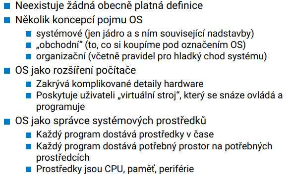

# OSY

Status: Done

## Requirements

Operační systémy a jejich architektury. Systémová volání, vlákna, procesy. Správa virtuální
a fyzické paměti, souborové systémy. Bezpečnost, virtualizace.

• Systémová volání - jak je implementována ochrana paměti jádra, jak se předávají parametry
a data ze systémových volání, rozdíl mezi mikro jádrem a monolitickým jádrem.

• Vlákna, procesy - jak se vytvoří proces, jak lze předat data mezi procesy. Jaký je rozdíl mezi
vlákny a procesy, která data sdílejí různá vlákna jednoho procesu (registry, zásobník, lokální
proměnné, globální proměnné, dynamicky alokované proměnné)

• Synchronizace vláken - jaké jsou problémy při paralelním přístupu ke sdíleným datům, jaké
existují synchronizační prostředky, co je to deadlock, kdy může nastat a lze se deadlocku
vyhnout.

• Správa virtuální a fyzické paměti - co je a jak vypadá stránkovací tabulka, jaké jsou zásadní
nevýhody stránkování, TLB-translation-lookaside-buffer, více úrovňové stránkování v 32-
bitovém a 64-bitovém systému, odkládání stránek na disk, algoritmy výberu oběti, metoda
copy-on-write.

• Souborové systémy - jaké typy souborových systémů znáte, který je vhodný pro sekvenční
čtený a který pro náhodné čtení souborů. Vysvětlete základní souborové systémy: FAT, systémy založené na inodech a systémy založené na extendech. Žurnálování, základní princip,
kdy mohou vzniknout v souborovém systému chyby, jaké jsou úrovně žurnálování a jeho
nevýhody.

• Bezpečnost - co je Trusted Computing Base, základní metody řízení přístupu, jak se provádí
útok na přetečení zásobníku, jak se lze takovémuto útoku bránit.

• Virtualizace - Softwarová virtualizace, metoda trap-and-emulate, virtualizace systémového
volání, virtualizace stránkovacích tabulek, hardwarově asistovaná virtualizace.

## Operating system basics

OS has some main functions

- Start and watch user programs
- Proper HW utilization
- Make the usage of a computer easier

### Real-Time Systems

Embedded, time-critical applications (robotics, monitor, scientific instrument)

Multiprocessing implement using Time Sharing Systems.

### x86 architecture - status register

### Super important, different privilege levels!

### Some main registers

### Interrupt handling

### OS components

### Kernel

## System Calls

Processors have 2 operation modes, system and user. User mode cannot execute all (privileged) instructions. To switch between these modes, an interrupt is being used (syscall, sysenter).

Upon the interrupt, the handler operates in system mode and can perform privileged operations.

After boot, this is the only way to access the kernel from the userspace.

### ABI

Application Binary Interface Defines how a user program interacts with the system on machine code level

For 32bit x86:

### API

Application Programming Interface is a more comfortable way to call OS services through high-level languages. API specifies this on source-code level.

How does a system call through an API work?

UNIX API

- Simple
- Introduced C
- Linux, BSD
- Everything is a file
- open, read, write, ioctl, close
- OS Services: file manipulation (above), directory management (mkdir, link), process management (fork)

WINDOWS API

- Not fully documented, hidden syscalls only available to some
- Dynamic

## Processes

A process - a running program with its state. Identified by PID.

It is very important to know what does “process” encompass:

- Register content of the processor (SP, PC, FLAGS, user registers etc)
- Used files/sockets/etc.
- Memory (stack, data, program)
- Can wrap its individual threads

The OS allows processes to spawn/fork other processes.

Different processes need to be scheduled in some fair way that also maximizes usage of the HW, minimize latencies perceived by the processes.

It should also provide means for interprocess communication.

At the end, there must be a way for a process to end cleanly and release its resources.

### Process Initialization

### Process Management Syscalls

### Zombie Processes

If a child process terminates while the parent is still running, it cannot be cleanly deallocated as it must report its result (return value) back to the parent. Until the parent requests this result, the child process must be kept in memory.

### Fork Bomb

Uncontrollably branching processes overload the system

### Process Termination

## Threads

Is it important to distinguish between a program, a process and a thread.

Program: Binary data with a predefined format describing instructions, data, initialization constants.

Process: A running program with its state (see above).

Thread: Sequence of instruction executed by the processor, shared memory space with other threads, private registers.

Threads are objects contained within a process, usually one thread per process. The execution of threads is scheduled (across time and hardware). TCB (thread control block) defines the thread.

Data is shared between multiple threads of a single process, e.g. global variables, files, etc. Be careful with data races!

Why do we need threads?

### Implementation

User level: OS takes care only about processes, threads live only in the user program with scheduling managed by the library. Thread waiting blocks all other threads. Not used in practice.

OS level: Kernel manages threads, and is able to schedule them for truly parallel execution.

However, OS level threads may suffer from high overhead during switching. More difficult to fairly schedule.

### Pthreads

POSIX-bound threading library. Uses OS-level threads if they’re available, and user level otherwise. Linux threads are called tasks.

### Java

Java threads are true OS level threads, executed as threads of the JVM, so OS if possible.

## Programs

First, we write the source code in the respective programming language, then we either compile it or run with an interpreter (or use a hybrid approach).

### Interpreted programs

### Compiled Programs

Compiler must understand the source code, be able to detect errors, and convert it into a suitable representation. Often times, the compiler will identify known patterns and redundant operations and optimize the code for better performance. Depends on the exact target architecture. We would like also to get an optional assembler version of our program.

The C compiler performs the following:

Lexical analysis: convert text strings into tokens

Syntactical analysis: Use a context-free grammar to to split the expressions (BNF description).

Intermediate representation: three address code: opnd1 op opnd2

Then optimization

Finally, the target code is generated: assembler, binary machine code, object module, java bytecode

### Binary Object Module

Has distinct sections with different purposes

Text: program instructions

Data: memory allocation

BSS: uninitialized global and static variable

The rest is format-dependent, which depends on the OS.

Linux (and many POSIX systems) uses ELF (executable and linkable format). macOS uses mach-o.

Local symbols are suppressed in object modules, instead replaced by addresses.

Global symbols may be either exported (libraries) or imported (from other libraries).

### Static Libraries

### Dynamic Libraries

Are not part of the resulting binary object file. The extern symbols are resolved at runtime. Instead, their code is replaced by stubs that call the OS and request the library code (the OS handles loading of the library if not present in memory).

PIC = position independent code, can be placed relatively in memory, all addressing is done by offsets or by determining the current address. Better security.

DLL = Library at the same address available for all processes, can be relocated, Windows

### Program Loader

In POSIX - execve handler

## Process and Thread Scheduling

Processes go through a series of states during their lifetime.

### Process Switching

Happens based on interrupts or exceptions

Important step: context switching

Lets follow a switch from P1 to P2

1. Freeze the state of P1 in a PCB (Process control block)
2. Select P2 as a replacement
3. Pop registers from the PCB of P2, set return address and return from interrupt handler

Context switch is expensive, nothing else executes. Need to take care of memory (save registers).

### Process Control Block

### Process Scheduling

Multiple queues depending on what is a given process waiting for.

There are multiple schedulers, to cover all decision aspects of process switching. They are split into 3 levels: short term, mid term and long term.

Short term: Scheduling across CPUs, must be fast

Mid term: Collaborates with memory management, takes care of memory allocation and deallocation when switching processes

Long term: E.g. update scheduling, not used much

Swap: waiting process get sent to the long-term memory if not needed or out of main memory

### Thread States

Threads are a bit simpler, they share a common address space of the whole process. Cannot be swapped on their own, are terminated at once with the process.

### Process Dispatcher

Works only with processes loaded in main memory and ready to run.

2 main approaches:

### Planning Criteria

### Scheduler Types

- FCFS: FIFO, convoy effect, non-preemptive
- SPN: In terms of waiting time it is optimal, but is biased towards short processes, long processes may not get enough execution time
- SRT: Preemptive SPN modification, processes with the shortest estimated time till end will be (forcibly) reinstated. Needs an arbitration rule.

It is necessary to somehow estimate the time statistics, e.g. by averaging the process’ execution history

### Priority Planning

Every process is tagged with a priority ID and planning is performed with this ID in mind. Preemptive and non-preemptive.

Suffers from balancing problems:

### Round-Robin

Preemptive, each process gets a small time quanta for execution. When quanta for a process ends, it is switched with the longest-waiting process (circular queue). Maximum waiting period is q\*(n-1) where q is time quanta and n is the number of processes. Needs to be balanced for overhead and responsiveness.

### Feedback Planning

### Realistic Linux Scheduling

## Synchronization

When accessing the same memory location from multiple threads or processes, we could cause an inconsistency by concurrently reading/writing.

When we have a multilevel cache, it further becomes more complicated.

### Critical Section

We generalize the access to any shared resource into the critical section

There are some conditions on the critical section that we require in order for each process to perform its other tasks.

- Mutual Exclusion: at any moment, there may be at most 1 process changing data in the critical section.
- Progress: If a process requires a shared resource, and no other process requires this resource, then we must allow entry to the critical section is finite time.
- Fairness: Wait for entry into a critical section must be finite, and there must be a bound on the number of entries into CS between request is dispatched and granted.

### Solution to the problem of a Critical Section

Peterson Algorithm

Needs to apply a barrier instruction to ensure cache consistency.

There are some hardware-accelerated solutions:

### Semaphore

Implemented on the OS level to avoid busy waiting.

### Mutex

A binary semaphore, lock/unlock.

### Monitor

### Spin Lock

Busy-waiting semaphore for high-speed applications. Avoids syscall overhead.

## Deadlocks

Dining philosophers!

Deadlock describes a situation where threads get stuck when waiting for a resource.

### Coffman Conditions

Necessary conditions for a deadlock to occur.

How can we solve it?

We can break some of the coffman conditions, e.g. by not using shared resources (hard to do), or eliminating the Hold and Wait mechanism (new C++). We could enable preemption, but that is dangerous because a process could have modified it. Decreases throughput. We can remove cyclic requirements, but sometimes its unavoidable.

We need to have some prior info on how will the resources be utilized.

We can do that by requiring the process to declare what will be needed.

### Avoiding deadlock

We can track the resource usage using a resource allocation graph

If the request edge (dashed) turns solid and closes a cycle, we can detect deadlock conditions.

### Banking Algorithm

Processes declare their maximum requirements ahead of time

Banker doesn’t lend money if he can’t satisfy the need of the client

### Deadlock Detection

## Interprocess Communication

### Signals

### Pipes

Special case - named pipes, can be used between arbitrary processes (opened through the pipe name).

### Memory-mapped files

### Shmem

### MSGQ

## Paging

We distinguish 2 address spaces:

- PAP - physical address space, the actual physical RAM
- LAP - logical address space, also called virtual memory, size bounded by the amount of addressing bits

Computers without any memory management: fast access, simple to implement, no OS needed, but no security, HW limitations, microcontrollers, embedded

### Segmentation

Intel 8086 - 16bit cpu data/registers but 20 bit addressing

Split the 20 bit address into encoding of a segment number (16 bits) and offset number (16 bits) that get added together to compute the address.

Still used in some simple modern systems.

Addition of MMU for true segment management.

Advantages:

- Tailored size to the needs of the platform
- It is possible to detect segmentation faults
- The access can be controlled using rules (user program cannot endanger OS)
- Can move the program’s memory around in physical RAM

Disadvantages

- Allocation is difficult (variable size), external fragmentation
- Fast changes in segments are computationally expensive

Segment allocation

### Paging

The addresses of pages are defined using standard bitwise operators

The pages are contained within tables. A table of pages contains the following info:

- Frame number - physical address of the LAP page
- Some signal bits: present, size, access control, cache policy

We can cache the lookups using TLB - Translation Lookaside Buffer

There are some important design considerations when making page tables.

Example of 2-level paging

When process is sleeping or memory is full, we can swap it over to the disk

### Paging Policies

It is important to consider when will we allocate the page frame in the physical memory (fetch policy)

In this case, locality principle also applies.

It is also sensible to copy frames only when they’re being altered (e.g. after forking) - copy on wite.

### Page Replacement

FIFO

Estimate the ideal algorithm from the behaviour statistics collected over some time.

LRU

### Page Assignment

### Thrashing

## Memory Management

Linux on intel 32bit:

### Memory Allocation

There are some important considerations to make the allocation effective.

## Physical Memory Allocation

### Memory Zones

## File System

What is a file system? It is a way to organize files on a hard drive. We save data in named files and files in directories with some hierarchy.

We split the disk into logical partitions. Filesystems usually operate on one logical disk.

### Directories

### Blocks

Typically, files are stored across multiple blocks. We need to keep track using either contiguous blocks, linked lists or some indexing structures.

### FAT file system

File Allocation Table - hybrid between linked lists and index structures. Filesystem info is kept within a FAT table, which have 2 copies for redundancy. Nowadays considered old, latest version is exFAT.

### Index-based Filesystems

Base of UNIX filesystems (ext2-ext4). File metadata, including indices pointing to data blocks are stored within so-called inodes. The data block indices are limited in size, the block that should be accessed is computed from the file size (offset).

Sometimes, the data doesn’t fit into the fixed block count, in which case we need indirect links to blocks containing indices of the data blocks. In general, an N-ary tree.

The physical drive contains a fixed number of inodes (index nodes). The filesystem contains inode tables. A superblock is typically used to store info about the filesystem.

We need an efficient way to keep track of free and used inodes. Use vacancy bitmaps - easy to parallelize, fast, memory efficient.

On some physical media, it is better to keep spatial locality. We can make the above concept smaller, and replicate these smaller versions into groups. Used in ext2-ext4.

Fixed block indexing tables are inefficient for very large files, therefore, the inode can store links (indices) to contiguous ranges of blocks.

### Data Consistency

When writing to the drive, we have to change all of the described structures and keep them coherent. If we lose power in the middle, we could end up with a corrupted FS.

### Journaling

Before a modification starts, it is saved into a dedicated location - the journal. If there is a power loss, the journal is checked for any unsaved/incomplete changes. Also known as forward logging. Used in NTFS, ext3.

EXT3 Journal:

There are potential faults when writing to the journal (power loss). If the saved transaction is incomplete, it is ignored. Otherwise, the operation is performed again. The OS may dispatch barriers to prevent multiple partially-saved transactions in the journal.

Journaling speeds:

### Flash Challenges

## Virtualization

Virtualization has some advantages:

- Isolation of VMs between each other
- HW independence
- Pause/suspend the VM
- Live migration
- templates/containers
- Development of OSes (no crashes)

Helps solve the problem of incomplete/imperfect OS. Instead of adding more abstraction, we can virtualize a different OS.

### Types

### CPU Virtualization

We need to implement a privileged (ring 3) mode of the host using something other than the privileged mode of the hypervisor (to ensure safety and isolation). Both virtual user and privileged mode operate in hypervisor’s user mode → host VM appears as a process.

Trap-and-Emulate Principle

Syscall virtualization

We can emulate either the complete hardware (the whole CPU) or just link the virtual and actual modes.

Okay, now we need to virtualize memory management.

### Hardware-assisted Virtualization

### I/O Virtualization

### Containerization

## Security

Mainly the protection of my interests (computer-related) against enemy attacks

CIA-attributes

Minimum request on the OS to give us for better security:

- Mechanism for building secure systems
- Enforcing user-defined policies

Basics:

### Trusted Computing Base

OS Kernel is part of the TCB

### Access Control

Access Control Lists are parts of all standard OSes. Subjects represented by classes, e.g., owner, group in UNIX.

ACL → Everyone’s rights for given objects, can be used to find the objects

Abilities → Actors receive only the abilities they actually need

### Buffer Overflow

Often a risk in IoT devices

Consider a code that uses the frame point (base pointer). It is convenient for debugging. The base pointer stores the address where the current function frame begins on the stack.

Idea: rewrite the return address of the previous function with our binary.

Catch:

### Return Oriented Programming

We can’t send a whole binary, instead, send addresses (ROP gadgets) that jump to e.g. libc code that calls system functions

There exist ROP compilers (library + program → compiles C source to a sequence of ROP jumps).

### Additional Techniques

## I/O and Drivers

Monolithic Linux Kernel

### Disk R/W

### Disk Arrays

### Networking

Sockets = kernel datastructures with information about a network endpoint, use file descriptors

### Device Drivers

