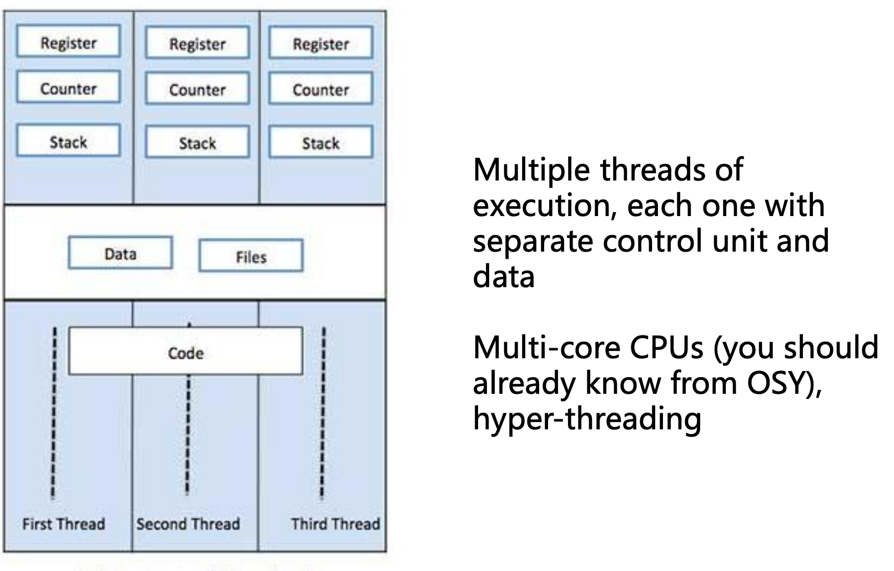

# PDV

Status: Done

# Requirements

Modely a architektury paralelních a distribuovaných systémů; prostředky pro jejich implementaci a základní algoritmy.

### Paralelní systémy/výpočty

- Hardwarová podpora pro paralelní výpočty: (super)skalární architektury, pipelining, spekulativní vyhodnocování, vektorové instrukce, vlákna, procesy, GPGPU. Hierarchie cache pamětí.
- Komplikace v paralelním programování: souběh (race condition), uváznutí (deadlock), iluze sdílení (false sharing).
- Podpora paralelního programování v C a C++: pthreads, thread, jthread, atomic, mutex, lock_guard.
- Podpora paralelního programování v OpenMP: sériově-paralelní model uspořádání vláken (fork-join), paralelizovatelná úloha (task region), různé implementace specifikace. Direktivy parallel, for, section, task, barrier, critical, atomic.
- Techniky dekompozice programu: statické a paralelní rozdělení práce. Threadpool a fronta úkolů. Balancování a závislosti (dependencies).
- Techniky dekompozice programu na příkladech z řazení: quick sort, merge sort.
- Techniky dekompozice programu na příkladech z numerické lineární algebry a strojového učení: násobení matice vektorem, násobení dvou matic, řešení systému lineárních rovnic.

### Distribuované výpočty/systémy

- Úvod do distribuovaných systémů (DS). Charakteristiky DS. Čas a typy selhání v DS.
- Detekce selhání v DS. Detektory selhání a jejich vlastnosti.
- Čas a kauzalita v DS. Uspořádání událostí v DS. Fyzické hodiny a jejich synchronizace. Logické hodiny a jejich synchronizace.
- Globální stav v DS a jeho výpočet. Řez distribuovaného výpočtu. Algoritmus pro distribuovaný globální snapshot. Stabilní vlastnosti DS.
- Vzájemné vyloučení procesů v DS. Algoritmy pro vyloučení procesů a jejich vlastnosti.
- Volba lídra v DS. Algoritmy pro volbu lídra a jejich vlastnosti.
- Konsensus v DS. FLP teorém. Algoritmy pro distribuovaný konsensus.

# Parallel computing

## Motivation

Modern hardware has many cores, can paralellize.

Compilers can’t help.

### Amdahl’s law

$S = \frac{1}{s+\frac{1-s}{P}}$

## Hardware support

### MIMD

Multi-core CPUs

### SIMD

Also instruction-level parallelism (superscalar architectures)

2 approaches - parallelism and concurrency

Parallelism: multiple independent tasks

Concurrency: multiple workers share resources

### Threads

A single computational flow in a program (process), shares memory space with other threads

### Process

A single running program in computer memory, isolated virtual memory space, may have multiple threads

### GPGPU

Use modern GPUs as general parallel processors (ML)

### Cache hierarchy

### Instructions

Atomic instructions: test and set

Compare and swap: performs this operation atomically

2 versions, weak and strong, weak can sometimes be faster

## Challenges

### False sharing

Seemingly separate data live on the same cache line and the processor has to synchronize the cache content on every write

### Data race

Multiple threads try to change the same memory location at once, leads to corruption and unexpected results

### Deadlocks

Multiple threads share lockable resources, lock a part of what they need and then wait for the rest in a cycle

Coffman conditions

- mutual exclusion: lockable resources in critical section
- no preemption: resources cannot be taken away from the process once acquired
- cyclic requests: p1 waits to p2 to release r2, p2 waits for p1 to release r1
- possibility of partial locking: I can lock r1 even when I don’t have r2

# Multithreading in C++

### C++ APIs

We can also use pthread like in C

### thread

standard thread impl

must check joinable, then join

### jthread

RAII - resource acquisition is initialization

autojoining thread when it goes out of scope 

can accept a stop_token for cooperative thread cancellation

### scoped lock

locks a mutex only for the duration of a scope, holds as long as we are in the scope on exit unlocks and is destroyed. 

Explicit deadlock avoidance algorithm, tries to acquire all mutexes at once.

Cannot control it manually, simple to use but not flexible.

### unique lock

locks only a single mutex

ownership transfer

manually controllable (defer, lock, unlock)

conditional locking (try_lock)

compatible with condition variable

### condition variable

requires a mutex and some shared state for implementation

on wait, releases the mutex lock and sleeps the thread

when woken up, acquires mutex/lock and returns

when we check the condition variable whether it is safe to proceed

the owner can call notify_one or notify_all on the condition variable to wake up the consumer threads

# Atomic Operations

## Motivation

This would be a problematic situation, we could get data corruption

## Implementation

It ensures causality between events happening in threads.

# OpenMP

Automatic parallelization of compute-bound programs

A compiler extension for high-performance languages (C/CPP/Fortran)

Using pragmas we can compile the code even without OMP

## Fork-join model

OMP keeps an internal thread pool of workers. If the code encounters a omp-parallel code block, a necessary amount of workers is woken up from the pool and set to execute the task. After execution, they are reserved for next potential regions. This improves efficiency.

First parallel region usually takes longer because of the thread pool init overhead.

OMP allows spin-lock sleeping threads for lower latencies ([https://www.openmp.org/spec-html/5.0/openmpse55.html](https://www.openmp.org/spec-html/5.0/openmpse55.html))

## Sections

### omp parallel

denotes the section where the parallel computation will be performed

### omp for

omp-parallelized for loop

collapse option allows automatic collapsing and parallelization of nested for cycles

### omp section

hints the compiler which code segments can be executed in parallel (one per thread)

### omp atomic

atomic variable

### omp critical

automatically synchronized critical section

### barrier

syncs the threads at that point in the code

parallel, sections, for, single contain implicit barriers

use nowait option to disable implicit barriers

### omp task

sends a task (e.g. a function call) to a different thread, then taskwaits for threads to finish

used in e.g. bfs, dfs, sorting algorithms

## Performance considerations

It is necessary to well specify the data behaviour (what is shared, private etc)

Scheduling adjustments can buy extra performance depending on the workload (static, dynamic, guided)

## Example

# Parallel decomposition

## How to

First we must identify parts that can be parallelized

### Task assignment

We have static assignment

Use when the load is predictable.

If it is very unpredictable, take care of it at runtime

### Work Queue

### Load balancing

### Load stealing

### Mapping to hardware

## Parallelization of sorting

### Bubble sort

Odd-even sort

In first step, compare even with the one higher-up

In second step, compare odd with one higher-up

After each step, swap them if they are not as they should be.

This bubbles them up in pairs

### Quicksort/Divide and Conquer algorithms

After the common serial operations (e.g. pivot transfer) parallelize one branch of the computation on a separate thread (OMP task)

### Merge sort

Besides the above, we can parallelize the merging operation.

Even simpler, run the algorithm bottom up, start by merging every pair in parallel, then 4 etc. getting a parallelization tree

### Bitonic sort

Bitonic sequence: first monotonously increasing, then monotonously decreasing or cyclically rotated (first decreasing, then increasing) - V or A shaped

Parallel merge: 2 sorted sequences, each 2^n

Flip one, obtain a bitonic sequence, then perform parallel min-max operations

min = lower half of all numbers

max = upper half of all numbers

both are bitonic (they have only increasing or decreasing direction)

## Parallelizing Linear Algebra

### Off-the-shelf libraries

LAPACK, BLAS, cuBLAS, NVBLAS

Used in numpy, pytorch

### Matrix-vector multiplication

Naive: row-wise, if rows too large, do it column-wise with temporary variables to avoid false sharing cache synchronization

### Matrix-matrix multiplication

We could use the same as before.

Better: chunk the matrix and multiply in in blocks

### Linear systems

GEM can be parallelized in the pivot part - subtracting from the rows below

Iterative methods can use matrix-matrix multiplication acceleration

GS - graph coloring

# Distributed computing

## Two generals problem

We need a communication channel that ensures reliability

### Potential solution

### Problems in distributed systems

## Distributed systems

### Characteristics

### Challenges

### Types of distributed systems

## Fundamentals

### Failure modes

## Failure detection

### Centralized heartbeat

### Circular heartbeat

### All-to-all heartbeating

## Failure detectors

### SWIM

## Time and causality in distributed systems

We may be dealing with two different clock degradations

We need to synchronize the clocks periodically

### Physical clock synchronization

### Cristian’s algorithm

Synchronizes the global clock

We may only adjust the process’ clock forward otherwise we could break causality and ordering in the process

### Network Time Protocol

Error is limited by the round trip time of the message, but still non-zero

Synchronization of physical clocks is difficult, suitable only for slower systems

How to solve in fast systems?

### Logical clock

Instead of physical timestamps use some logical time markers (incremented values). We just need ordering of type “A happened before B”

### Lamport’s logical clock

Example:

### Problem

### Vector clock

### Conclusion

Lamport’s clock respects but does not guarantee or imply causality

Vector clock implies causality

## Global Snaphost

We need to solve this challenge for logical clock (no absolute global clock available)

All events preceding some event in the snapshot

### Computation of global snapshot

### Chandy-lamport’s algorithm

Useful properties:

- always consistent snapshot (FIFO channel + timestamping)
- detection of stable attributes

## Mutual exclusion

### Model

### Requirements

Critical section - we need to control access

Liveness: the computation must end, each process must gain access to the critical section

Safety: there must be no deadlock or race condition

### Centralized algorithm

The coordinator is a weak link

Low computational load: 2 messages for entry, 1 for exit

Client delay 2 latency, sync 2 latency

### Ring algorithm

Delay up to N communication latencies

Synchronization delay up to N-1 latencies

O(N), not great

### Ricarto-Agrawal Algorithm

Scalar clock causality

Worst case delay: N-1 latencies

Communication delay: 2N-2 for entry, N-1 for exit

Client delay 1 latency

## Consensus

### Requirements

### Perfect systems

### Synchronous systems with failures

Also solvable, perform as many rounds as there can be failed processes to cover the potential deaths. Take minimum value at every step.

### Asynchronous with failures

Cannot be solved, implied by the FLP theorem

### RAFT

Asynchronous system with failures.

Raft uses a leader method

### Log Replication

### Algorithm components:

1. Leader election
2. Standard operation
3. Consistency enforcement
4. Client interaction

### Server states

### Epochs

### Election

All servers start as followers, timeout of the leader heartbeat will trigger an election

### Log structure

### Consistency enforcement

Enforces consistency of the previous log chunk by induction

### New leader log change

### Leader log fix

## Leader election

### Ring algorithm

### Bully algorithm

The proces that first detects leader failure initiates an election against other processes with higher IDs

