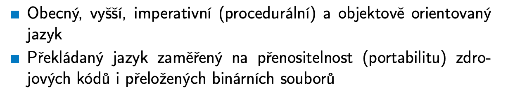

# PJV

Status: Done

## Requirements

Programování v jazyce JAVA: vlastnosti a koncepce jazyka. Principy objektového programování. B0B36PJV (Webové stránky předmětu)

• Vývojové prostředí (JDK), JVM. Kompilace a běh programu. Správa paměti, GC. profilování a
optimalizace.

• Objekty, třídy a jejich vztahy, princip abstrakce a zapouzdření, modifikátory přístupu. Interface
a abstraktní třída. Dědičnost a kompozice, polymorfismus, dynamická vazba.

• Výčtové typy, práce s kolekcemi, vzor iterátor, generické typy.

• Vnitřní a anonymní třídy. Imutabilita, vzor singleton. Proměnné a metody třídy vs. instance.

• Mechanismus výjimek (typy a jejich ošetření, vlastní výjimky), práce se soubory (přístup k
souboru, textové vs. binární, proudy, ukládání dat) a sokety (typy soketů, typy spojení, síťová
komunikace).

• Paralelismus, vícevláknové aplikace, problém souběhu a zastavení. Tvorba vláken a jejich
ukončení, threadpool, synchronizace, volatilita.

## Java Basics

Java is pass by reference!

## OOP

### Class Attributes

### Objects

### Encapsulation

### Instance vs Class

### Access Modifiers

### Constructor

### Immutable Objects

### Polymorphism

Simply put - we have a method with the same name, but the underlying implementation for each class differs.

### Inheritance

### Composition

### Derived Classes

### Abstract Classes and Interfaces

### Single Dispatch

Calling the correct method implemented for the runtime type of an object.

### Double Dispatch

### Method Overloading Vs Overriding

## Data Types

### Primitives

Same as C

### Objects

Duals of the primitives with some convenience methods.

### Enums

## Collections

### Java Collection Framework

Some advantages of JFC

### Iterators

It is important to consider what will happen with the underlying data when using an iterator some collection:

### Collection Interface

### Set

### List

Exact implementations: ArrayList (hash-table based), LinkedList, Vector (thread safe)

### Map

## Generic Types

Type checking and automatic casting solved by the compiler

## Exceptions

Example exception classes:

### Checked and unchecked exceptions

### Finally

## File Operations

Main model of file access in Java

### Sequential and Direct (Random) access

Sequential: file is read iteratively by bytes, data can be interpreted on the fly (e.g. numbers). A cursor points to the current index in the file. Cursor can only be reset to the beginning. Suitable for different data sources, not just files.

Random: Read and write at any position in the file. Cursor can be set to an arbitrary position, the file must be available in memory (loaded) for this to work.

### Files and streams in Java

Readers/streams are for sequential access

### Serialization

### Example

## Parallel Programming

### Process

### OS

### Semaphores

A more abstract construct is a Monitor (used in Java):

### Multi-threaded applications

### Java Threads

Exposes some useful methods

### Thread Synchronization

As mentioned, monitors

or Synchronized

This is useful is multiple threads call a method on the same instance of an object

### Thread Pool

### Other typical applications

Boss/Worker

Peer

Pipeline

### Multithreaded functions

### Race conditions and deadlocks

## Sockets and networking

### Java Sockets

## Performance and profiling

## Garbage Collection

GC runs on the heap!

Or with reduced fragmentation

### Generational Garbage Collector

### the core concept: generations

java's heap is divided into different "generations" based on object age:

1. **young generation (eden space, s0, s1):** where new objects are born.
2. **old generation (tenured space):** where long-lived objects "graduate" to.
3. **metaspace (or permgen before java 8):** not really part of the gc generations for object allocation, but important for class metadata. this isn't handled by the generational gc in the same way.

### step-by-step gc process (simplified for common collectors like G1/ParallelGC concepts)

### phase 1: young generation gc (minor gc)

this is the most frequent gc event.

1. **object allocation in eden:**
    - when you create a `new object()`, it's initially allocated in the `eden` space of the young generation.
    - eden is filled up pretty quickly.
2. **eden space full - minor gc trigger:**
    - when `eden` is full, a minor gc is triggered. this is a "stop-the-world" (stw) event, meaning application threads pause briefly.
3. **root scanning:**
    - the gc identifies "gc roots." these are objects that are definitely alive and reachable, like:
        - local variables on method stacks.
        - active threads.
        - static fields.
        - jni references.
4. **reachability analysis & marking (young gen only):**
    - starting from the gc roots, the gc traverses the object graph in the young generation to find all objects that are reachable (i.e., still being used by the application).
    - unreachable objects are considered garbage.
5. **copying live objects to survivor spaces:**
    - all the *live* (reachable) objects in `eden` are copied to *one* of the two `survivor spaces` (let's say `s0`).
    - objects that were already in the *other* survivor space (`s1`) from a previous minor gc that are *still alive* are also copied to `s0`.
6. **age incrementation & promotion:**
    - each time an object survives a minor gc (i.e., it gets copied to a survivor space), its "age" counter increments.
    - if an object's age reaches a certain threshold (the "tenuring threshold," which is configurable), it's considered long-lived enough and is *promoted* (copied) to the **old generation**.
7. **clearing young generation:**
    - after copying, `eden` and the `survivor space` that was *just vacated* (`s1` in our example) are completely cleared. all the garbage objects that weren't copied are simply gone.
8. **survivor space swap:**
    - the `s0` and `s1` roles swap. the `s0` (which now contains live objects) becomes the "from" space for the next minor gc, and `s1` becomes the "to" space.

### phase 2: old generation gc (major gc or full gc)

this is less frequent but more expensive.

1. **old generation full - major gc trigger:**
    - when the old generation fills up, a major gc (or full gc, depending on the collector and context) is triggered. this is often a longer stw event than a minor gc.
2. **root scanning (entire heap):**
    - gc roots are identified across the *entire* heap (young and old generations).
3. **reachability analysis & marking (entire heap):**
    - the gc traverses the entire object graph, starting from roots, to identify all reachable objects in both the young and old generations.
4. **sweep/compact (old gen):**
    - unreachable objects in the old generation are identified and their memory reclaimed.
    - some collectors (like parallel old) then *compact* the old generation, moving live objects together to reduce fragmentation. other collectors (like g1) do this in phases or regions.
5. **concurrent phases (for concurrent collectors like cms/g1):**
    - more modern collectors (like cms, g1) have concurrent phases where they can do a lot of the marking and even some sweeping *while the application threads are still running*. this significantly reduces the stw pause times for major collections. however, there are still short stw pauses at the beginning and end of these phases.

