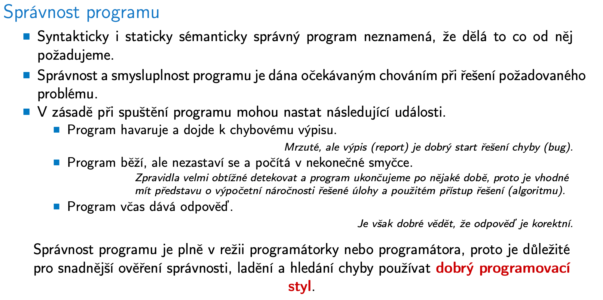

# PRP

Status: Done

Imperativní programování. Programovací jazyk C. Abstraktní datové typy a spojové struktury. 

• Řídící struktury, výrazy, funkce, nedefinované chování, kódovací (programovací) styly a čitelnost a srozumitelnost programů.

• Dekompozice programu do funkcí, předávání argumentů funkcím, návratová hodnota, rekurze a volání funkcí.

• Datové typy, vnitřní reprezentace číselných typů, struktury a uniony v C.

• Pole, ukazatel, textový řetězec, dynamická alokace a paměťové třídy.

• Zpracování vstupů a ošetření chybových stavů, práce se soubory.

• Zápis, překlad a spouštění programu v C. Vstup, výstup programu a jeho interakce s operačním systémem.

• Abstraktní datové typy (ADT) - definice, příklady specifikací základní ADT.

• Jednosměrný a obousměrný spojový seznam - implementace zásobníku a fronty.

• Nelineární spojové struktury - binární vyhledávací strom, prioritní fronta a halda.

• Datové struktury reprezentovatelné polem - kruhový buffer, prioritní fronta a halda.

• Využití prioritní fronty v hledání nejkratší cesty v grafu.

## Basics

C is a low-level, system programming language. Close to the hardware. Needs careful memory management.

## Programming Style

## Program Structure

### Expressions

In expressions, we need some operators

Variables

### Control Flow

Blocks can be nested, functions are named blocks. Curly braces.

### Functions

We break the program atomically into functions

**EXTREMELY IMPORTANT** in C, functions have pass-by-value arguments!

Everything is stored temporarily on the system stack, we have to pass pointer (whose value is an address) to pass arrays etc. to functions.

We can have function pointers:

## Data Types

### Numeric

### Enums

### Symbolic Macros

### String Literals

### Constants

### Custom

### Structs

This is super important for some structures with large data inside, we want to avoid copying them!

Structs are usually aligned, we can force packing:

### Unions

### Type Casting

## Arrays and memory

### Arrays

These arrays are fixed-size, cannot be resized, saved on stack!

Basically, a contiguous chunk of memory of sizeof(type)*count bytes

C99 allows VLA - run-time variable-size static memory allocation.

They are scope-local and the stack frame is trashed after function exits → don’t return the pointer.

### Pointers

### Dynamically-allocated memory

Always manage carefully, don’t forget to free!

### C and memory organization

Super important, storage class specifiers!

## C standard library

Why do we need it?

### Examples of common headers

### Files

### Error Handling

## Linked Structures

### List

Improvement - cyclic tail link

Bidirectional

Cyclic-bidirectional

## Abstract Data Types

Super important to know the definition - independent of exact implementation

### Stack

### Queue

### Priority Queue

Not good

Use a heap

### Heap for Dijkstra Shortest Path

