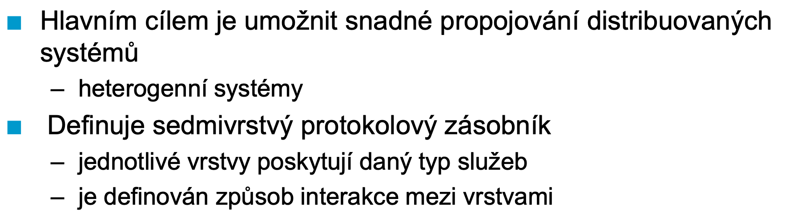

# PSIA

Status: Done

## Requirements

Počítačové sítě, ISO/OSI model, vlastnosti fyzických vrstev, topologie, řízení přístupu k médiu, kódování, spolehlivost datových přenosů, protokoly rodiny TCP/IP. 

• ISO/OSI model, funkce vrstev a komunikace mezi nimi, PDU, SDU, multiplexování, splitting,
segmentace … metody zpracování chyb při datových přenosech, dopředná chybová korekce,
ARQ metody, jejich vlastnosti a vhodné aplikační nasazení, CRC a jeho vlastnosti.

• Protokoly TCP/IP, IPv4, IPv6, ICMP, ARP, NDP, TCP, UDP, DHCP, systém DNS, princip směrování v
IP sítích.

• Síťové technologie Ethernet a WiFi, přístupové metody, adresace, technologie VLAN, funkční
rozdíly rozbočovač vs. přepínač.

## ISO/OSI Model

### Physical Layer

- takes care of sending binary data (bits)
- codes, modulation, synchronization, elmag stuff
- does not interpret the underlying data passed from layers above
- parallel or serial transmission
- synchronous (req-repl), asynchronous (send when needed)

### Data Link Layer

- Transfers frames of data
- Only within the local physical link (over the ethernet cable, the connected wifi network)
- Reliable/Unreliable (checksums, CRC, parity bits)
- Independent of the physical layer (e.g. ethernet protocol over wifi)
- Takes care of synchronization, assembling frames, addressing, rate limiting

### Network Layer

- Data Packets (splits the data requested to be sent, e.g. 1GB image into 16KB packets)
- End-to-End delivery (addressing, routing in situations without direct physical connection)
- Aware of the network topology (e.g. packets are sent to a router which forwards them to their targets) - routing tables
- Last layer considered to be the part of a network infrastructure (e.g. ethernet WAN network). Omitted in some systems (CAN)

### Transport Layer

- The upper layers (application etc) may require specific communication attributes that are not directly offered by the low-level layers
- Low-level layers often fixed (ethernet/WAN, CAN, etc.)
- Transport layer ensures high-level requirements are met using low-level layers
- Data segmentation/port addressing (tcp, udp), TCP reliability and management

### Session Layer

- Relation init, control, and cancelling for connected communication (dialog control, synchronization of interrupted communication).
- Transaction handling (databases)

### Presentation Layer

- Any lower layer only takes care of transmission of data on the binary level
- The presentation layer ensures general, understandable data format, e.g. little vs big endian, character encoding (ascii vs unicode), pointer format etc.
- Also encryption/decryption, compression/decompression

### Application Layer

- Core mechanism of some common networked application
- E.g. email or access to some networked devices (FTP), SSH, NFS/SMB

## Error Detection and Correction

How do they come up?

- Usually on the physical level due to interference, noise
- Implementation errors, undetected errors from lower layers

We cannot make any extra assumptions about the contents of the data itself coming from the higher layers.

Parity codes can detect only odd number of errors

### CRC

Motivation: take the hamming distance of 2 binary words (# of different characters)

Code Hamming Distance: lowest possible hamming distance between 2 codewords (e.g. 2 for parity checksum)

Split all words into code words and the rest. If every code pair of code words differs by more than $t$ characters, any error that alters up to $t$ bits is detected. 

Further, if the they differ by more than $2t$, the code can correct an error of up to $t$ bits, because the invalid word will be closer to one of the neighboring codewords.

XOR method

## Physical Transport Methods

### Metalic (wired)

- In reality, we always have some parasitic capacitance and inductance, couple into characteristic impedance $Z_o = \sqrt{\frac{L_0}{C_0}}$ and characteristic delay $\tau = \sqrt{L_0 C_0}$
- Usually long, then the speed of signal transfer starts to matter due to transient effects

- Coaxial cable (better, but expensive and less flexible), twisted pair (emi cancels)

### Optical

### Radio Waves

## TCP/IP

ARPANET (DARPA), older than ISO/OSI → does not follow the standard.

There exist 4 different way of delivering data to some IP address:

Examples:

- Unicast: send an email
- Broadcast: intentional, or e.g. ARP (looking for MAC for a specific local IP)
- Multicast: video streaming (provider-side)
- Anycast: CDN, DNS root servers

### IPv4

4-byte addresses (32bit words)

Old system - fixed address classes with fixed prefix/suffix allocation → wasteful

Efficient address management though subnet mask (4 byte boolean mask)

Final, most efficient standard:

### IPv6

16 bytes (128 bit word)

“::” denotes a contiguous zero region of the 128bit word

Important - when routing IPv6, there is usually no NAT, the router doesn’t have to translate anything, every device in the world has it’s own individual global public IPv6.

### IP Packets

IP packets carry information about the underlying protocol (ICMP, TCP etc.) within a header (origin address, destination address, TTL, checksum)

IPv6 can chain multiple headers in a linked list.

### NAT

### ARP

Address resolution protocol, used for MAC address discovery in IPv4 networks. If a Host A needs to know the MAC of Host B to send some data, it will send an ARP request packet with Host B’s IP and its own MAC. It is sent using broadcast. Host B, upon receiving, will fill its own MAC and unicast a response back to Host A.

### ICMP

Diagnostic/Information Protocol for IP packets. Not used for addresses that are not unique host addresses. Used by e.g. **ping, tracert.**

Some types:

- echo reply
- echo
- destination unrecheable
- address mask reply/request
- router advertisimenet
- router solicitiation

Can check for timeout through TTL (routing hops).

### NDP

ARP replacement in IPv6 networks. Network configuration through router advertisement services

### TCP/UDP Ports

### UDP

Minimal, simplest, no control or checks of anything

### TCP

Reliable communication, sessions, full duplex. Acknowledge messages!

Header structure: sequence number, ACK number, data offset (packets), signal flags (reset, finish, sync).

Session and reliability mechanism uses sequence numbers related to segment size (e.g. received segment 3 ending at 1500 for 500 bytes)

Retransmisison after timeout. Window of packets sent at once.

3-way handshake

1. Send SYNC with X to server, server receives, sends SYN with Y and ACK with X
2. client receives ACK with X and SYN with Y  
3. client sends ACK with Y

Congestion control: exponentially increase the number of packets sent ($2^k$) until losses start. Avoidance mechanism: if timeout happens, slow-start threshold is set to 1/2 of the congestion window (number of packets sent at once). Congestion window is reduced to 1 segment size. Then it is exponentially increased until reaching slow-start threshold, after that, the rise is only linear.

Fast retransmit is performed using duplicated ACKs. 

### DHCP

Dynamic Host Configuration Protocol - distributes TCP/IP configuration. UDP packets, broadcast (IPv4) or group addresses (DHCPv6)

Used for distribution of e.g. local IP addresses, DNS, domain name

### DNS

Hierarchical domain name system. Distributed with distributed management, usually follows some organizational structure, e.g. country → organization → department.

Split into zones, with a main authority server. Authority delegation.

Server types:

Primary → zone authority, holds main record, can be edited

Seconary → zone authority, takes data from primary server

Caching → unauthorized replies, caching to reduce load of primary and secondary

Data stores in Resource records (many types depending on content)

## Encryption

Encryption of data - similar theory to CRC. Minimum codeword length is $-\log_2{P(x)}$ in bits.

The mapping from data to code word must be injective → no collisions!

### Message digest, Hashing

### Digital Signature

## Information Channel

Message: A sequence of symbols

Symbol: Signals, characters

Alphabet: All symbols

Signal: Physical quantity used for information transfer

Kodovani: Transformation of messages between alphabets

Information: Content of the message

### Information Theory

Transmission path: signal propagation medium

Transmission channel: All technical means necessary for signal transmission

Important attributes: channel capacity, reliability

Entropy: $H = -\log P$ is equal to the amount of information received by that event happening, bits or shannon

### Channel Capacity

### Signal Coding

### Channel Modeling

## Signal Modulation

For binary data:

## Transmission Kinds

## Channel Multiplexing

- FDM - Frequency Division Multiplexing: frequency band split into multiple segments, spectra of different segments should not overlap otherwise big bad
- TDM - Time Division Multiplexing: fixed time slots for transmission of each respective channel, statistical variant: variable time slot size
- GSM - Combination of the above
- Code-based mux: different channels encoded using mutually-orthogonal codes (pseudorandom sequences).

## Network Topology

## Link-Layer Adressing

Node oriented: MAC address, sender + receiver

Message oriented: For broadcasting, identifies the content of the message, can be received by many members at once

## Access Control

### Deterministic

Master-Slave: single Master-denoted node queries other Slave nodes, who may transmit only when queried. Prone to delays dependent on the number of Slaves and the failure of Master.

Token-Passing: Nodes are mutually equal, transmission may only be performed by the token holder. The token is passed in a circular manner and the ownership is time-limited. 

Delegated-Token: Bus Arbiter Node allows the rest to transmit

### Stochastic

CSMA (Carrier Sense Multiple Access): senders wait until a channel is free (carrier sensing). Potential collisions, don’t have to be resolved.

CSMA/CD (with Collision Detection): Upon collision detection, nodes wait for some time, which is given by a random period with exponentially growing upper bound.

CSMA/CR (Collision Resolution): Collisions are by design, only highest priority message is transmitted, used for message arbitration (CAN!)

CSMA/CA (Collision Avoidance): Wireless Networks, if a channel is detected to be free, there is an additional random wait period, and if the channel remains free, the message is transmitted

## Reliable and Unreliable Service

Unreliable services (e.g. Ethernet) do not guarantee all packets to be delivered. Error checking may be present, but data is only thrown away if an error is detected.

Reliable services ensures that all data is delivered without any errors or packet drops, checks the binary content of each message using checksums etc. Errors are corrected or data re-transmitted. E.g. USB.

## Forward Error Correction

Data interleaving, coding (block - reed-solomon, stream).

Critical for channels without repeats (DVB), high error rates, streaming.

## ARQ

Automatic Repeat Request - if an error is detected, the sender is asked to retransmit that packet/segment.

Stop and Wait: for every sent segment, the sender expects an acknowledgment packet (ACK). If it does not arrive within some interval, the data is retransmitted. ACK is usually numbered or identified for each received segment.

Go-Back-N: Sequentially-numbered packets, there is an N-packet sized window which is transmitted at once. ACK reply contains the number of the last-received packet. The window is then shifted to start at the last-received+1 and the data is (re)transmitted. If the middle packet is dropped, it and every following one are retransmitted (inefficient).

Selective Repeat: Numbered packets as before, the receiver has an M-sized receive window. ACK contains the number of the first corrupted packet or the next one needed. The sender then retransmits all errored packets + whatever capacity for new data remains in N.

## Switching

## Connected and connection-free service

## Internetworking

Connection between network segments/distributed systems. Can be performed between different technologies (internet → phone). Physical limitations of network extents. Need to connect to far-away resources (servers). Redundancy.

Can operate on different OSI layers.

### Repeater

Works on the physical layer, just a signal amplifier of the individual bits, no semantics of the data. Realtime operation. Doesn’t cache data. Downside: Cannot distinguish and segment networks.

### Bridge/Switch

Connect different network segments, inspects the origin and destination of the message. Works on the link layer (MAC). Can cache data. Can perform filtering of packets and forwarding (sent only where the destination is), keeps a MAC table. Introduce some latency (they need to inspect the data).

### Router

Works on the network layer, inspects the packet and then routers the packet to its destination. Has to understand the topology of the network and distinguish between e.g. sending a local ssh command to another device on the network or sending an http request packet to the internet modem. The routing logic is stored inside of the routing table. On the link layer level, data is sent to its MAC address. Not realtime operation.

### Gateway

Operates at a higher layer (often application). Has to understand the data. Can be used as a general interconnect element, usually for some class of applications (http, ftp gateway). E.g. an FTP client behind a NAT asking an online server to send some data, using its own private local IP as the destination (wouldnt work), so the gateway translates the local IP using the public IP.

## Data Flow Models

### Client-Server

Server fulfills the client’s requests.

### Producer-Consumer

Producer sends a request, to all consumers at once, usually unreliable/unconfirmed.

## Ethernet

IEEE 802.2/3

Different variants based on the bandwidth and network topology (802.3XX).

Classical - 10 Mbit/s

Fast - 100 Mbit/s

On the MAC level, uses CSMA/CD, requires minimum packet length (512b).

Upon detection, uses an exponentially-increasing backoff time.

### Ethernet Devices

Repeater 

- Same as before, must also repeat collisions (collision domain), this limits the maximum number of repeaters
- Mainly in bus topologies

Hub

- For structured wiring networks, same as repeater
- Different mediums (optical vs copper) but same speed

Bridge/Switch

- Link-layer operation (MAC)
- MAC address-based filtering/forwarding, listening on the network to pick up addresses and ports.
- Network cannot contain cycles (tree topology) - logical cycles are disconnected in software, rapid spanning tree
- Bridge → traffic localization, Switch → forwarding
- Collision domain ends at the switch for each subnet
- Different speeds

RST

### Auto Negotiation

Link Pulses - determines the link capability

## VLAN

Logically independent virtual LAN networks on the same physical infrastructure

Communication and broadcast are separated

Handled by active network elements (switches)

MAC frames contain tags, which determine their VLAN membership (either added by sender or by a switch).

Networks are mapped using multiple spanning trees (one for each VLAN)

VLAN IDs define membership

### WiFi

Radio-based communication. Flexible, extendable topology. Frequency bands need to be stringently defined. Risk of unexpected drops/unavailability due. to interference and/or S/N ratio (too far from radio).

802.X defines some variants of wireless networks

802.11[a,b,g,h,n]- WiFi

Uses orthogonal code multiplexing

### 802.11n

2.4 Ghz, 5Ghz

MIMO → spatial multiplexing using multiple input/output antennas

64QAM

### 802.11ac

5Ghz, 256QAM

Multi User MIMO

### Network Types

Ad-hoc - direct between hosts 

Stationary - access points (AP) usually connected using a bridge to Ethernet distribution system, identified by SSID (service set ID)

### MAC in WiFi

Uses CSMA/CA (collision avoidance). Main issue: members of the network usually cannot contact each other (send traffic to AP, not other devices, but radio waves still run in the air). It makes CD harder.

Before transmitting, the node waits for the inter-frame period with some back-off interval (randomly selected). If the channel is busy, backoff is increased.

Virtual Carrier Sense: assuming everyone is connected to the AP, the node sends RTS (request to send), AP returns CTS (Clear-to-send) with transmission slot time. Other nodes assume channel busy during this period (also get CTS).

### ACKs

Only for unicast frames

### Fragmentation

Large frames (defined by MAC) get fragmented and sent as higher priority messages

### Point Coordination Function

Ensures collision-free access (contention free).

Usually implemented by the AP.

During the contention-free period, the AP polls devices on the network and allows them to transmit

### Hybrid Coordination Function

Modern variant

### MAC Frames

### Protection

WEP - original encryption, can be cracked in terms of minutes, 24 bit init vector

WPA - larger init vector (48 bit), dynamic key changes, frame authentication

WPA2 - AES block cipher, integrity + protection

