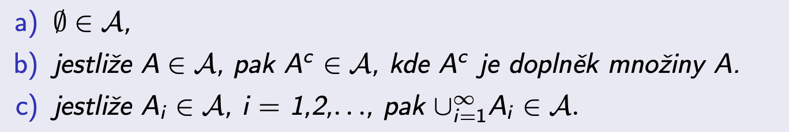

# PST

Status: Done

Způsoby popisu rozdělení náhodných veličin a vektorů. Odhady parametrů rozdělení.
Základní statistické testy. Markovské řetězce a jejich asymptotické vlastnosti. 

• Definice pravděpodobnosti (Kolmogorovova), nezávislost náhodných jevů, podmı́něná pravděpodobnost, Bayesova věta. Pojem náhodné veličiny, popis jejı́ho rozdělenı́ pomocı́ distribučnı́ funkce, hustoty, pravděpodobnostnı́ funkce. Střednı́ hodnota, rozptyl, směrodatná
odchylka, momenty náhodných veličin. Základnı́ typy spojitých a diskrétnı́ch rozdělenı́.

• Náhodné vektory a jejich popis. Nezávislost náhodných veličin, kovariance a korelace.

• Čebyševova nerovnost, centrálnı́ limitnı́ věta.

• Základnı́ pojmy statistiky, náhodný výběr, empirické rozdělenı́.

• Obecné vlastnosti odhadů parametrů. Odhady střednı́ hodnoty, rozptylu, směrodatné odchylky, momentů. Odhady parametrů metodou momentů a metodou maximálnı́ věrohodnosti. Intervalové odhady.

• Princip statistického testovánı́ hypotéz. Testy střednı́ hodnoty a rozptylu, porovnánı́ dvou
rozdělenı́, χ2 -test dobré shody, test nezávislosti v kontingenčnı́ tabulce.

• Markovovy řetězce: základnı́ pojmy a vlastnosti, popis přechodovým diagramem a maticı́
přechodu. Klasifikace stavů, periodicita, rozložitelnost. Asymptotické chovánı́ Markovových
řetězců.

## Probability axioms

### Sigma algebra

System of all subsets of a set such that 

If the original set is a set of random elementary events, then every element of the sigma algebra is also an event (e.g. an union of elementary events)

### Kolmogorov probability

This defines a probability space

Some key properties

### Conditional probability

We have a very important chain rule

The law of total probability allows us to compute probabilities from disjoint subsets and their respective conditionals

### Bayes theorem

Law of total probability + conditional probability

### Independence

Alternative definition uses conditional probability and says P(A) = P(A|B) iff A independent of B (reduces to the product rule I guess)

Total independence >> pairwise independence

## Random Variables

“a random number”

### Distribution Function

Probability mass/cumulative distribution function tells us the probability for any random variable how likely it is to fall under some threshold

### Discrete RV

There exists a sequence (a mapping $\mathbb{N} \to \mathbb{R}$) of values of the RV and the respective probability of each value (nonzero - gaps in integers).

CDF is computed as the sum of discrete values

### Continuous RV

The CDF is an integral in this case

### Mixed RV

A random variable can be expressed as a mixture (a convex combination) of continuous and discrete random variables

We can mix continuous and discrete however we like in a fully general fashion. Don’t forget the proper limits to handle both continuous and discrete points.

### Quantile function

“inverse” of the CDF. Maps probability of X ≤ x to x

### Expected Value

The exact calculation depends on the type of the random variable

It is completely linear (superposition holds).

We can transform the random variable using an arbitrary function and compute the expectation ($\phi(x)$ is also a random variable)

### Higher-order moments

Don’t forget to use the shortcut $\mathbb{V}[X] = \mathbb{E}[X^2] - (\mathbb{E}[X])^2$  

## Concentration inequalities

### Chebyshev

## Instances of distributions

### Bernoulli

Coin flip distribution

### Binomial

Sum of repeated Bernoulli flips

### Poisson Distribution

Probability of a number of events happening on some constrained space (time, spatial). E.g. number of broken bulbs in 5 hours in my room. 

### Geometric Distribution

Number of failed attempts before the first successful one (order-sensitive)

### Uniform

Useful probably only when we know something is bounded and cannot make any other prior assumptions about it.

### Exponential

Time until the event occurs (e.g. customer walks into a store)

### Normal Distribution

“Everything is normally distributed” - me

Some nice properties

Invariance to linear transforms is a big one.

## Convolution

## Random Vectors

A randomly-sampled point in $\mathbb{R}^n$

### Distribution Function

The properties as we know them but coordinate-wise

### Discrete vs Continuous

The distribution function is calculated coordinate-wise like in single variable case

Continuous case is again the same

### Marginal distribution

In the case of random vectors, we may want to isolate the probabilities in one or a few coordinates. We can integrate/sum over the rest.

### Properties

### Independence of a set of random vars

Same as random events, just multiply probs

How to test?

### Covariance of independent RVs

## Central Limit Theorem

## Statistics

### Quantiles

### Empirical Distribution Function

## Parameter estimation

Point estimates

### Bias, Asymptotic Efficiency

### Moment matching

### MLE

Discrete: use the probability function

Continuous: use the density

### Confidence Interval

Example application for a Normal Distribution with known Variance

With unknown variance used the student’s t-distribution

Using these alternative distributions

We can estimate the expected value of an arbitrary distribution using CLT

Prove by constructing the CLT estimate of the sample mean and use the fact that $\frac{S_n}{n} \to 1$ as $n \to \infty$. Special modification for Bernoulli and Poisson: estimate the sigma parameter directly from MLE. 

## Hypothesis Testing

### Mean of Normal Distribution

Idea: the test statistic corresponds to an empirically-estimated random variable where we use the parameters of the sample mean distribution. The resulting RV is distributed according to the student t-distribution with n-1 DoF. Then simply test if the absolute value falls within the defined confidence interval.

TODO: ask michal why absolute value

Pairwise variant to test differences in mean values

Before performing the first one, we should test whether the variances agree

Using the fisher distribution

### Pearson Chi-square

Given a multinomial distribution

Fake the normally-distributed RVs, note the variance is computed differently because the components of the sample are not independent. Once we obtain the chi-square variable, simply test its quantile.

### Contingency Table Independence

We are testing the independence of two discrete random variables with arbitrary finite ranges. Construct a table with counts for each one of the value combinations. Then compute marginals for each row and column. Finally, compute the discrepancy between expected frequency (obtained as a product of the marginal) and the recorder one, in a “fake-normal-distribution” fashion. This is chi-square distributed, then evaluate against the quantile.

Note: the term $\frac{n_{i.}n_{.j}}{n}$ comes from the following observation:

for independent events $P(A \cap B) = P(A)P(B)$

obtain the frequencies after n samples as $nP(A \cap B) = nP(A)P(B)$. However, the marginals correspond to $nP(A)$ and $nP(B)$ respectively, therefore use this:  $nP(A \cap B) = \frac{nP(A)nP(B)}{n}$

## Markov Chain

First-order Markov chain depends only on the previous state.

### Transition probabilities

Putting the probabilities into a matrix, we get the probability transition matrix, which is stochastic!

This is for a homogeneous chain!

The matrix is row-stochastic (rows sum up to 1).

We can compute the power of this matrix to get a simple result

### State classification

Periodic state = all return times are multiple of d

This is basically the same as graph connectivity, except the edges are stochastic.

Cannot be decomposed → just one closed component

If we arrive at an absorbing state, we can never leave

If we ever arrive at an absorbing state, we will always get stuck → the chain gets stuck

### Stationary Distribution

Lambda 1 eigenvector of the transition matrix.

Exists in a nondecomposable markov chain with finite number of states

For a decomposable chain, we can find it as follows:

### Limit of a Markov Chain with Absorbing states

Analogy of a geometric series

We can also find the stationary distribution using the “infinite recursion” series of equations.