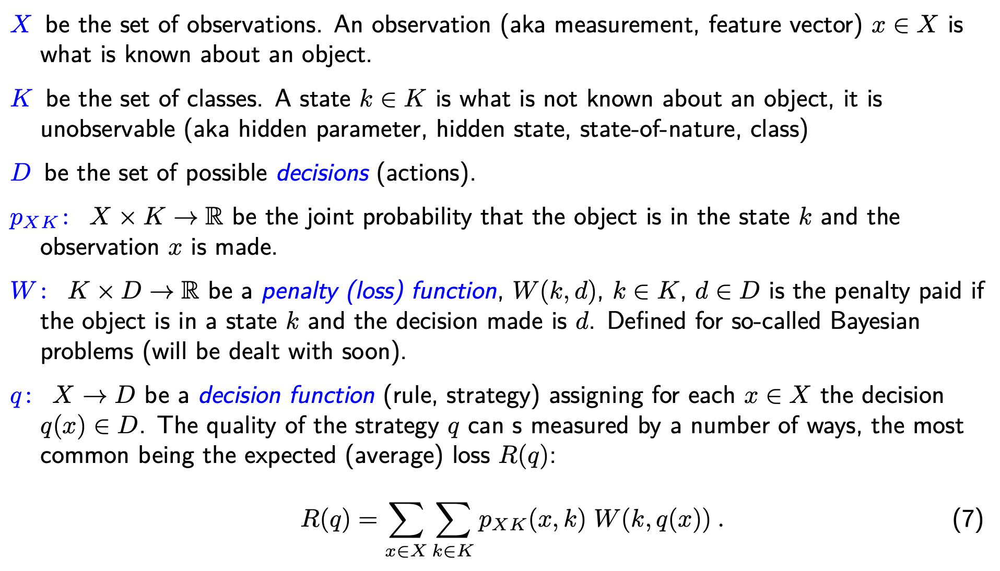
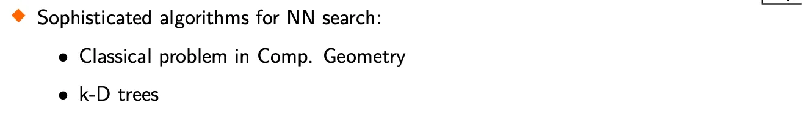

# RPZ

Status: Done
Assignee: David Korčák
Due date: 05/31/2025

## Requirements

**Statistické rozhodování. Klasifikátory a jejich učení. Neuronové sítě. B4B33RPZ (Webové
stránky předmětu)**
• Bayesovská formulace statistického rozhodování (rozpoznávání). Popis řešení úlohy při
znalosti statistického modelu pro ztrátovou funkci 0 (za správné rozhodnutí), 1 (při jakékoli
chybě). Rozhodování s možností “nevím”.

• Logistická regrese. Formulace úlohy. Algoritmus učení. Vlastnosti (výhody a nevýhody).

• Klasifikátor typu Support Vector Machine. Formulace úlohy učení, i pro neseparabilní data. Učení SVM, jak lineární, tak s jádrovou funkcí (kernel SVM). Vlastnosti (výhody a nevýhody).

• Adaboost, popis algoritmu, jeho interpretace jako minimalizace horního odhadu empirického rizika. Vlastnosti (výhody a nevýhody).

• Neuronové sítě s dopředným šířením. Struktura. Učení pomocí metody zpětného šíření.
Vlastnosti (výhody a nevýhody).

• Klasifikace metodou nejbližšího souseda. Výhody a nevýhody. Řadu nevýhod triviální implementace lze odstranit, jak?

• Shlukování metodou k-means, formulace úlohy a popis algoritmu. Vlastnosti algoritmu.
Zobecnění - použití pro jiné ztrátové funkce než L2.

Pozn. k dotazu na vlastnosti klasifikátorů a s nimi spojených metod učení. Vyjádřete se: 1. k
typu úlohy, pro který je metoda vhodná (např. 2 třídy, menší počet tříd, velmi vysoký počet
tříd), množství dat, které je typicky potřeba (schopnost generalizace), k předpokládaným
vlastnostem dat, 2. k vlastnostem algoritmu učení (vztah mezi kritériem použitím při učení
a jeho vztahem ke kritériu, typicky chybě na testovacích datech), k době učení, konvergenci
algoritmu (do lokálního nebo globálního minima) a 3. k vlastnostem z pohledu nasazení
(při rozhodování) - paměťová a výpočetní náročnost.

## 1. Statistical (bayesian) decisionmaking

We formalize the problem using the following mathematical concepts:

This formulation is fully general, applicable to any real-world measurement

Problems? The joint PDF is often unknown and estimation is untractable, due to uncountable or very large cardinalities, strategies cannot be constructed exactly (e.g. as a table).

We then define the Bayesian Decision problem as follows:

To make the solution of the problem computationally tractable, we may use the following observation:

The simplest instantiation of this problem is 0/1 classification:

We can introduce a third option, where we say “we don’t know”.

We can further modify the task of classification, this time to guarantee a bound on the classification error of one of the two classes, usually called “dangerous”.

This introduces a solution through the *likelihood ratio* which can be derived by constructing the Lagrangian of the problem (it is convex) and finding the only non-constant term.

 Alternatively, it may be solved through Integer Linear Programming (discrete decisions!)

The last variant of a bayesian decision task is the Minimax Task, which tries to minimize the error of harder-to-classify class (by error).

The solution techniques are identical to the Neyman-Pearson task. It can be viewed as Optimal Bayesian Decisionmaking with Unknown Priors:

In this case, it makes sense to minimize the maximum, as we do not know the actual prior and therefore the total error of the classification system, and we try to solve for the “worst case” in advance.

## Parameter Estimation

### Maximum Likelihood Estimate

Theoretically and asymptotically efficient

Simple, but may be problematic with too little data

### Maximum A Posteriori

Incorporates additional parameter prior, handy to have a prior in a conjugate form.

### Bayesian Parameter Estimation

We define some loss of the parameter, solve for the minimum by derivative and then obtain the estimate.

### Histogram

Non-parametric estimate 

Learned using MLE

Number of bins is difficult to estimate, increasing B increases the log-likehood to infinity. Regularize using the dirichlet distribution

## 2. Logistic Regression

A method for direct modeling of the class posteriors based on the following observation. It is discriminative!! Models the likelihood of the class directly, doesn’t know the class prior or feature likelihood.

That is, in 0/1 classification setting we optimally select the class with the higher posterior probability, corresponding to the odds ratio being larger than one. 

There exist problems, where the logarithm of this odds (posterior) ratio is a linear function, notably:

- 2 classes with normally-distributed features and equal covariance matrices: $\mathbf{x}_{|1} \sim \mathcal{N}(\boldsymbol \mu_1, \boldsymbol \Sigma_1)$, $\mathbf{x}_{|2} \sim \mathcal{N}(\boldsymbol \mu_2, \boldsymbol \Sigma_2)$ and $\boldsymbol \Sigma_1 = \boldsymbol \Sigma_2$
- Independent binary features (N bernoulli-distributed random variables):
$x^i_{|1} \sim \text{Ber}(\pi_i)$, $x^i_{|2} \sim \text{Ber}(\kappa_i)$, $p(\mathbf{x}|k) = \prod_{i=1}^N p(x^i | k)$
- Multinomial Naive Bayes features - we gather a constant number $n$ of observations from multiple bins (= different features). For each feature $i$, the sampling process can be viewed as gathering some $x_i$ instances. More specifically, the probability of of the entire gathered feature vector is $p(\mathbf{x}|1) = \frac{n!}{\prod_{i=1}^N x_i!} \prod_{i=1}^N \pi_i^{x_i}$ (and similarly with $\kappa_i$ for class 2). In this case, we do not care about the ordering the of the sequence of collections in each bin (we can gather 5 instances in 5! different ways, all of them are considered to be the same). We must therefore add the correction term, which effectively says “we have n! possible gather combinations, however, we only care about the potentially different order of gathering different features $i$ without counting the instances where we only permuted some consecutive members of the same feature, of which there are exactly $x_i!$ for each feature”

### Derivation for Gaussians

### Derivation for Multi-Bernoulli

(similar for the multinomial case)

Using the standard definition of a linear function, we can express the posterior models in closed-form.

For solving the problem, we apply the following reasoning: as standard in recognition tasks, estimate the model of $p(x,k)$. Apply the factorization $p(x,k) = p(k|x)p(x)$. By factorizing the likelihood function this way, and applying the logarithm (log-likelihood), we obtain a term that can be maximized with respect to the weights of the linear function. This corresponds to the maximization of *conditional likelihood.*

This problem does not have a closed-form solution, however, we can apply standard gradient descent.

We are guaranteed to find the global optimum, because the problem is convex:

### Multi-class generalization

To derive the posterior closed-form, use the fact that the log-odds ratio is linear for any 2 classes, and the posteriors must sum up to 1. Learn using GD, same concept as before.

### Advantages

- If the conditions hold, we know the solution exists and is globally-optimal
- Efficient to evaluate at runtime (1 dot product)
- Interpretable outputs as well as learned features

### Disadvantages

- If the conditions do not hold, it is hard to quantify how bad the solution is (if the problem converges)
- Needs at least some amount of data from both classes for reliable gradient and well generalizing solution
- Numerical solution (vs. e.g. perceptron or SVM)
- Might need regularization (infinite increase in probabilities)

## 3. Perceptron and SVM

Both of these methods are discriminative linear classifiers. Perceptron is a simple variant that only tries to minimize misclassification errors, SVM includes regularization and tries to maximize generalization, assuming all points are classified correctly.

Basic motivation: structural risk minimization

Why do linear classifiers make sense?

When is it correct to use them? If the gathered data are linearly separable:

### Perceptron

Very simple - classification only based on dot products with linear combination. 

Why does it make sense? Because it’s gradient descent

Novikoff theorem gives an upper bound on the time of convergence

### SVM

Still a linear classifier, however, we reformulate the problem for a slightly different setting. We don’t only want correct classification, but also maximum distance of the classifier boundary from any of the points of the dataset

However, this introduces a scale ambiguity on the RHS of each inequality constraint. We can break this by setting a fixed RHS.

By using this bound, we can remove the inner optimization problem and invert the maximization to minimization

This is the final, primal SVM problem. However, for actually solving this problem, we have to reformulate into a more tractable, and actually more modular/general dual problem. We do this by applying Lagrange multipliers to a standard convex problem. 

Add constraints to the criterion, find Lagrangian critical point. Then reintroduce these values into the Lagrangian and therefore get rid of the inner optimization.

Finally, we obtain the problem formulation used in practice. 

So far, we have only assumed linearly separable data. We can allow the classifier to make errors, discounted by some variable constant. This makes it suitable even for data that are not perfectly linearly separable. We get the *soft margin* SVM. C is the generalization/non-separability constant. 

Note the presence of dot products in all of the dual formulations. We can exploit this, and use any symmetric positive semidefinite function (a “kernel”) and replace this dot product. Mathematically, it corresponds to performing a dot product in some alternative dimension (lifted), e.g. adding a quadratic term to the features or an infinite exponential base (RBF/Gaussian kernel).

K is the kernel function.

Some kernel examples:

### Advantages

- Perceptron is easy to implement, computationally cheap training
- Cheap inference for vanilla version of Perceptron or if explicit form of the kernel is available
- Guaranteed optimality for linearly-separable data (convex problems)
- Potential application of the kernel trick to lift the dimension and improve performance on non-separable data
- Alternative formulations to handle non-separable data (Soft SVM)
- Training time complexity not dependent on the amount of data (Dual SVM)
- Low structural risk (hypothesis class complexity)
- Principled motivation and derivation

### Disadvantages

- Memory requirements for SVM (need to store support vectors)
- Inference complexity of SVM depends on the number of SV
- Expressive power may not be enough for very complex datasets
- Perceptron may take long to converge
- Not directly probabilistic
- Less interpretable features (especially for SVM)
- SM-SVM - C is a hyperparameter
- Kernel SVM - e.g. RBF $\gamma$

## Adaboost

A method for building a single strong (binary) classifier from a set of weak classifiers by weighing their outputs (as a linear combination) of a given datapoint.

The algorithm is formulated as follows:

Note the behaviour when performing data reweighting:

Why does it work this way, does it make sense?

We will see after investigating the following theorem:

In other words - the exponential of the function bounds the value of the 0/1 loss bounds the value of the empirical risk. 

This says that by using the distribution update rule defined in Adaboost, we obtain an upper bound on the value of the empirical risk.

Is this what we want? yes!

Let us try to minimize $Z_t$ with respect to $\alpha_t$

We can now see that $\alpha_t$ in Adaboost is the one that minimizes the upper bound on empirical risk. Plugging this in gives us:

Minimize $Z_t$ → pick the classifier with the lowest $\epsilon_t$

## 4. Neural Networks

Recall the dimensionality lifting used with SVMs and Perceptrons. In those cases, we applied 1 optionally non-linear transform on the data, and then computed a linear combination (or something similar). 

We can generalize this approach, and stack multiple such steps after each other into “layers”.  This is basically a neural network. In such networks, we combine linear → nonlinear steps in multiple consecutive layers, to approximate highly non-linear mappings

The UAT gives theoretical justification for the composition of such simpler functions.

Usually, we split the network into each linear-nonlinear block as a single layer as follows:

Activation functions (need to be differentiable, can’t use the original step function from the perceptron):

Types of outputs/applications of neural nets:

- Classification → output vector of logits is passed through a softmax function (one hot encs.), then we use cross-entropy loss same as in linear regression (the derivation is identical).
- Regression → output represents some real quantity, usually L2 Loss (MSE)

### Training

Backpropagation:

### Tricks

To improve learning and converge to a better minimum of the loss function, numerous tricks are employed.

- Layer Initialization → ensure stable scale of the weights for many consecutive layers (usually try to keep unit variance and zero mean). Xavier Init, Kaiming He init, Orthonormal
- BatchNorm → Normalize activations within a batch to force stable scales in deep network, super effective but correlates the batch samples (IID careful)
- DropOut → Clever Ensembling
- Conv padding

### Advantages

- Highly expressive, can approximate an arbitrary function, provided enough data
- Relatively cheap to evaluate (unless talking about LLMs)
- The concept of non-linear gradient-based function fitting can be extended to many areas beyond simple recognition and regression (RL, VAE, LLM, Diffusion)

### Disadvantages

- Almost no guarantees on convergence or quality of local minima found by (S)GD
- Due to high expressive power tend to overfit if not approached carefully with regularization
- Can get very large (memory, compute) for high-dimensional inputs, though are probably the only tractable method for such problems
- Classical VC theory breaks down, double descent
- Black boxes

## 5. K-Nearest Neighbor Classification

We have a set of datapoints (training set), each point with a label (class) $k_i$ and some feature vector $x_i$. We also have a function for measuring distance between 2 feature vectors $d\left(x_i, x_j\right) \in \mathbb{R}^+_0$. The classification procedure for a datapoint $j$ computes the distances of feature vectors $x_j$ and $x_i \forall i \in \Tau$, sorts the datapoints from $\Tau$ by the distance function, takes $K$ closest and selects the classification label of the new datapoint as the majority class among the $K$ nearest (neighbors).

Some properties:

The improved (faster) version operates as follows (assuming the distance function is euclidean):

1. Construct a k-d tree of the datapoints, splitting median-wise along each coordinate to create a (hopefully) coordinate-wise binary search tree
2. Upon receiving a query point, traverse the tree towards the closest neighbor (coordinate-wise), always keeping the lower bound at the split point in memory (the abs. difference of coordinates is the lower bound of the distances at that point). 
3. After reaching a leaf of the tree, compute full distance. If higher than the lower bound of the any of the previously-encountered split points (top of priority queue), pop the top and return to that node to explore the unvisited branch.

To store the intermediate points and keep the procedure simple, we can use a **heap** to store the split points and keep them sorted by distances (or distance lower bounds). Then upon returning, we only need to check the top of the heap (it always remains sorted).

The improved variant has a build complexity of $O(nd\log(n))$, where $d$ is the data feature dimension and $n = \left| \Tau \right|$. The search is $O(\log(n))$ on average (the found root is the actual closest neighbor) and $O(n)$ in the worst case.

We can optimize the algorithm to reduce the size of the training set, which is the main driver of asymptotic complexity during inference.

What sort of error should we expect from the KNN classifier?

### Advantages

- Conceptually simple, naive variant very simple to implement
- Provable upper bound on error
- Robust to outliers with higher K
- Techniques for optimization exist

### Disadvantages

- Naive implementation can be slow
- High memory requirements
- The metric can be difficult to define sensibly, scale-sensitive

## 6. K-Means Clustering

Let us define the following task:

Note that this task is unsupervised.

With this equivalent formulation, we make the solution tractable, as we only need to optimize the criterion in the cluster centers.

Why does it work? Let us investigate:

We interleave 2 steps of optimization. By assigning the closest cluster center to each point, we minimize the inner sum of the criterion (assignment minimization). This gets us the minimum possible squared distance (literally just solves the inner sum current clusters). In the next step, we fix the assignment and set its center to its mean. This solves the outer problem, finding cluster centers that minimize the already minimal distances. Mean = minimum of MSE of distances to a point.

The number of assignments is K^T (K possible cluster assignments per each one of the T points). They cannot be visited twice, as the steps of the algorithm never increases the criterion. The only case when the criterion doesn’t change is when we converge and the assignment stays the same, at which point we end the procedure. Needs a tiebreaker!

Potential speedup with a KD-Tree closest cluster search (TlogK vs TK). Partial sums (if large changes are not expected). However, there is a danger of a local minimum!

We can look at this probabilistically 

Solution? Clever init.

We can generalize this method to minimize other criterions than just the squared euclidean distance. Generalized K-Clustering framework:

For p=1 Norm: coordinate-wise K-Medians

For p=2 Norm: K-Medoids, the solution is the geometric median, needs to be found iteratively using Weiszfeld Algorithm

### Advantages

- Unsupervised learning: a variant of the EM algorithm
- Very cheap to infer, use KNN with the cluster centers only (typically a low number)
- Conceptually simple (baseline)
- Guaranteed convergence

### Disadvantages

- Convergence may take arbitrarily long, only a local minimum
- Train-time criterion does not tell us much about the generalization if we receive an outlier, similarly, the standard K-Means is outlier-sensitive (mean is sensitive)
- Only an approximate method

## EM Algorithm

Find MLE parameters in situations with incomplete data, or in models that don’t have closed form solution/criterion.

Latent variables: VAEs

Unsupervised learning again!

### EM for Mixture of gaussians

The weights correspond to the likelihood of mixture components, after normalization, they form a distribution for each data sample. We then perform weighted MLE with these convex coefficients.

### Contrast with K-Means

EM is defacto soft-assignment K-Means

### Derivation

Uses the ELBO trick with variational sampling

We introduced a sampling distribution completely dependent on $z$. The last term is the ELBO.

This lower bound is equal to the KL divergence between the sampling distribution over latent codes and the marginalized distribution over latent codes

### General formulation

### E-step

Whole trick: minimize KL divergence by setting q to p. In our MoG case, probability of $z$ was simply $\pi_a$ or $\pi_b$

### M-step

This is the “weighted MLE”, marginalized over the domain of  $z$

### Summary

## Decision Trees

### Building using IG

