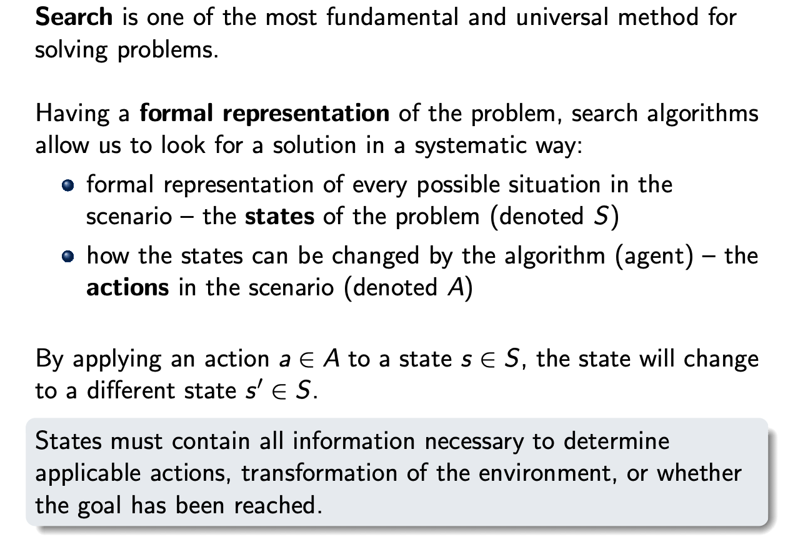

# ZUI

Status: Done

## Requirements

Metody prohledávání stavového prostoru, algoritmy. Reprezentace znalostí a rozhodování s nepřesnou znalostí. Dvouhráčové hry. 

• Známé systémy umělé inteligence: DeepBlue, Watson, AlphaGo, Eliza, Shakey, DQN.

• Formální reprezentace problému AI: problém mnohorukého banditu, MDP, POMDP, hra v
rozšířené formě.

• Metody prohledávání stavového prostoru: DFS, BFS, ID-DFS, Dijkstra, A*.

• Algoritmy posilovaného učení: policy evaluation, policy improvement, policy iteration, value
iteration, Q-learning.

• Algoritmy pro řešení her dvou hráčů: minimax, alpha-beta prořezávání, negamax, negascout,
MCTS.

• Strukturovaná reprezentace znalostí: CSP, Scheduling, Situation calculus, STRIPS.

• Neurčitost v AI: maximalizace očekávané utility, Bayesovo pravidlo, Bayesovské sítě.

• Řešení POMDP: PBVI, HSVI.

## Known Successful AI Algorithms and Systems

### DeepBlue

The first computer system (Hardware + Infrastructure + Algorithms) to beat a chess grandmaster. Based on search, no ML involved yet. Beat Kasparov in 1997. 

- Main Algorithm was NegaScout (fast, heuristic-driven search)
- Additional state space reduction techniques/optimizations (transposition tables, iterative deepening)
- Heavily parallelized over specific hardware (custom chips for chess play)
- Opening and Endgame databases tuned by chess grandmasters
- Overall a brute-force based approach allowed the standard, relatively simple textbook algorithms to scale (200 million positions per second)

### Watson

One of the first successful/complete-package NLP systems, developed by IBM. It could extract semantic information from even unstructured documents, operated chatbots. Beat humans in the quiz “jeopardy!” in 2011. 

- Ensemble of expert algorithms
- Logistic regression as posterior model for question answering
- Decision trees
- Bayesian modeling

### AlphaGo

First successful attempt to beat a human champion at Go, a combinatorially much more complex game than chess. In 2016, AlphaGo defeated a human professional player 4-1. Considered much more important than chess, because Go requires explicit reasoning/intuition as “searching” over all potential moves is not tractable (for people or computers). Core idea was the use of deep learning (reinforcement learning) to learn a prior knowledge-guided search.

- Deep CNNs that process the board as an image (policy and value function).
- First, networks were pretrained in a supervised manner from human-annotated data (expert moves)
- Next, they were finetuned using reinforcement learning from self-play
- During self-play, multiple instances of the networks play against each other and the gradient updates try to reinforce the best strategy and suppress the losing ones
- The learned policies guided an MCTS-based search algorithm to allow for some online exploration/planning
- The xxZero variants learned purely with RL, without supervised pretraining

### Eliza

An early natural-language chatbot, designed to mimic a psychologist. Published in 1966.

- Pattern Matching
- Transformation rules: identify keyword → relate to context → transform the keywords + context

### Shakey

A “complete” multi-purpose autonomous robot, developed by Stanford Research Institute 1966-1972. Automatic control, vision, perception, planning, NLP. Name because the movements were shaky. Introduced numerous new technologies. 

- Fully integrated perception, reasoning, planning, navigation, control
- Camera, rangefinders, collision sensors, electric motors
- System programmed in Lisp
- Very high-level planning and reasoning: STRIPS
- Environment navigation: $A^*$ algorithm (new development)
- NLP command processing
- Hough transform for perception: geometrical primitives in polar parameter space

### DQN

A critical success in combining reinforcement learning (Q-learning) and Deep Learning. The objective was to learn an RL policy for playing Atari Games, whose state space is mainly represented by RGB images, making it intractable to use standard tabular Q-learning. Instead, the   action-value function is approximated with neural network with multi-class outputs representing the buttons on the Atari controller. Published in 2015, it achieved human or even superhuman levels of performance on many Atari games.

- Q-Learning is the main learning algorithm
- The Q-function is approximated by a CNN
- $\epsilon$-greedy exploration policy
- DQN tricks: frozen target parameters to stabilize gradients and experience replay to reuse old experiences and improve sample complexity

## Search

Okay, but what do the formal representation?

There are some fundamental models to which we apply search:

### Markov Decision Process (MDP)

### Partially-Observable MDP (POMDP)

### Extensive Form Games (EFG)

### Solving a Deterministic MDP

Say that we have a deterministic MDP without stochastic effects. 

Some problems there: we want to find the best sequences, choosing any state to expand does not guarantee that we find the best action. We also need to be able to detect returning to a previously visited state (otherwise we would end up in an infinite loop).

BFS/DFS can be intractable for realistic problems. Uniform-cost search is Dijkstra’s algorithm. 

In practice, use a hash set for fast lookup of already evaluated states. 

The iterative deepening procedure always searches a whole level in either the edge count space or the cost space. By moving this upper bound, we are guaranteed to find the goal state with the minimum number of actions. Be careful! If we come back to a state we previously found with some cost, we might have a lower cost and could have to re-expand it.

Uniform-cost search has a caveat!

What is a heuristic?

There is a catch! If the heuristic underestimates the cost of a state, and we expand it sooner (instead of a state whose apparent cost is higher, but true cost might be lower), we could arrive in the goal state through a sub-optimal solution.

An admissible heuristic guarantees this won’t happen: 

We can now define the whole $A^*$ procedure:

Note we have to add the accumulated cost to guarantee optimality (goal state is popped from the PQ iff it is the one with lowest accumulated cost). 

In other words, with an admissible heuristic, we’re guaranteed to always expand the state with the  lowest apparent cost, which however isn’t lower than the real cost. At worst, we can expand a seemingly good node, but then in reality it’s bad, we accumulate a lot of incurred costs and then then stop expanding this path. Note that the goal state is always expanded with apparent cost being the sum of incurred costs along the way and nothing else.

Or in other words, the decrease in heuristic estimates between neighboring nodes is always less than the actual cost incurred for that transition.

The consistent heuristic ensures that we don’t open a state more than once (which would happen if we later find a cheaper path to a previously explored state). 

Some extra modifications:

## Reinforcement learning

Standard model for the world in RL is a Markov Decision Process. The simplest instance used to study RL algorithms are Multi-armed bandits.

### Multi-Armed Bandits

We would like to learn how to maximize the expected return from the bandit environment. This means we have to learn which levers to pull to obtain the highest reward.

How to gain and learn at the same time?

This is the basis of Q-learning methods. In this case, we form the estimate as a simple sample mean. However, we still need to learn how to explore the environment

Okay, but we still need a way to learn the estimate. We will do this with a running mean.

Alternatively, it can also be good to use EWA, because it will track even non-stationary distributions.

UCB ~ Consider the “standard deviation” of the samples and add it to the current estimate for a more optimistic value. As an action is explored more and more, its empirical sttdev goes down and it makes way for an another, less explored action.

Conclusion for bandits:

### General MDPs

The behavior learned by the agent is encapsulated into a policy, a function or probability distribution mapping a state in the MDP to a single action or some distribution over actions. 

Our goal is to maximize the expected **return** in every state. The return can be defined in various ways.

We split this based on the underlying task we’re trying to solve:

To model the expected return for each state of the MDP, we use a value function.

Note that the value function is parameterized by the policy (the expectation depends on the probability of taking an action in the next state, which in turn depends on the policy again.

We also define an optimal policy/optimal value function:

Bellman Equation for the Value Function:

Recall the greediness of the optimal policy wrt. the optimal value function. We can derive a closed-form of the optimal value and action-value functions through bellman equations.

If we want to solve these equations exactly, we need to know the exact model of the environment. If we do, we can define some basic methods for finding the value function (solving the equations) iteratively.

### Policy Evaluation:

Given a fixed policy, find the value function.

Why does it work? Because the mapping is contractive and converges to a unique fixed point for any initialization

### Policy Iteration

An iterative process where we interleave improvement and evaluation steps in order to find the optimal policy/value function. If we know that some action has the highest action-value function in a given state, by setting the policy to be deterministic in this action we monotonously improve the policy’s value function.

### Value Iteration

We can merge the 2 steps of Policy Iteration into one. In every state, set the value function to the highest action-value function in that state (greedy, deterministic). This effectively merges the two steps, skipping the policy improvement step (it is equivalent).

### Q-learning

Off-policy temporal difference learning. We don’t know the underlying dynamics, we only try to learn from collected samples. 

TD Method:

One-step Q-learning

There are some potential problems: maximization bias (keeps selecting the currently best action, which may not be the best globally, especially with noise), keeps propagating downstream to other states. Solution is Double Q-Learning.

### RL Summary

## Games

Games differ from search in a key aspect - there are more agents affecting the environment (state of the game).

Good to know

We will focus only on games with the following properties:

- two players
- zero-sum (strictly competitive) - one’s win is the second one’s loss
- perfect information, fully observable (chess, go, tic-tac-toe)

How to represent an **Extensive Form Game**?

A history of the game can be understood as an action sequence executed up to a state of the game. The per-player indexing simply says the history (from the set $H_1 \subset H)$ ends at a point where player 1 should make a move.

### Minimax algorithm

The minimax algorithm simply swaps between 2 operations depending whose move it is currently. The utility values are defined for MAX (the player who started evaluating the search tree at the root).

This algorithm can be cumbersome, we can “prune” subtrees if we e.g. know that the MAX player got something (say 3 from the example above), while MIN finds a minimum lower than this value (say 2 in the middle node). Regardless of what lower value MIN finds (lower than 2), MAX will never choose this as it can get 3 elsewhere, therefore it does not make any sense to expand this branch further. We can formalize this

### Alpha-Beta Pruning

We keep track of both the upper and lower bound on the value of the game. In every turn of the MAX player, we keep the maximum value found from the nodes below. Whenever we cross the upper bound set by the MIN player, we prune and end the search. If our chosen value would be discarded by MIN, the whole subtree can be pruned and discarded too. The MIN player keeps a minimum, the situation is symmetrical. If our minimum is lower than the lower bound from MAX, we know MAX wouldn’t choose our node and we can again prune.

### Negamax

A variant of Alpha-Beta search, only difference is that instead of changing the operations, we take turns in flipping the signs and the bounds, which has the same effect mathematically.

### NegaScout

We can save even more time by setting the bounds to some narrower values, pruning earlier.

Example

Simply put, whenever we violate the interval set initially, we know that the true value is bounded by this new value, depending on the cross bound either higher (was pruned in MAX after crossing the upper bound) or lower (was pruned in MIN for crossing the lower bound)

Can we systemize this?

First give the best action a chance to find its true utility, then shortcut and see if re-searching is needed.

The overall algorithm is as follows:

MAX

It makes sense → first evaluate full, break or shrink window, evaluate with null window, perform a full window search if necessary. Note we don’t re-search if the value would be lower (we are maximizing).

MIN

The inverted behaviour for minimization

### Game Solving vs Game Playing

### Games with Chance

In unbounded case, we cannot do anything, negative values will skew the expected utility from chance nodes. With non-negative, we can do more, the expected value is indicative enough.

### Monte Carlo Tree Search

Only select-expand is performed in a guided way, the simulation is usually random (to not consume too many resources).

In the selection part, we need to select actions that are promising in that state. 

In the expansion part, we create new nodes of interest

We then simulate from the expanded node all the way until we find any leaf of the game tree. Then, take the utility in that leaf and propagate it back to the newly expanded and previously selected nodes (similar to bandits, simply update the estimates).

### AlphaGo

MCTS in AlphaGo works as follows:

## Constraint Satisfaction Programming, Scheduling

The previous approaches were not specifically tied to an exact problem, instead, they were general frameworks for solving different problems of the same high-level class (games, MDPs). We can look into approaches that are tailored to a very specific problem.

Example 

Variable = Queen, Domain = Allowed Values, Constraints = Relationships between feasible values

Constraint is defined in its most general form (set of tuples)

More examples:

Example CSP formulation of the N-Queens Problem:

The answer is not difficult - it simply becomes a large search tree

### CSP with binary constraints

We can reformulate any k-ary constraint into a binary constraint. 

Say we have $x_1 - x_2 + 3x_3 \leq 0$, the valid solutions (in reals) is a hyperplane.

Every point on the plane is a 3-tuple of variables. Define $x_{\text{plane}}$ with the domain of all points that lie on the original plane. 

Now create only binary constraints like $(x_\text{plane})_1 = x_1$. Whenever we assign $x_1$, we force quality to the first coordinate of $x_\text{plane}$, which in turn forces the other variables to have only feasible values.

MRV: assign something, alter variables domains for assignment. On next expansion, pick the variable with smallest current domain. But here is a problem. What if we locally violate some constraint, remove the values from domains, but there is one more constraint that we haven’t touched, but violated by our domain pruning? Big problem!

This is simply BFS over the constrains over the just-altered variable.

## Logical Agents and Planning

### Logical Agents

Logical Agents are a way to symbolically perform reasoning and plan steps that have to be taken to achieve a certain goal.

Example: Monkey & Banana

We will use First Order Logic to derive predicates that describe the world and actions.

The actions themselves (environment dynamics) are defined axiomatically.

Frame axioms ensure that the state of the world is unchanged, or that objects retain their properties:

Once we have all of these definitions, we can give a logical statement describing the goal state and perform logical inference using reasoning techniques:

### Domain-Independent Planning

First, we need to establish what can be generalized and shared:

Where is this useful?

We can see this as finding a path in some transition graph, solvable by e.g. uniform cost search (dijkstra).

Some spaces are too large for this, and there are many situations where would like to apply the planning.

Sokoban Example

Okay, we now have a problem definition, how to solve it? 

In particular, we can use relaxation heuristics:

So we removed all bad effects from the actions, making the problem simpler. Okay, now lets construct the solution and graph and solve the planning problem

What this means: In every step, check what preconditions hold (what atoms are true) and add the available actions (whose preconditions are met). Repeat this until all atoms for the goal state are true.

Okay, what is this simplified solution good for? Well, we now know how many steps we have to take to reach the goal in the simplest version of the problem. Or:

### Summary

## Rational decisionmaking under uncertainty

What does this mean? We want to make decisions that maximize the (expected) utility/reward under all possible outcomes. E.g. a lottery. For this, we need to measure and estimate the probability of events. Where do we need this?

It is important to know the Bayes’ theorem.

Okay, we can compute the probabilities of many events using the full joint distribution, but there is a big problem!

We can use a clever shortcut, leveraging the conditional independence of some terms. 

With this observation, lets formalize the concept with Bayesian Networks. 

How to perform inference?

What are some nice properties we can see and extract in BNs? 

Now the core task - computing the posterior given some evidence.

We need to marginalize over the internal parent variables.

Simplest instances of BNs: Spam filter (naive bayes), HMMs, Bayes Filter (HMM), KF

## Partially-Observable MDPs

The base definition is the same as vanilla MDP, however, we add the observation model (observation distribution), and we lose the perfect information about in which state the agent may be. We can only perform probabilistic inference.

This is just the classic bayes filtering scheme

### Example (to not go insane)

Okay, we now know how to extract the belief state. How should we act in an POMDP? Recall classic MDP:

We now compute the transition probability between beliefs, which is kinda hard to do (a belief is a probability distribution), so we are integrating over going from a probability distribution to some other probability distribution. But - this belief state can be easily represented by some continuous function, either a categorical distribution (n-dim vector on the standard simplex) or by parameters of a continuous distribution (e.g. normal - look at a bayes filter with normal distribution). The transition probability is then more or less given by the previous formula.

Alpha vectors simply put: a vector $\alpha =  (v_{s_1}, v_{s_2}, \dots, v_{s_n})$. The individual value functions are defined with respect **to the underlying MDP, and a fixed conditional action plan (conditioned on observations) which is stateless. Also can be imagined as a policy belief-tree.**

We then pick the highest alpha vector for the current belief over states, intuitively, we should follow the plan which maximizes the return based on the current expectation of states.

Lets decompose the sums one by one

1. Innermost sum: computes the *next* belief in $s^\prime$, and then computes the value of the t+1 step policy that takes action $a$ and receives observation $o$, this is the part of the conditional action-observation policy tree. We effectively prepend this action to the alpha vector $\alpha^\prime$ plan.
2. Outermost sum: over all possible observations, find the best alpha vector for this observation (in the *next* belief state induced by the observation)
3. The value of the belief is one for the action which maximizes the return over all possible belief states and all possible previous alpha vectors

To obtain the alpha vector corresponding to this value function, we need to remember the different observations and what actions would maximize the value in their respective belief states.

How to arrive at this number? For every available action we execute, we receive an observation, and for that observation, there exist exactly the number of strategies we had in the previous step. Because this selection is repeated for every observation, we exponent by the number of observations.

### Point-based Value Iteration

How it works:

We have some fixed belief points.

For each belief point, pick an action to find the value of. You do this by fixing the action, then for each alpha vector from the previous alpha vector enumerating over all possible observations and taking the expected value w.r.t. observation probability, you take the maximum over all alpha vectors.

This gives you a scalar value of each action. The new alpha vector is then defined as “take the best action found, and based on the received observation, follow the plan given by the best alpha vector for that situation from the previous step”.

### HSVI

Just read this retard: [https://arxiv.org/pdf/1207.4166](https://arxiv.org/pdf/1207.4166)